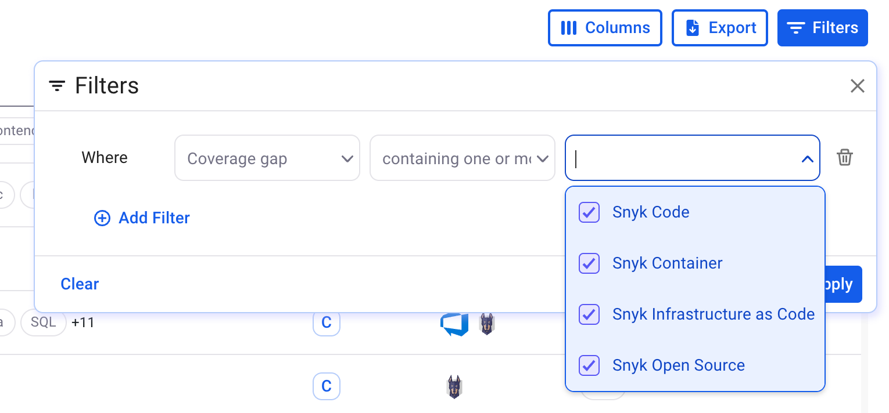

# Excluding directories and files from the import process

When you import a repository to be tested by Snyk Code, you can exclude certain directories and files from the import by using the **`.snyk`** file. The `.snyk` file is a YAML policy file that can contain shell matching patterns (regular expressions), which allow you to specify the directories and files you want to exclude from the import process. The `.snyk` file should be created in the repository you intend to import.


* In Snyk Code, the `.snyk` file can only be used for excluding directories and files from import. It cannot be used to ignore vulnerabilities or for any other action as in other Snyk products.
* Currently, the Exclude option in the `.snyk` file applies only to the Snyk Web UI and CLI Environments, and not to working with Snyk Code via the IDE Environment


You can also use the instructions in this section to exclude directories and files from the [Snyk Code CLI test](../../../cli-for-snyk-code/testing-your-source-code-via-the-cli.md), by creating the `.snyk` file in your tested repository.

### **The Exclusion Syntax of the .snyk File**

**Use the following syntax to exclude files and directories via the `.snyk` file:**

| <p><mark style="color:green;"><code># Snyk (https://snyk.io) policy file</code></mark><br></p><p><code>exclude:</code><br><mark style="color:green;"># Use either “global” or “code”. “global” currently applies only to Snyk Code and Snyk IaC products, and it will exclude the specified directories and files from these tests; “code” applies only to the Snyk Code analysis.</mark><br></p><p><code>global:</code></p><p><mark style="color:green;"># Exclude a single file. For example, - test.spec.js</mark></p><p><code>- file_name.ext</code></p><p><mark style="color:green;"># Exclude a single directory. For example, - src/lib</mark></p><p><code>- source/directory_name</code></p><p><mark style="color:green;"># Exclude any file with a specific extension in the specific directory. For example, - tests/</mark><em><mark style="color:green;">.js</mark></em></p><p><em><code>- directory_name/</code></em><code>.ext</code></p><p><mark style="color:green;"># Exclude files with a specific ending in any directory. For example, - “<strong>/*.spec.js”</strong></mark></p><p><strong><code>- "</code></strong><code>/</code><em><code>.ending.ext"</code></em></p><p><em><mark style="color:green;"># Exclude files in directories that have the same name with a different ending, like “test” and “tests”. The last character before the question mark is optional. For example, - tests?/</mark></em></p><p><code>- directory_name?/</code></p><p><em><mark style="color:green;"># Exclude all files and directories in a specific directory. For example, - tests/</mark></em><code>*</code></p><p><code>- directory_name/**</code></p> |
| ---------------------------------------------------------------------------------------------------------------------------------------------------------------------------------------------------------------------------------------------------------------------------------------------------------------------------------------------------------------------------------------------------------------------------------------------------------------------------------------------------------------------------------------------------------------------------------------------------------------------------------------------------------------------------------------------------------------------------------------------------------------------------------------------------------------------------------------------------------------------------------------------------------------------------------------------------------------------------------------------------------------------------------------------------------------------------------------------------------------------------------------------------------------------------------------------------------------------------------------------------------------------------------------------------------------------------------------------------------------------------------------------------------------------------------------------------------------------------------------------------------------------------------------------------------------------------------------------------------------------------------------------------------------------- |

**Notes**:

* The path in the rule should be relative to the `.snyk` file location.
* All rules must have a preceding dash to be valid: - \<Exclusion\_rule>
* Any rule beginning with an asterisk must be wrapped in quotes. For example:\
  \- ”\*/src”
* Indentations –
  * When using the syntax in the `.snyk` YAML file, pay careful attention to new lines and their indentation. Using the wrong indentation will prevent the execution of your excluding specification.
  * Do NOT use tabs for indentation. Use only spaces for indentation.
  * To verify that you are using the syntax correctly, you can use a YAML Validator, like the [YAML Lint](http://www.yamllint.com/). Be aware that some YAML Validators do not differentiate between the use of tabs and spaces for indentation. If you use tabs, a Validator may approve the syntax, but the exclude specifications will not be executed.
* For more information on the syntax of shell matching patterns, see for example:
  * GNU Org - [Shell Pattern Matching](https://www.gnu.org/software/findutils/manual/html\_node/find\_html/Shell-Pattern-Matching.html)
  * Docstore - [Pattern Matching Quick Reference with Examples](https://docstore.mik.ua/orelly/unix/upt/ch26\_10.htm)

### **Using the .snyk File to exclude directories and files from import**

**To exclude directories and files from the import process using the .snyk file:**

1\. On the repository you want to import, create a YAML file called “.**snyk**”.

For example:


2\. On the `.snyk` file, specify the directories and/or files you want to exclude from import according to the following syntax:

```yaml
# Snyk (https://snyk.io) policy file
exclude:
 global:
   - <Exclusion_rule>
   - <Exclusion_rule>
```

For example:

```yaml
# Snyk (https://snyk.io) policy file
exclude:
 global:
   - todolist-goof/** 
```

3\. From the Snyk Web UI, import your repository by one of the following ways:

* If the repository was already imported to Snyk – retest the repository as follows:
  * On the **Projects** page, click the **Code analysis** Project of the repository. Then, on the **Code Analysis** page, click the **Retest now** option below the header:

<figure><figcaption></figcaption></figure>

* If the repository was not imported yet to Snyk – [import the repository](importing-additional-repositories-to-snyk.md).

Your repository is imported to Snyk, without the directories and/or files you selected to exclude.

### **Example**: **Excluding 2 files from the Snyk Code analysis**

We have a repository called “**snyk-goof**”, which we want to test for vulnerabilities using Snyk Code. After we imported this repository to Snyk, we get a list of 10 detected vulnerability issues, which were found in 3 files:


Now we want to exclude the **app.js** and **db.js** files from the Snyk Code analysis. To achieve that, we perform the following:

1\. We create a **`.snyk`** file in the **snyk-goof** repository in GitHub:


2\. In the `.snyk` file, we enter the following commands to exclude the **app.js** and **db.js** files from the import:


3\. We retest the **snyk-goof** repository, by clicking the **Retest now** option on the **Code Analysis** page of the repository:

The **app.js** and **db.js** files are excluded from the retest, and therefore are not tested by Snyk Code. For this reason, they do not appear in the Code Analysis results, and now only 5 vulnerability issues are detected:

<figure><figcaption></figcaption></figure>
