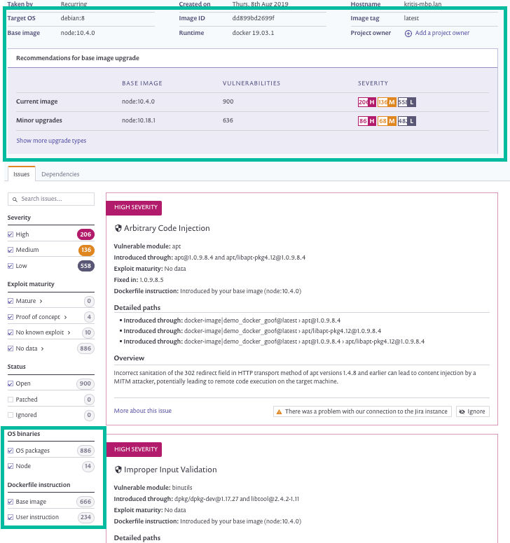
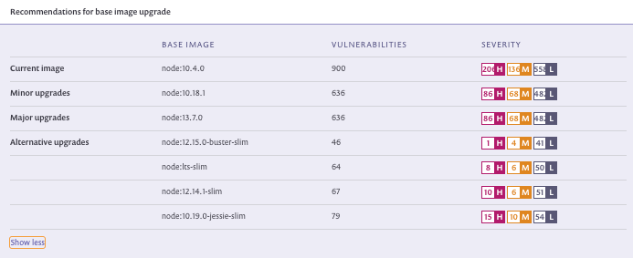

# Analysis and fixes for your images from the Snyk app

You can import container projects into Snyk using `snyk monitor` from the CLI. Alternatively, you can import projects directly from a supported container registry from the UI.

We then scan your project, testing for vulnerabilities, and import a snapshot of your projects. Snyk scans the image snapshot dependencies (which in turn refers to its tag) regularly based on your configurations (daily or weekly) and updates you when any new vulnerabilities are identified (email or Slack, also based on your configurations). If the tag for an image changes and the original tag is used for a different image, Snyk continues to scan the image associated with the original tag, meaning we scan the new image on recurring tests. In order to continue testing an image with a different tag, import the relevant tag.

From the **Projects** page, if the project is imported from a registry integration, then it is marked with the relevant registry icon; if it is imported from the CLI, then similarly it is marked with a CLI icon.

You can filter for all container projects, similar to the following example:

.png>)

When you open any container project, the resulting analysis and fix advice appears in the Snyk UI:

The following information is displayed:

* Project summary, displays general project details, including these unique details:
  * Image ID
  * Image tag
  * Base Image
  * Total dependencies with known vulnerabilities, and the total number of vulnerabilities
* Fix advice—if you included your Dockerfile for monitoring, then any available actionable fix advice is displayed. To view all advice, click the **Show more upgrade types** link. The advice offered is dependent on available fixes, and appears similar to the following image:

* Upgrade suggestions can include:
  * Minor upgrades—the safest and best minor upgrade available
  * Major upgrades—an option for a major upgrade which will reduce more vulnerabilities but with greater risk
  * Alternative upgrades—viable alternative image options for replacing your current base image with other, different base images that provide the least amount of vulnerabilities possible.
  * If your base image is outdated, Snyk also recommends rebuilding your image.
* Upgrade recommendations include these details:
  * the name of the recommended base image version
  * the number of vulnerabilities existent in the recommended upgrade
  * a summary of the vulnerability severities accordingly.
* Filters—in addition to the other filters available for all supported project types, when you view a container project, you can also filter by:
  * a specific binary or by OS packages (for binaries/packages containing issues)
  * Dockerfile instructions - if you attach your Dockerfile, then you can filter to view issues associated only with the base image, or to view Dockerfile-related advice (user instruction), or both


**Note**\
If there is only one category of issues in your container, such as Node binary vulnerabilities only or OS packages only, this filter does not appear.\
If there is no Dockerfile attached for additional advice, the Dockerfile instruction filter does not appear


* Issues tab—List of vulnerabilities, including origins, paths, and an overview of the vulnerability
* Dependencies tab—a tree view of package hierarchy inside the image
