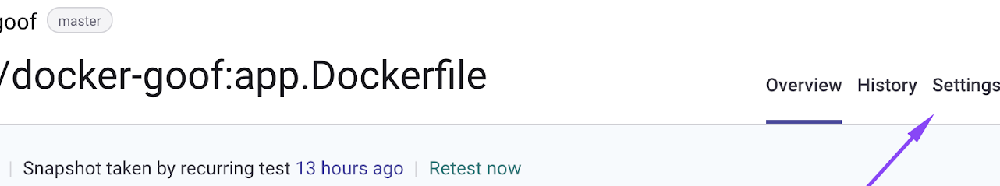

# Custom Base Image Recommendations


This feature is currently in Beta. Please contact your CSM if you are interested in participating.&#x20;


## **Overview**

When scanning a container image, Snyk provides recommendations based on the base image detected. These recommendations apply only to a subset of images, as Snyk precomputes recommendations only for Official Docker images.

Customers often maintain their own internal, customized base images, built on top of Official Docker images or other upstream images. These are provided as a service to a wider set of development teams, for example, `somecompany/java:v1.2.4`.

Using the custom base image recommendation feature, Snyk can recommend an image upgrade from a pool of the customer’s internal images. This allows teams to be notified of newer and more secure versions of their internal base images.

## **Case study**

1. Your company's platform team, responsible for creating and maintaining custom base images for the organization, scans and marks images in Snyk as custom base images.
2. Your company's application teams, using those pre-built custom base images and adding additional layers on top of it for their applications, can get recommendations for upgrading to a newer internal version.

### **SemVer recommendation logic**

As an example, when scanning the following images and marking them (in the following order) as custom base images:

1. `developer-java/oracle-jre-rhel7/8e32:1.8.0`&#x20;
2. `developer-java/oracle-jre-rhel7/8e32:1.9.2`&#x20;
3. `developer-java/oracle-jre-rhel7/8e32:1.7.0`

Snyk will recommend the second image, as it is the newest image **based on the semantic versioning of the tag**.&#x20;

If Snyk cannot find a [standard semantic versioning schema](https://semver.org/) in the tag, the recommendation is the last image that was marked as a custom base image (in this example, the third image), as determined in the following logic.

### **Timestamp recommendation logic**

As an example, when scanning the following images and marking them (in the following order) as custom base images through the Snyk interface, under project settings:

1. `developer-java/oracle-jre-rhel7/8e32:1.8.0_2021021008`&#x20;
2. `developer-java/oracle-jre-rhel7/8e32:1.8.0_2021022508`&#x20;
3. `developer-java/oracle-jre-rhel7/8e32:1.8.0_2021031708`

Snyk recommends the third image, as it was last marked as a custom base image.

## **Notes**

* To use the Custom Base Image Recommendations feature, Snyk needs to enable it for each **organization** that wants to be able to mark images as custom base images (for example, the platform team).
  * This means that every user in the organization (platform team in this example) will be able to mark images as custom base images in the project settings.
  * Later, projects in the same **group** as the organization (platform team in this example) will be able to receive custom base image recommendations.
* The current logic is: for the same image family (same repo and name), Snyk will recommend the newest image based on the **semantic versioning of the image tag**. If Snyk is unable to find a [standard semantic versioning schema](https://semver.org/) in the tag, the recommendation will be the last image that was marked as a custom base image (timestamp of marking. See the User flows→ Platform team section that follows.
* A Dockerfile must be specified (see the instructions that follow) in the project in order to receive custom base image recommendations

## **User flows**

### Platform team

_Responsible for creating and maintaining custom base images for the organization._

1. Ask Snyk to enable the feature for the organization being used by the platform team.
2. Create a custom base image.
3. Import the image to a Snyk’s project either:
   1. Through the Web UI: Import an image into Snyk using a container registry.
   2. Through the CLI
      1. Use `--file` (optional) to specify the path to the Dockerfile, and `--project-name` (mandatory) to give the project a **unique** name (Snyk recommends using the image **name and tag, without the repo**.\
         Example: `oracle-jre-rhel7/8e32:1.8.0_2021022508`)
      2. The following is an example command: `snyk container monitor snykgoof/custom-base-python:3.9.2_2021110408 --file=path/to/Dockerfile.3.9.2 --project-name=custom-base-python:3.9.2_2021110408 --org=ORGANIZATION_ID/ORGANIZATION_NAME`
4. Mark the project as a custom base image.
   1. Go to the project’s **Settings** page\
      :\

   2. Under **Custom Base Image Recommendation**, select **Treat as custom base image**.
   3. Click **Update image status**.
5. Mark whether the image should be eligible for recommendations.
   1. Again in **Custom Base Image Recommendation,** select the **Use in recommendations** checkbox.
   2. Click **Update image status**.
6. To test the feature, go through the preceding steps for at least two different images from the same repository in order to get recommendations.

### Application team

_Using pre-built custom base images and adding additional layers on top of it for their applications_

1. Import an image to a new Snyk project.
   1. Be sure the project is in the same **group** as the custom images.
   2. Through the UI: Configure the Dockerfile through the project’s settings (**mandatory**).\
      \
      
   3. Through the CLI:
      1. Use `--file` (**mandatory**) to specify the path to the Dockerfile.
      2. The following is an example command: `snyk container monitor snykgoof/custom-base-python:3.9.2_2021110408 --file=path/to/Dockerfile.3.9.2`
      3. Optional: use the -`-exclude-base-image-vulns` flag for the `snyk test` command to not show the base image vulnerabilities.
   4. Note: if the same image is scanned from both the CLI and UI, Snyk creates two projects which will both be monitored.
2.  Get recommendations for the image

    

## Known gaps

1. Marking an image as a custom base image is supported only through the UI, and not through the API/CLI.
2. Scanning only a Dockerfile (and not the image itself) that contains a custom base image will not show vulnerabilities, but will give recommendation advice.
3. Custom base image recommendations will not appear when scanning an image without attaching the Dockerfile to the project.
4. Automatic fix PRs are not available for custom base image projects
5. The image’s registry is ignored when giving recommendations for custom base images. Images with the same repository but different registries will be treated as coming from the same registry (the current base image’s registry) in showing recommendations and fix PRs.
