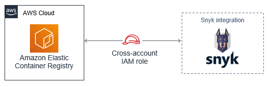

# Configure integration for Amazon Elastic Container Registry (ECR)

Enable integration between one Amazon ECR registry and a Snyk organization, and start managing your image security. To integrate with multiple registries, create a unique organization for each one.

**Automated Process:**

You have the option of establishing cross-account access to enable Snyk's Amazon ECR integration as a 1-click deployment. This options is available as an official [AWS Quick Start](https://github.com/aws-quickstart/quickstart-snyk-security) and eliminates the need for manual configuration.

You will need your Snyk **Organization ID** and AWS IAM [role ARN](https://docs.aws.amazon.com/IAM/latest/UserGuide/reference\_identifiers.html#identifiers-arns) to complete the integration. The role ARN will be provided for you in the AWS CloudFormation Console's Output tab.

**Manual Process:**

To enable integration, you must first create a read-only AWS Identity and Access Management (IAM) role. The role delegates read-only access to all repositories in your registry for Snyk per organization by indicating the list of permitted Snyk-assigned organization IDs.

Thereafter, when integrating additional organizations, you can simply add the additional organization IDs as necessary.

Follow these steps to set up your integration:

* [enable-permissions-to-access-amazon-elastic-container-registry-ecr-for-the-first-time.md](enable-permissions-to-access-amazon-elastic-container-registry-ecr-for-the-first-time.md "mention")
* [add-additional-organizations-to-your-aws-iam-role-for-snyk-authentication.md](add-additional-organizations-to-your-aws-iam-role-for-snyk-authentication.md "mention")
* [amazon-elastic-container-registry-ecr-configure-your-integration-with-snyk.md](amazon-elastic-container-registry-ecr-configure-your-integration-with-snyk.md "mention")
