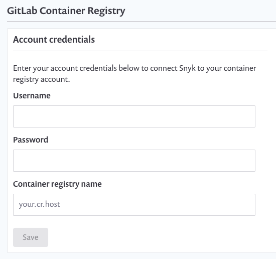

# Container security with GitLab container registry integration

Snyk integrates with GitLab container registry to enable you to import your container images and monitor them for vulnerabilities.

Snyk tests the images you’ve imported (referred to as \`projects\`) for any known security vulnerabilities, testing them at a frequency you control, and alerts you when new issues are detected.

Integration with GitLab container registry is available for all Snyk users.

To set up GitLab container registry integration in Snyk and start managing image vulnerabilities:

**Prerequisites**

* You must be an administrator for the organization you're configuring in Snyk.
* Snyk needs user credentials to integrate with GitLab container registry and Snyk does not support integrating if the user is using GitLab SSO for accessing their GitLab container registry.

**Configure integration**

1. In your Snyk account, navigate to Integrations from the menu bar at the top. Under the Container Registries section, find the GitLab container registry option and click it.
2. In the **Account credentials** section, enter your GitLab container registry username and password login credentials. In the **container registry name** fill in the full URL to the registry you want to integrate with. To finish, click **Save**.

If you are using a self-hosted GitLab container registry registry, [contact Snyk Support](https://support.snyk.io/hc/en-us/requests/new) to provide you with a token. For more information about setting up private registry integration see [Snyk Container for self-hosted container registries (with broker)](../../integrate-self-hosted-container-registries.md).

Snyk tests the connection values and the page reloads, now displaying GitLab container registry integration information, and the **Add your GitLab container registry images to Snyk** button becomes available. If the connection to GitLab container registry fails, notification appears under the **Connected to GitLab container registry** section. Now you can use Snyk to scan your images from GitLab container registry.
