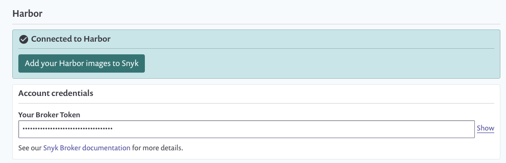

# Container security with Harbor integration


**Feature availability**  
This feature is available with Enterprise plans. See [pricing plans](https://snyk.io/plans/) for more details.


Snyk integrates with Harbor Container Registry to enable you to import your container images and monitor them for vulnerabilities.

Snyk tests the images you’ve imported \(referred to as \`projects\`\) for any known security vulnerabilities, testing them at a frequency you control and alerts you when new issues are detected.

To set up Harbor integration in Snyk and start managing image vulnerabilities:

Prerequisites

* You must be an administrator for the organization you're configuring in Snyk.
* Snyk needs user credentials to integrate with Harbor and does not support Harbor when configured for single sign-on \(SSO\).

**Configure integration**

1. In your Snyk account, navigate to **Integrations** from the menu bar at the top. Under the **Container Registries** section, find the Harbor option and click it. \_\_
2. In the **Account credentials** section, enter your Harbor username and password login credentials. In the **container registry name** fill in the full URL to the registry you want to integrate with. To finish, click **Save**.

In case you are using a self-hosted Harbor registry, contact us to provide you with a token. You can read more about setting up private registry integration [here](https://docs.snyk.io/snyk-container/integrate-self-hosted-container-registries/snyk-integration-to-self-hosted-container-registries).


**Note**  
To set up the integration, the Harbor user should be an admin user. It currently uses /v2/\_catalog endpoint for listing repos. There is an [open issue in Harbor](https://github.com/goharbor/harbor/issues/6784), where only users with admin rights can use this endpoint.


Snyk tests the connection values and the page reloads, now displaying Harbor integration information, and the **Add your Harbor images to Snyk** button becomes available. In case the connection to Harbor failed, notification appears under the **Connected to Harbor** section.  
Now you can use Snyk to scan your images from Harbor.

