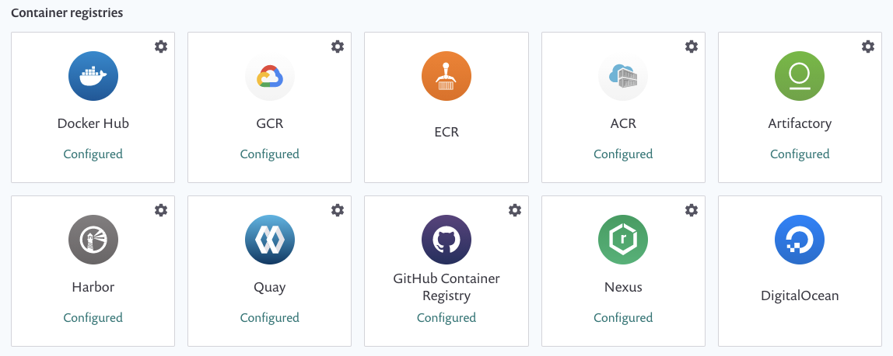
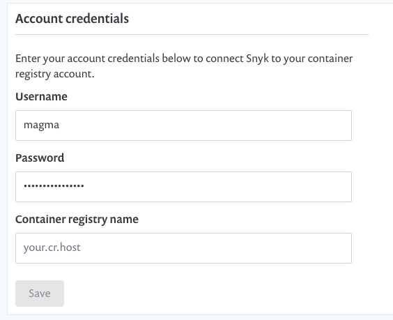

# Container security with Nexus integration


**Feature availability**\
This feature is available with Enterprise plans. See [pricing plans](https://snyk.io/plans/) for more details.


Snyk integrates with Nexus Container Registry to enable you to import your container images and monitor them for vulnerabilities.

Snyk tests the images you’ve imported (referred to as \`projects\`) for any known security vulnerabilities, testing them at a frequency you control and alerts you when new issues are detected.

To set up Nexus integration in Snyk and start managing image vulnerabilities:

Prerequisites

* You must be an administrator for the organization you're configuring in Snyk.
* Snyk needs user credentials to integrate with Nexus and does not support Nexus when configured for single sign-on (SSO).

**Configure integration**

* In your Snyk account, navigate to **Integrations** from the menu bar at the top. **\*\*Under the** Container Registries **section, find the** Nexus\*\* option and click it.
* In the **Account credentials** section, enter your Nexus username and password login credentials. In the **container registry name** fill in the full URL to the registry you want to integrate with. To finish, click **Save**.

If you are using a self-hosted Nexus registry, [contact our Support team](https://support.snyk.io/hc/en-us/requests/new) to provide you with a token. You can read more about setting up private registry integration [here](https://docs.snyk.io/snyk-container/integrate-self-hosted-container-registries/snyk-integration-to-self-hosted-container-registries).&#x20;

Snyk tests the connection values and the page reloads, now displaying Nexus integration information, and the **Add your Nexus images to Snyk** button becomes available. In case the connection to Nexus failed, notification appears under the **Connected to Nexus** section.&#x20;

Now you can use Snyk to scan your images from Nexus.
