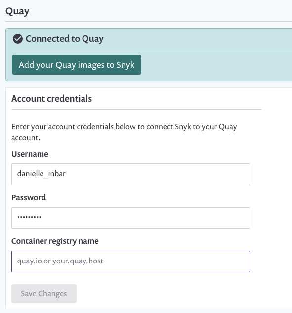

# Container security with Quay integration

Snyk integrates with Quay Container Registry to enable you to import your container images and monitor them for vulnerabilities.

Snyk tests the images you’ve imported (referred to as \`projects\`) for any known security vulnerabilities, testing them at a frequency you control and alerts you when new issues are detected.

Integration with Quay is available for all Snyk users.

To set up Quay integration in Snyk and start managing image vulnerabilities:

Prerequisites

* You must be an administrator for the organization you're configuring in Snyk.
* Snyk needs user credentials to integrate with Quay and does not support Quay when configured for single sign-on (SSO).

**Configure integration**

1. In your Snyk account, navigate to **Integrations** from the menu bar at the top. Under the **Container Registries** section, find the **Quay** option and click it.
2. In the **Account credentials** section, enter your Quay username and password login credentials. In the **container registry name** fill in the full URL to the registry you want to integrate with. This can be a cloud-based Quay, or a private host. To finish, click **Save**.

If you are using a self-hosted Quay registry, [contact our Support team](https://support.snyk.io/hc/en-us/requests/new) to provide you with a token. You can read more about setting up private registry integration [here](https://docs.snyk.io/snyk-container/integrate-self-hosted-container-registries/snyk-integration-to-self-hosted-container-registries).


**Note**\
[Quay.io](http://quay.io) is [deprecating](https://access.redhat.com/articles/5925591) the usage of Quay login by end of June, 2021. From that point, the credentials can no longer be Quay username and password, but rather Quay robot account credentials (username and token), that has at least 'read' permissions to the desired repo\*\*.\*\*


Snyk tests the connection values and the page reloads, now displaying Quay integration information, and the **Add your Quay images to Snyk** button becomes available. In case the connection to Quay failed, notification appears under the **Connected to Quay** section.\
Now you can use Snyk to scan your images from Quay.
