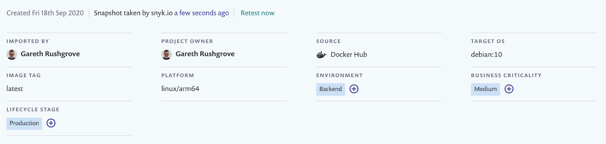

# Advanced Snyk Container CLI usage

## Testing archives

As well as testing images from a local Docker daemon or remote registry, Snyk can also directly test or monitor a Docker or OCI archive.

```
snyk container test docker-archive:archive.tar
snyk container test oci-archive:archive.tar
```

## Testing multi-platform images

Some repositories represent multi-manifests, pointing to several different images depending on the operating system and architecture required. The Snyk Container CLI can be used to explicitly test an image for a specific platform:

```
snyk container test --platform=linux/arm64 debian
```



The `--platform` flag should contain one of:

* linux/amd64
* linux/arm64
* linux/riscv64
* linux/ppc64le
* linux/s390x
* linux/386
* linux/arm/v7
* linux/arm/v

## Authenticating to a remote container registry

When Docker is installed, the Snyk Container CLI will use any pre-configured registry authentication. If you're not using Docker then you can instead explicitly pass the credentials on the command line. This can be done either by:

* Using the following environment variables: `SNYK_REGISTRY_USERNAME` and `SNYK_REGISTRY_PASSWORD`.
* Or by passing `--username` and `--password flags`, like so:

```
snyk container test <repository>:<tag> --username= --password=
```

Note that the flags take precedence over the environment variables in the case both are passed.

## Common additional options

Some useful CLI options include:

| Option                       | Description                                                                                                                                                                                                       |
| ---------------------------- | ----------------------------------------------------------------------------------------------------------------------------------------------------------------------------------------------------------------- |
| `--json`                     | Output the results as a JSON document, useful for integrating with other tools                                                                                                                                    |
| `--sarif`                    | Output the results as a [SARIF](https://www.oasis-open.org/committees/tc\_home.php?wg\_abbrev=sarif) document, useful for integrating with other tools. Note this requires the test to be run with --file as well |
| `--exclude-base-image-vulns` | Don’t show vulnerabilities only introduced by the base image. Available when using `snyk container test` only.                                                                                                    |
| `--severity-threshold`       | Only show a subset of vulnerabilities which match the severity or higher                                                                                                                                          |
| `--app-vulns`                | Snyk allows detection of vulnerabilities in your application dependencies from container images, as well as from the operating system, all in one single scan.                                                    |
| `--nested-jars-depth`        | When using `--app-vulns` the `--nested-jars-depth=n` flag to set how many levels of nested jars Snyk will unpack.                                                                                                 |

For a full list of options, access the Snyk help information:

```
snyk container --help
```

## More information

* [Test images with the Snyk Container CLI](https://docs.snyk.io/snyk-container/snyk-cli-for-container-security)
* [Understand Snyk Container CLI results](https://docs.snyk.io/snyk-container/snyk-cli-for-container-security/understanding-snyk-container-cli-results)
