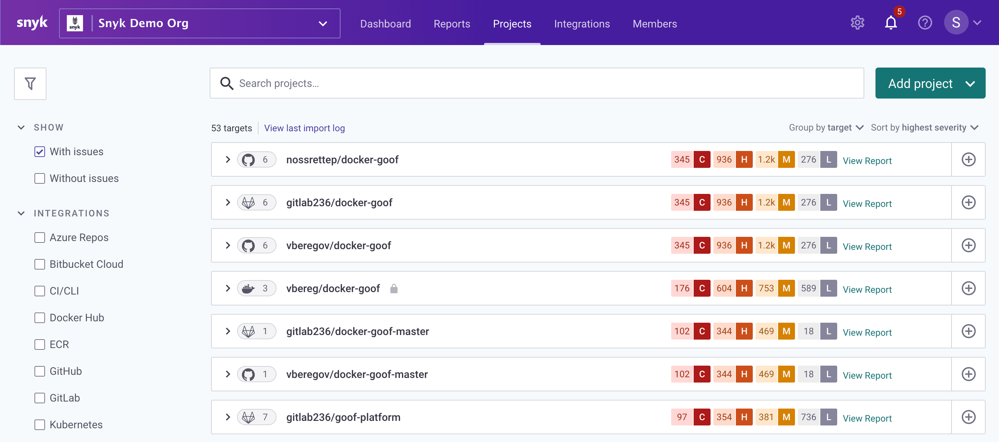

# Snyk Container security basics

Containers provide a standard packaging format for applications, but container images can be opaque, leading to problems identifying the software and vulnerabilities they contain.

Snyk Container:

* Provides tools and integrations to quickly find and fix these vulnerabilities.
* Allows you to create images with security built-in from the start.

Read more about how we scan images for vulnerabilities in Container image scanning.

## Snyk Container integrations

To address the container image security problem, Snyk Container provides a range of integrations which import projects into Snyk. These integrations support different workflows for our users and customers.

The main integrations are:

* [CLI](https://docs.snyk.io/snyk-container/snyk-cli-for-container-security): useful for local investigation, or testing an image you have built.
* SCM: Snyk can detect Dockerfiles directly from Git repositories, and provide recommendations for updating the base image to a less vulnerable one. 
* CI: can act as a gate, for example breaking the build on new high severity vulnerabilities.
* Container registries: useful to test a large number of images, or if you cannot modify lots of CI pipelines.
* [Kubernetes](https://support.snyk.io/hc/en-us/articles/360003916138-Kubernetes-integration-overview): similar to container registries, but with more context about the running workload Snyk can use to prioritize vulnerabilities or group projects.

The integrations you use depends on your requirements and workflow. You can start with one integration and move to others later, or use a combination of integrations as your team grows.

For example, it’s common to use our CI integrations to provide fast feedback to development teams when you build an image, then use the Kubernetes integration to provide assurance around running images in production.

Learn more about [container security](https://snyk.io/learn/container-security/).

