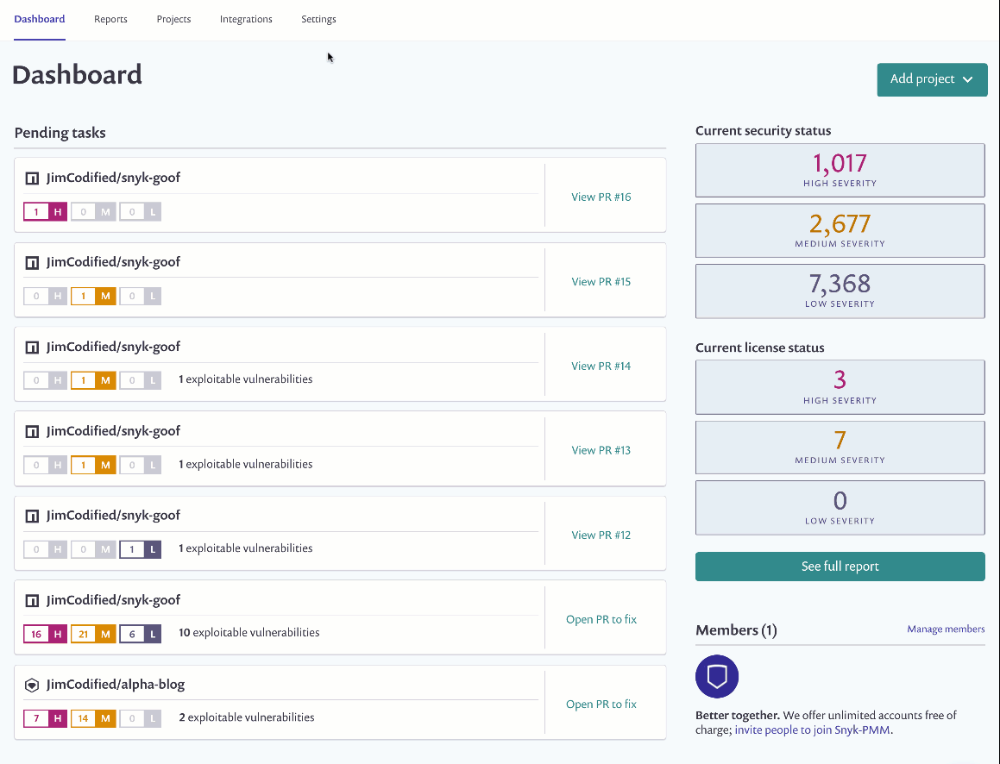
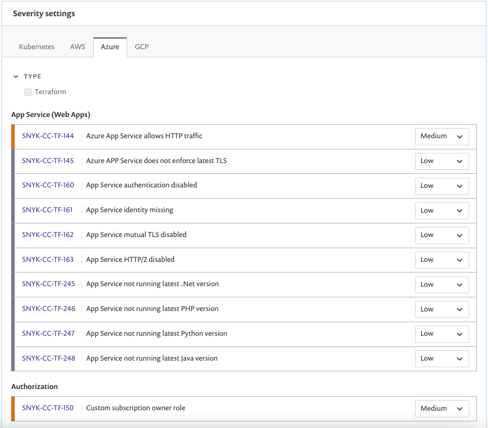

# Configure your integration to find security issues in your Terraform files

Snyk tests and monitors your Terraform files from your source code repositories, guiding you with advice for how you can better secure your cloud environment--catching misconfigurations before you push to production and helping you to fix them.

## Supported Git repositories and file formats

Snyk currently scans Terraform \(`.tf`\) files when imported from an integrated Git repository. Scanning a Terraform module repository is done by importing the repo that holds the module from an SCM or by scanning the directory itself using `snyk iac test` command.

Scanning Terraform gives you security feedback on everything that is statically configured in the module. To benefit from recurring/scheduled testing, it's best practice to import custom modules directly from an SCM.

Please see read our blog post about the ability to interpolate variables: [Snyk IaC public beta introduces Terraform plan analysis](https://snyk.io/blog/snyk-iac-public-beta-introduces-terraform-plan-analysis/) and scans Terraform modules. This allows scanning the Terraform Plan output via the CLI. Enabling scanning of the entire Terraform deployment to include the output of the modules used to create the deployment.

## Configure Snyk to scan your Terraform configuration files

**Prerequisites**

* You must be an administrator for the organization you're configuring in Snyk.
* Ensure you’ve already integrated your Git repository; if you haven’t done this yet, check out the [Git repository \(SCM\) integrations](https://support.snyk.io/hc/en-us/sections/360001138098-Git-repository-SCM-integrations).

**Configure Snyk**

* Log in to your account and navigate to the relevant group and organization that you want to manage. **Note:** Integrations are managed per organization
* Enable Snyk to detect Infrastructure as code files as follows:

* If needed, review and adjust settings in the **Infrastructure as code** settings area:

