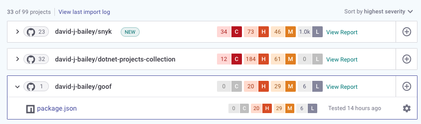

# Getting started with Snyk Open Source

Get started with Snyk Open Source to inspect, find and fix vulnerabilities in your application's Open Source libraries.


This process describes getting started using the Snyk Web UI and a SCM (source code management) system.

* You can also use an [IDE tool](https://docs.snyk.io/integrations/ide-tools) or a [CI/CD integration](https://docs.snyk.io/integrations/ci-cd-integrations). See [Integrations](https://docs.snyk.io/integrations).
* You can get started with the [snyk-cli](../../snyk-cli/ "mention"); see [getting-started-with-the-cli.md](../../snyk-cli/getting-started-with-the-cli.md "mention").


### **Prerequisites**

Ensure you have:

* A code project using open source packages, on a supported SCM system such as GitHub. See [git-repository-scm-integrations](../../integrations/git-repository-scm-integrations/ "mention").
* A supported language and package manager, such as Java. See [language-and-package-manager-support](language-and-package-manager-support/ "mention").
* A Snyk account (go to [https://snyk.io/](https://snyk.io) and sign up - see [getting-started](../../getting-started/ "mention")).

### Stage 1: Add source control integration


if you already have an integration set up, go to Step 3.


Choose a source code integration, to allow Snyk to work on a project.

1. Log in to the Snyk Web UI ([app.snyk.io](https://app.snyk.io)).
2. Select **Integrations > Source control**.
3. Click the source control system (for example, GitHub) to integrate with Snyk.
4. Fill in the account credentials as prompted (or authenticate with your account in GitHub), to grant Snyk access permissions for integration.

### Stage 2: Add Projects

Add projects to test with Snyk, by choosing repositories for Snyk to test and monitor.

In the Snyk Web UI, first select **Projects** from the Snyk Web UI, then click **Add Project**, selecting where to add the project repositories from (for example GitHub).

#### Add a repository

Select the repositories to use, then click **Add selected repositories** to import the selected repositories into your projects:

This also:

* Sets Snyk to run a regular check ([daily by default](../../features/user-and-group-management/managing-settings/usage-page-details.md#projects)) for vulnerabilities.
* Creates a [Webhook](../../snyk-api-info/snyk-webhooks/), so when you change code, Snyk tests your pull / merge requests, to check that new dependencies do not introduce more vulnerabilities.

In **Settings**, optionally choose to:

* Use **Add custom file location** to add any additional dependencies from custom paths.
* Use **Exclude folders** to list up to 10 folders to exclude from scanning during the import; for example, to shorten scanning time.

#### Import progress

1. A progress bar appears: click **View last import log** to see log results.
2. Project import completes, with a status error message:


If you see any errors during import, see [Project import errors](https://support.snyk.io/hc/en-us/articles/360001373118).


### Stage 3: View vulnerabilities

You can now view vulnerability results for imported projects. The **Projects** tab appears by default after import, showing vulnerability information for project you've imported.

You can expand an imported project to see vulnerability information for that project, including the number of issues found, grouped by severity level:

Click on an entry to open the issues view for that entry, including the module, where it was introduced, and how to fix it, plus more details about the vulnerability itself:

See [view-project-information.md](../../snyk-web-ui/introduction-to-snyk-projects/view-project-information.md "mention") for more details.

### Stage 4: Fix vulnerabilities

For some languages, Snyk can fix your vulnerabilities using fix pull/merge requests.


See [what-languages-do-we-support-fix-pull-requests-or-merge-requests.md](../../features/fixing-and-prioritizing-issues/starting-to-fix-vulnerabilities/what-languages-do-we-support-fix-pull-requests-or-merge-requests.md "mention")


Navigate to the **Issues** view for a project:

To fix vulnerabilities:

1. Click **Fix this vulnerability** to raise a fix PR for that issue (or click **Fix these vulnerabilities** to to fix multiple issues).
2. The **Open a Fix PR** screen opens and indicates the vulnerabilities you selected.
3. Check any additional issues you want to fix, or uncheck items to remove them from the fix.
4. Scroll down to the bottom of the screen and click **Open a Fix PR**.
5. Snyk now actions this PR, then a results screen appears.
6. Optionally, select the **Files changed** tab to see details of the changes made.

.png>)

See [fix-your-vulnerabilities.md](../../features/fixing-and-prioritizing-issues/starting-to-fix-vulnerabilities/fix-your-vulnerabilities.md "mention") for more details.
