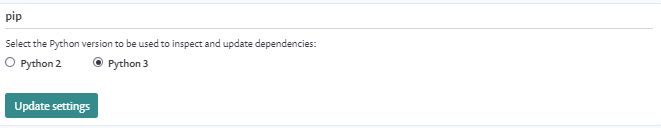

# Snyk for Python


Snyk provides security scanning on projects for vulnerabilities both through the [Snyk CLI ](../../../snyk-cli/)and from the Snyk Web UI through different [Snyk Integrations](../../../integrations/).


This page describes how to use Snyk to scan Python projects.

## Features

| Package managers / Features                          | CLI support | Git support | License scanning | Fix PRs |
| ---------------------------------------------------- | ----------- | ----------- | ---------------- | ------- |
| [Pip and PyPI](https://pypi.org/project/pip/)        | ✔︎          | ✔︎          | ✔︎               | ✔︎      |
| [pipenv](https://pipenv.pypa.io/en/latest/) | ✔︎          |             | ✔︎               |         |
| setup.py                                             | ✔︎          |             | ✔︎               |         |
| [Poetry](https://python-poetry.org)                  | ✔︎          |             | ✔︎               |         |


Features might not be available, depending on your subscription plan.



PyPI licenses are supported for all Python projects.


## How scanning Python projects works


To scan your dependencies, you must ensure you have first installed the relevant package manager, and that your project contains the supported manifest files.


Once Snyk has built the tree, we can use our vulnerability database to find vulnerabilities in any of the packages anywhere in the dependency tree.

The way Snyk analyzes and builds the tree varies depending on the language and package manager of the project, as well as the location of your project. For more information see the section [Snyk CLI for Python projects](snyk-for-python.md#snyk-cli-for-python-projects).

## pip

Snyk requires the full, nested dependency tree in order to run tests. Requirements.txt files only contain the top-level dependencies and not the nested or transitive dependencies. The most efficient way to ensure accuracy is to install the full pip project.

Snyk runs tests against the specific pip installation used for that specific service/product rather than an unlinked, separate dependency tree.

In order to scan the full dependency tree, Snyk analyzes the installed packages to ensure none are missing. This happens even when not explicitly specified in the manifest file.

Install the missing packages by invoking pip install, for example:

```
python3 -m pip install -r requirements.txt
```

## Pipenv

To build the dependency tree, run `pipenv install` as Snyk needs this to create the `pipenv graph` which is then used for the dependency scan to fulfill itself.

Snyk uses the built dependency tree to analyze the `Pipfile`.

## setup.py

To build the dependency tree, Snyk analyzes the `setup.py` file, and detects packages listed in the `install_requires` key.

There is no auto-discovery for this file. It must be specified manually:

```
snyk test --file=setup.py
```

You can convert `setup.py` to `requirements.txt` by installing the packages into a virtual environment and then running `pip freeze`.

## Poetry

To find issues in a Python Poetry application Snyk uses `pyproject.toml` and `poetry.lock` files. Note both these files must be present for Snyk to identify Poetry dependencies and test for issues.

## Additional support details

URLs in `requirements.txt` files are not supported, as this introduces a security risk.\
They are removed before resolving the dependencies in the files.

Refer also to the [snyk-python-plugin repository](https://github.com/snyk/snyk-python-plugin/blob/master/lib/types.ts).

## Snyk CLI for Python projects

The way Snyk analyzes and builds the tree varies depending on the language and package manager of the project.

### **Prerequisites**

* Ensure you've installed the relevant package manager before you begin using the Snyk CLI.
* Ensure you've included the relevant manifest files supported by Snyk before testing.
* Install and authenticate the Snyk CLI to start analyzing projects from your local environment. For more information about Snyk CLI see [Getting started with the CLI](../../../snyk-cli/getting-started-with-the-cli.md).

### Snyk CLI parameters for Python

When scanning your Python project for vulnerabilities, use these options to modify commands:

| Option                  | Description                                                                                                                                                                                                                                                                                                                                                                                                                                                                                                                                                                               |
| ----------------------- | ----------------------------------------------------------------------------------------------------------------------------------------------------------------------------------------------------------------------------------------------------------------------------------------------------------------------------------------------------------------------------------------------------------------------------------------------------------------------------------------------------------------------------------------------------------------------------------------- |
| `--command=`            | <p>Snyk uses Python in order to scan and find your dependencies. Snyk needs the Python version to start scanning, and defaults to "python"</p><p>If you are using multiple Python versions, use this parameter to specify the correct Python command for execution.</p><p>For example: <code>snyk test --command=python3</code></p><p>See <a href="snyk-for-python.md">Using different Python versions</a> for more details</p>                                                                                                                                                           |
| `--skip-unresolved=`    | Skip packages when they can’t be found in the environment (for example, private packages that can’t be accessed from the machine running the scan).                                                                                                                                                                                                                                                                                                                                                                                                                                       |
| `--file=`               | <p>Specify a specific file to test. By default, Snyk scans the requirements.txt file at the top level of the project.</p><p>If explicitly specified with this parameter, Snyk can recognize any manifest files based on <code>--file=*req*.txt</code>. Each (*) is a wildcard and <code>req</code> can appear anywhere in the file name.</p><p>For example, Snyk recognizes your manifest file when you have renamed it to requirements-dev.txt.</p><p><strong>Note</strong>: <code>--package-manager=pip</code> should be added to your cmd if the file name is not requirements.txt</p> |
| `--package-manager=pip` | This parameter is mandatory if you specify a value for the --file parameter that is not to a requirements.txt file. The test fails without this parameter. Specify this parameter with the value pip.                                                                                                                                                                                                                                                                                                                                                                                     |

## Git services for Python projects

Python projects can be imported from any of the Git repositories Snyk supports.

To test your Python projects using pip as a package manager, Snyk analyzes your `requirements.txt` file, and so you must have this file in your repository before importing.

If you’ve renamed your `requirements.txt` files (for example, if you have renamed a file to `requirements-dev.txt)`, Snyk tries to import every file that follows the `**/*req*.txt` convention as a Python project.

If you've placed your files in a requirements folder (for example, if you have placed your file under `requirements/requirements.txt`) Snyk tries to import every file that follows the `**/requirements/*.txt`convention as a Python project.

If you are using a package manager that creates different manifest file formats other than `requirements.txt`, then either convert or import (depending on the package manager/supported files) the manifest file to the `requirements.txt` format.

For example:

```
dephell deps convert --from=conda --to=requirements.txt
```

## Using different Python versions

Some Python projects may have dependencies that are only valid using Python 3. By default, Snyk scans with Python 2.

You can adjust the version of Python Snyk uses to scan dependencies, in both the CLI and Git integration.

### Setting Python version in the CLI

Add the following parameter to `snyk test` or `snyk monitor`  with the value of the python binary:

```
--command=python3
```

### Setting Python version in Git projects


When testing projects imported from Git, Snyk uses a recent version of either Python 2 or Python 3, for example 2.7.4 or 3.7.4.


By default Snyk tests using Python 2.

To define which Python major version Snyk uses to test your Git imported projects, use either organization settings, or a `.snyk` [policy file](https://docs.snyk.io/fixing-and-prioritizing-issues/policies/the-.snyk-file).

To define the Python version for all projects in an organization:

1. Log in to your account and navigate to the relevant group and organization to manage.
2. Click on settings  > **Languages**.
3. Click **Edit settings** for **Python**.
4. Select **Python 2** or **Python 3** to use when testing projects for this organization.



Snyk recommends you create different organizations to work with different Python versions.

If you prefer to use one organization but require projects to use different Python versions, you may add a `.snyk` file to a project repository, and specify the desired version.

The `.snyk` file must be in the same directory as the project manifest file.

## Major and minor versions

On finding a `.snyk` file, Snyk detects the major version specified, and uses this to control whether the project is tested with Python 2 or Python 3. It does not use the exact version specified.

For example, for projects imported via Git:

```
language-settings:
  python: '3.7.2'
```

This example tells Snyk to use a recent version of Python 3, but Snyk does not use the exact minor and patch version specified.

## Scanning Python dependencies in IDEs

If you are using any of the supported IDEs to write Python, there are some configurations you will need to add in order to properly scan Python manifest files. If you are using a virtual environment, it is important that you add the `PYTHON_PATH` to the Additional Options text input in the Snyk integration settings, for example, `--command=.venv/bin/python`. Snyk will try to look for a `*req*.txt` file in the root of the project as seen in the IDE.

However, if you have manifest files in other directories within the root of the project, Snyk will not be able to identify them. In order for Snyk to find them, you must to use the `--all-projects` flag. Snyk will then recursively search through each directory within the project to find all of the manifest files.

If those directories each require a different virtual environment to run, the Snyk scan will not be successful because it will be using one virtual environment to search for installed dependencies. In this case, it is best to use the CLI or the git integration to get vulnerability information on all of the dependencies listed in each directory of your project.
