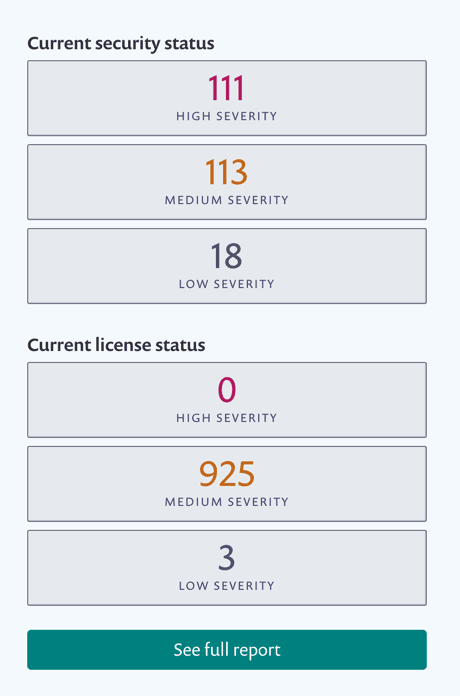
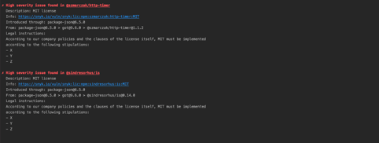

# License policies: What collaborators see

A newly assigned policy, or modifications to a policy, will apply, once the next scheduled test runs. This is what happens for all of the licenses in the organization:

If you changed severity, **Dashboard** statistics update based on severity changes:

The results update accordingly too, including any instructions or severity changes you made:

Results in the CLI update accordingly as well:

