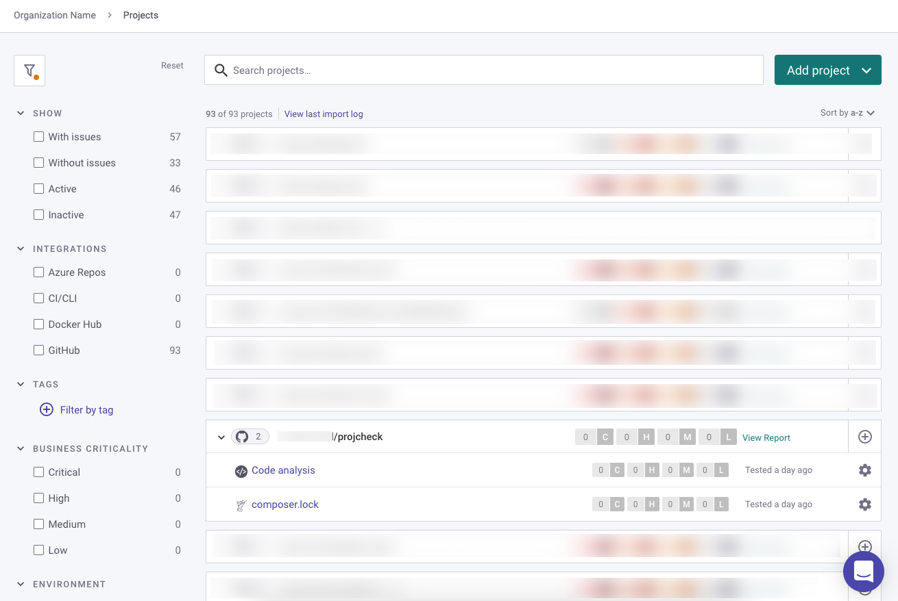
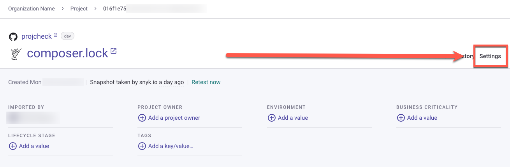
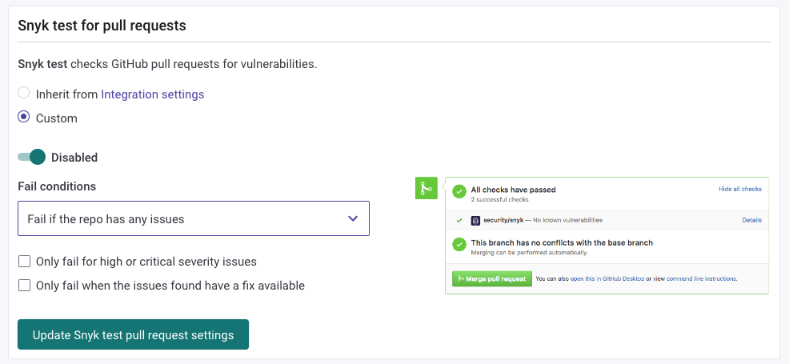

# Enabling PR Checks for Snyk Open Source


Look familiar? [Snyk Code](../../snyk-code/pr-checks-for-snyk-code/enabling-pr-checks-for-snyk-code.md) and Snyk Open Source enable PR Checks in the same way with the same configurations.&#x20;


The Snyk project must be active (see [Getting Started](../../../getting-started/)) in order to run checks against its repo.

<figure><figcaption></figcaption></figure>


If your project repo does not show Snyk tests--ensure the project is active. A **deactivated** project will have the "Activate" link next to the test results timestamp.&#x20;


#### Configuring Snyk project settings

Whether a check is successful or has failed is determined on the Snyk side of the check. Configure these settings by clicking on the project (in this case, _composer.lock_) link.

<figure><figcaption></figcaption></figure>


Before enabling PR Checks, your selected Git repository must be integrated with Snyk.


You can configure Snyk Code to automatically check your PRs for security vulnerabilities on the level of [an entire Organization](enabling-pr-checks-for-snyk-open-source.md#enabling-the-automatic-pull-request-checks-for-an-entire-organization) or [a specific Project](enabling-pr-checks-for-snyk-open-source.md#enabling-the-automatic-pull-request-checks-for-a-specific-project). In both levels, the configuration is done for a specific integrated Git repository.


One Snyk Organization can have several repository integrations. However, only the integration with PR Checks enabled in its Settings can be used for the PR Checks by the Organization.


By default, the Project Settings inherit the Organization Settings. However, when the Settings on the Organization and Project levels are different, the Project Settings override the Organization Settings, unless you selected to apply the Organization Settings to all its Projects when saving them.

### Enabling the Automatic PR Checks for a specific Project

By default, the Settings on the Project level override the Settings on the Organization level. However, the Settings on the Organization level can override the Custom Settings of a Project, if they are configured after the Project level customization, and are saved with the option - **Apply changes to all overridden projects** (see Step 6 above).

**To configure the Automatic PR Checks for a specific Project:**

1\. On the Snyk Web UI, open the Organization that includes the required Project:

 (1) (1) (1) (1) (1) (1) (1) (1) (1) (1) (1) (1) (1) (1) (1) (1) (1) (1) (1) (1) (1) (1) (1) (1) (1) (1) (1) (1) (1) (1) (1) (1) (1) (1) (4).png>)

2\. Move to the **Projects** page by clicking the **Projects** tab on the top menu.

3\. Locate the Project file for which you want to enable the Automatic PR Checks. Then, click the **Settings** button on the right side of its row:

4\. On the Project **Settings** page, click the relevant **integration** tab on left menu:

5\. On the **integration** page > **Snyk test for pull requests** section, select one of the following:

* **Inherit from Integration settings** – apply the Integration Settings of the Organization to the selected Project. Note that if the Automatic PR Checks feature is disabled for the Organization, this option will also be disabled for the Project when the Project inherits its Settings from the Organization. If you selected this option, move to Step 7 below.
* **Custom** – apply specific settings of the Automatic PR Checks feature to the Project. If you selected this option, move to the next step.

6\. \[For the **Custom** option only] If you selected the **Custom** option, perform the following:

* Slider – change to **Enabled**.
* **Fail conditions** – leave as is. You currently can configure the Automatic PR Checks to **Only fail PR on newly introduced issues**. This means that Snyk Code scans only the changes that are included in the new PRs. If the repository has older issues that are not part of the new PR, these issues will not fail the PR merge.
* **Minimal severity to fail PR check** – select from the drop-down list the minimal severity level of the discovered issue in the PR, which will cause the PR to automatically fail. For example, if you selected **Medium**, all PR Checks that have issues with severity level of Medium and higher will fail. PR Checks with issues that have a Low severity level will be merged.

7\. Click the **Update Snyk test pull request settings** button to save your settings.

From now on, the new PRs in the selected Project will be automatically checked for security vulnerabilities by Snyk Code.
