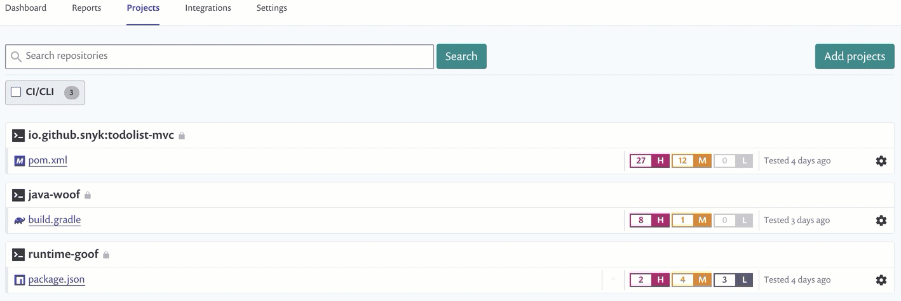
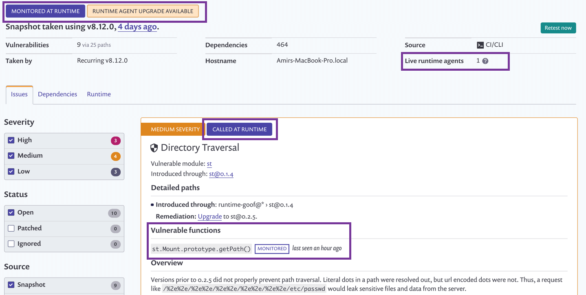

# Snyk runtime monitoring: an overview of the app interface


This feature is deprecated.


When Snyk runtime monitoring is successfully monitoring your projects, there are a few positive indications in the app:

* From the **Projects** tab, an animated indicator appears on the rows for all projects monitored at runtime:

 

From within a project that is monitored at runtime:

* **Monitored at Runtime** appears at the top of the project page.
* **Runtime agent upgrade available**, indicates we've updated the Snyk agent and we recommend you upgrade.
* **Live runtime agents**, displays the number of application instances running and monitored by Snyk at runtime
* **Called At Runtime** indicates that vulnerable functions were recently invoked in a monitored application instance. This tag appears only when vulnerable functions are called for a monitored project.
* Per vulnerability, the vulnerable functions are listed and **Monitored** appears next to those functions being watched at runtime.
* An indicator also displays how long it has been since one of the vulnerable functions was last called.

 

