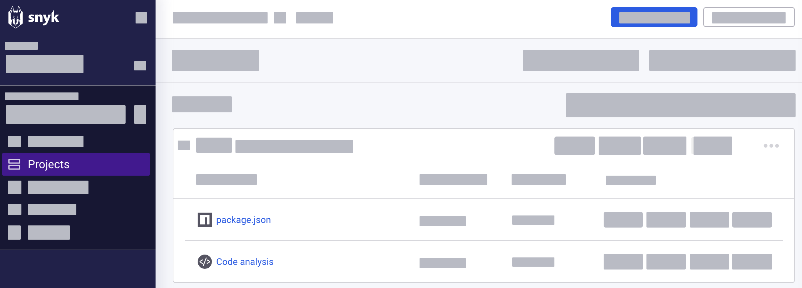

# Configure PR Checks

## Before you begin

A PR Check is counted as a test within your Organization's test count, including automatic checks of new commits in an open pull request (see[ What counts as a test](https://support.snyk.io/hc/en-us/articles/360000925418-What-counts-as-a-test-)). The number of tests is subject to the [pricing plans](../../more-info/plans.md).

## Prerequisites

To check for open source and licensing issues and code security, make sure that you meet the following conditions:

* Group Admin role to get access to all integration settings (see [Member roles](../../snyk-admin/manage-users-and-permissions/member-roles.md)).
* [Set up a Git repository integration](../../integrations/git-repository-scm-integrations/) (see the Snyk Training course: [Source code manager configuration](https://training.snyk.io/learn/course/source-code-manager-configurations)).
  * PR Checks rely on webhooks from the SCM. Integration scope must include the ability to create webhooks.
* [Import a Project](../../getting-started/quickstart/import-a-project.md) to have a working Git repository.
* For code security (Snyk Code), meet all of the above conditions and then contact your Snyk representative to enable the feature for you.&#x20;


PR Checks for Snyk Code is in Closed Beta and only available for Enterprise plans.


## Programming language support

PR Checks also support all programming languages supported by the Snyk Code and Open Source engines (see programming language support for [Snyk Code](../snyk-code/snyk-code-language-and-framework-support.md) and [Open Source](../snyk-open-source/snyk-open-source-supported-languages-and-package-managers/)).

## How the configuration works

You can configure PR Checks either [at the Integration level](configure-pr-checks.md#configure-pr-checks-at-the-integration-level) for your Snyk Organization or [for specific Snyk Projects](configure-pr-checks.md#configure-pr-checks-at-the-project-level) in an Organization.

* In your Organization, you can have multiple repository integrations, but the feature works only for those integrations that have been configured.
* At the Project level, the settings are inherited from the integration by default, but you can configure custom settings.

## Configure PR Checks at the integration level

Configure PR Checks on a specific Git repository you have already integrated with Snyk, such as GitHub.

The configuration settings apply to all Projects in that Organization. You can also extend the configuration to Projects with custom settings.

1. Open Snyk Web UI, go to **Settings >** **Integrations** section and then select your connected source code manager to open settings configuration.
2. To check for code issues, configure and save the following changes:

*   [ ] **Code Analysis**: Enable this option to fail the PR on new vulnerabilities detected in your Git repository. If the severity is higher than your threshold, the PR is not merged into the main branch.&#x20;

    * [ ] **Fail conditions**: Select the severity threshold at which the PR fails. For example, if you select **Medium**, the PR fails on issues found at this level or above, while it is merged for **Low** severity issues.

    <figure><figcaption>
PR check settings to analyze code issues
</figcaption></figure>


If you cannot see the **Code Analysis** section, make sure that your user has the Organization Admin role assigned and that the feature is enabled for Snyk Code (see [Prerequisites](configure-pr-checks.md#prerequisites)).


3. To check for open source and licensing issues, configure and save the following changes:

* [ ] **Open Source Security & Licenses**: Enable this option to fail the PR when open source and licensing issues found in the proposed changes exceed your specified severity threshold. In other words, if the severity is higher than your threshold, the PR is not merged into the main branch.
  * [ ] **Fail conditions**: Select one of the following PR failure conditions based on the security issues distribution.
    * [ ] **Only fail when the PR is adding a dependency with issues**: Set this condition when there is at least one dependency with security issues.
    * [ ] **Fail if the repo has any issues**: Set this condition for any security issues found in the Git repository.
  * [ ] **Only fail for high or critical severity issues**: Select additional failure conditions based on the severity threshold.
  * [ ] **Only fail when the issues found have a fix available**: Set this condition when the issue can be fixed automatically.

<figure><figcaption>
PR check settings to analyze open source and licensing issues
</figcaption></figure>

4. Either click **Save** to save the changes, or select the Save dropdown and click **Apply changes to all overridden Projects** to extend the current configuration to Projects with custom settings (see [Configure PR Checks at the project level](configure-pr-checks.md#configure-pr-checks-at-the-project-level)).

## Configure PR Checks at the Project level

You can configure PR Checks to work only for specific Projects:

1. Go to **Projects**, then expand the [target](../../manage-issues/introduction-to-snyk-projects/#target) containing your project.
2. Click a project name to open it. Based on the project type, you can choose the following:

* **package.json** to check for open source and licensing issues.
* **Code analysis** to check for security issues in your code.

<figure><figcaption>
Project level overview
</figcaption></figure>

6. Go to **Settings.**
7. On the left side, select your integration. For this example, GitHub has been integrated with Snyk.
8. Configure Project settings based on your Project type:

Configure for open source and licensing issues (click to expand)

1. In **Snyk test for pull request** select **Custom** to configure the settings.
2. Enable the option to fail the PR when open source and licensing issues found in the proposed changes exceed your specified severity threshold.
3. Configure the following settings:

* [ ] **Fail conditions**: Select one of the following PR failure conditions based on the security issues distribution.
  * [ ] **Only fail when the PR is adding a dependency with issues**: Set this condition when there is at least one dependency with security issues.
  * [ ] **Fail if the repo has any issues**: Set this condition for any security issues found in the Git repository.
* [ ] **Only fail for high or critical severity issues**: Select additional failure conditions based on the severity threshold.
* [ ] **Only fail when the issues found have a fix available**: Set this condition when the issue can be fixed automatically.

4. **Update Snyk pull request settings** to save changes.

Configure for code analysis (click to expand)

1. In **Snyk Code for pull request** select **Custom** to configure the settings.
2. Enable this option to fail the PR when the security issues found in the proposed changes exceed your specified severity threshold.
3. Configure the following settings:

* [ ] **Minimal severity to fail PR check**: Select the severity threshold at which the PR fails. For example, if you select **Medium**, the PR fails on issues found at this level or above, while it is merged for **Low** severity issues.

4. **Update Snyk pull request settings** to save changes.

###
