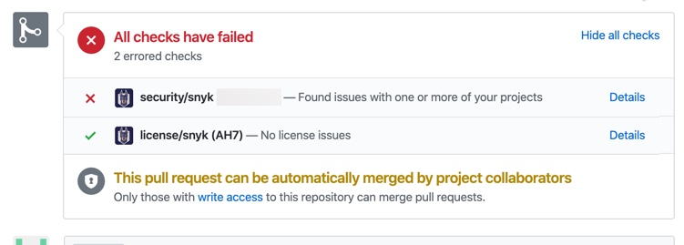
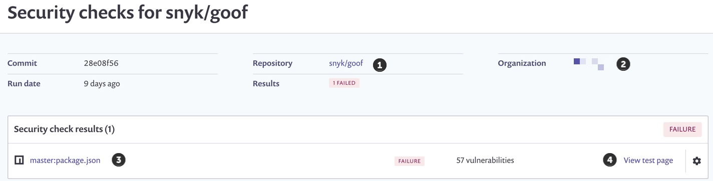
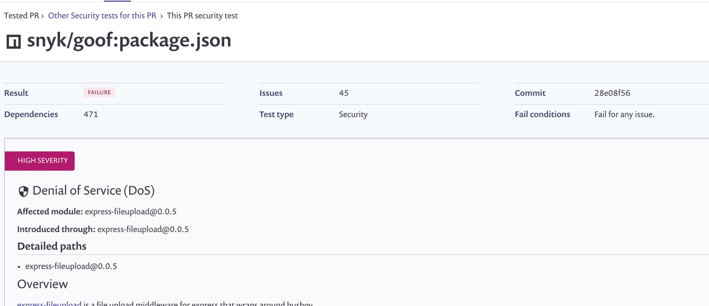

# Snyk checks on pull requests

By default, Snyk scans every pull request submitted to your monitored repositories, displaying the results and recommendations grouped together in a single security check and a single license check, regardless of the number of manifest files in the repository.


Administrators and account owners manage settings for Snyk PR tests from our app on both the organization and the project levels, configuring whether the feature is on (enabled by default) and under what conditions Snyk should fail your PR checks.



Currently, Snyk checks on pull requests is not compatible with **Dockerfile.**


## Viewing check details

If a test fails for any of the lines in your pull request, the check itself appears as failed from the pull request; if all of the tests pass, the check itself appears as successful from the pull request:

To view the check results for all of the manifest files, click the **Details** link for the full list of tests and the results per file, directly from our interface.

From this view, click the links for additional information as follows:

* Click the repository link (1) to go back to the Git repository
* Click the Organization link (2) to view all projects in this Snyk organization
* Click the manifest file link (3) to view the Project details page with full details for all vulnerabilities affecting this project
* Click the View test page link (4) to view full details regarding this pull request and the issues preventing the check from passing

When Snyk tests your pull requests, the following are the possible statuses that can be displayed from this page, in the Results field:

* **Success** - no issues are identified and all checks pass
* **Processing** - this status appears until the Snyk test ends
* **Failure** - when issues are identified that must be fixed in order for the check to pass
* **Error** - an error occurs when your manifest file is out of sync, Snyk couldn't read the manifest file, or Snyk couldn't find the manifest file
* **Canceled** - Snyk test can't run because you've reached your monthly test limit
