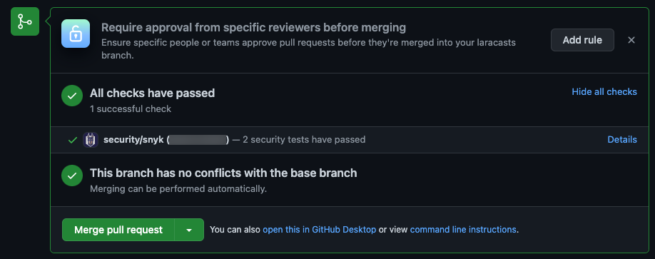
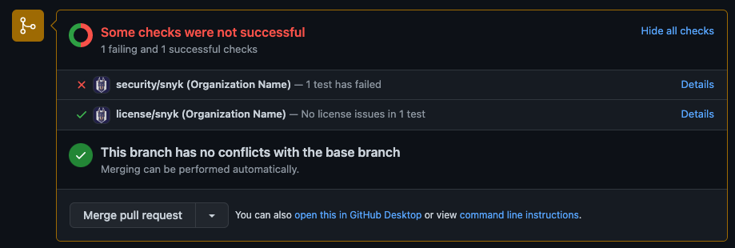

# Using PR Checks for Snyk Open Source


Look familiar? [Snyk Code](../pr-checks-for-snyk-code/viewing-the-pr-checks-in-your-scm.md) and Snyk Open Source use PR Checks in the same way with the same configurations.


After you enabled the Automatic PR Checks feature on the Organization or Project level, you can view the status of your new PRs in your integrated SCM.


PR Checks for Snyk Open Source are grouped and displayed in another row, called **security/snyk**.


The following statuses can appear on your Snyk PR checks in the integrated SCM:

* **Passed/successful** - no issues were discovered, and all the checks have passed.\
  **Note**: If you selected to manually pass failed checks via the Web UI, the checks will be displayed as “**passed**” in the SCM, but there will be an indication that the PR check was **Skipped**, and that a specific Snyk user forced this result change. For more information, see [Marking failed PR checks as successful](../pr-checks-for-snyk-code/viewing-and-working-with-the-pr-check-results-on-the-snyk-web-ui.md#\_ref105582006).
* **Pending** - this status appears until the test has completed.
* **Failed** – security issues were identified in the PR. These issues must be fixed in order to pass the PR check.

### **View the PR checks in your repository**


The instructions below use GitHub, but they apply to all supported Git repositories, with some minor differences. For more information, see [Exploring the display of the PR Checks on different integrated Git repositories](using-pr-checks-for-snyk-open-source.md#\_ref105582759).


1\. In your repository, after you finished creating a new PR, click the **Create** **pull request** button. Snyk automatically checks the PR you created, and displays the results of the check – either **Failed** or **Passed**:

<figure><figcaption></figcaption></figure>

2\. To view the details of the issues that were found in the PR on the Snyk Web UI, click the **Details** link on the left:

The Snyk Web UI opens, displaying the details of the issues that were found in the PR:

You can now [view and work with the discovered PR Check issues on the Web UI](../pr-checks-for-snyk-code/viewing-and-working-with-the-pr-check-results-on-the-snyk-web-ui.md).

<figure><figcaption></figcaption></figure>

### Exploring the display of the PR Checks on different Git repositories 

PR Checks works in a similar way on all supported Git repositories, but the results are displayed differently on each one.

#### **GitHub and GitHub Enterprise**

**Notes**:

* The PR Check results appear in the same way on GitHub and GitHub Enterprise integration.
* The instructions in this entire PR Checks section include screenshots from GitHub integration.

The results of the PR Checks appear on GitHub and GitHub Enterprise integrations as follows:

<figure><figcaption></figcaption></figure>

**To open the Snyk Web UI to view additional details on the PR Check results:**

* On the results area, click the **Details** link on the **repo/snyk** **(organization name)** row.
