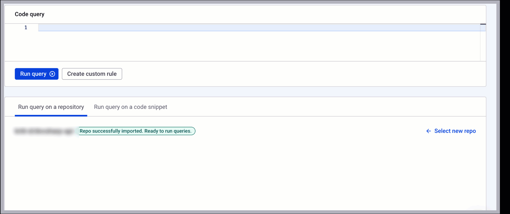
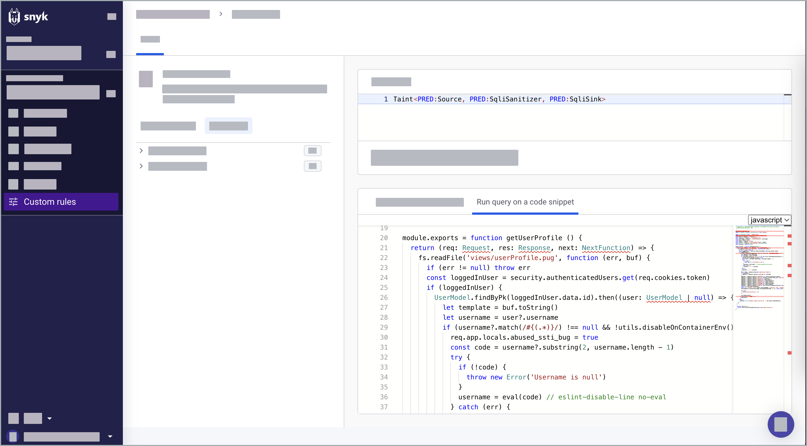

# Run query

## Conditions

* If you re-imported Projects in Snyk, you need to **Select new repo** in **Custom rules** or wait for the next automated scan cycle.\
  :link: [Re-importing existing repositories for the Snyk Code test](../snyk-code-and-your-repositories/re-importing-existing-repositories-for-snyk-code-testing.md)&#x20;
* The query language is case-sensitive.

## Run a query on a repository

Run queries against a repository from your Snyk Project list. The list contains repositories you previously uploaded to Snyk.

1. Open Snyk Web UI and go to your Group and Organization.
2. Go to **Custom rules**.
3. (Optional) in the **Get Started** panel, you can access the following:
   * Query examples: Examples of highly requested queries.
   * [Query Templates](how-custom-rules-work.md#query-templates): Pre-built templates of logical operators, conditions, and other components.
   * [Query Predicates](how-custom-rules-work.md#query-predicates): Predefined criteria and conditions to be included in the result.
4. Go to **Run query on a repository** > **Repositories** and select a repo where you want to run the query. The repo is imported after you select it.&#x20;
5. (Optional) If a repository is already selected, click **Select new repo** to run the query.
6.  Write your query in the **Code query** panel with [suggestive AI support](how-custom-rules-work.md#suggestive-ai-support).&#x20;

    <figure><figcaption>
Writing a query
</figcaption></figure>
7. **Run query**.
8. [Analyze query results](run-query.md#analyze-query-results).
9. (Optional) [Save the custom rule you created](run-query.md#save-custom-rule).

:link: [Query examples](query-examples.md)

## Run a query on a code snippet

Run queries against code snippets to detect vulnerabilities, review and audit code, and assess compliance and regulatory requirements.

1. Open Snyk Web UI and go to your Group and Organization.
2. Go to **Custom rules**.
3. Select **Run query on a code snippet**.
4. Select the programming language from the dropdown list and paste your code inside.


You can run queries only on certain languages in the code snippet area. See the dropdown menu for the full list of available languages.


<figure><figcaption>
Running a query on a code snippet
</figcaption></figure>

5. [Analyze query results](run-query.md#analyze-query-results).
6. (Optional) [Save the custom rule you created](run-query.md#save-custom-rule).

## Analyze query results

When you run a query, the results show the matching parts of the tested code, highlighting which parts of the code are related to the query. Each match is shown when testing a repository and can be triaged per finding.

\
