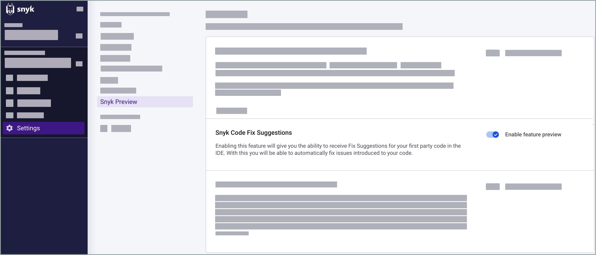

# Fix code issues automatically with DeepCode AI Fix Suggestions


DeepCode AI Fix Suggestions is in [Open Beta](../../more-info/snyk-feature-release-process.md) and fully supports Javascript frameworks.

:link:  [Enable DeepCode AI Fix Suggestions](fix-code-issues-automatically-with-deepcode-ai-fix-suggestions.md#enable-deepcode-ai-fix-suggestions)


Fix the source code's security issues and quality flaws through an automated flow. DeepCode AI Fix Suggestions calculates the most suitable solution for your issues and applies it automatically.

## Why use Fix Suggestions

Fix Suggestions combines the power of a thorough program analysis engine with the abilities of an in-house deep learning-based large language model. This merger allows for compiling large amounts of unstructured language information from [open source code](fix-code-issues-automatically-with-deepcode-ai-fix-suggestions.md#what-data-does-snyk-code-fix-suggestions-collect).

Two key features set Fix Suggestions apart. Firstly, it has a neural network trained on millions of lines of code, allowing for greater versatility and creativity. Secondly, the [Snyk Code engine](snyk-code-local-engine.md) rigorously checks the network's suggestions, ensuring all automated fixes are small and targeted to each vulnerability or code issue.

## What issues can you fix automatically

You can address various issues detected by the Snyk Code engine, both in terms of quality, promoting best code practices, and security vulnerabilities. DeepCode AI Fix currently does not support inter-file fixes.&#x20;

## How Fix Suggestions works

A representation of information flow involved in fixing one issue is presented in the table below.

<table><thead><tr><th width="211">Stage</th><th data-type="select">Subsystem</th><th>Details</th></tr></thead><tbody><tr><td>Code scan and   discovery of issues</td><td></td><td>Corresponds to a normal flow of scanning the code from IDE.</td></tr><tr><td>Code preprocessing and minimization w.r.t. the data flow of the particular issue \mathcal{I}</td><td></td><td>Data flow of \mathcal{I} is analyzed and code is minimized, keeping the relevant context only.</td></tr><tr><td>Generating k candidate fixes for the given issue \mathcal{I}</td><td></td><td>Here, k is an implementation parameter.</td></tr><tr><td>Candidate fixes ranking and self-assessment</td><td></td><td>Each of the  k fixes is assessed by the Code Engine, filtering out those rendering invalid code or failing to fix the issue (issue persists).</td></tr><tr><td>Returning the best candidate fix </td><td></td><td>The system has finished.</td></tr></tbody></table>

## Requirements

* **Snyk Security - Code, Open Source Dependencies, IaC Configurations** **IDE plugin**. Available for IDE plugins that use Language Server, such as [VS Code](https://marketplace.visualstudio.com/items?itemName=snyk-security.snyk-vulnerability-scanner-preview) and [Eclipse](https://marketplace.eclipse.org/content/snyk-security-code%E2%80%8B-open-source%E2%80%8B-iac-configurations).
* Available in the USA Multi-Tenant region. \
  :link: [What regions are available?](../../more-info/data-residency-at-snyk.md#what-regions-are-available)

## Language support

Fix Suggestions supports only [Javascript](snyk-code-language-and-framework-support.md#javascript-frameworks).

## Enable DeepCode AI Fix Suggestions

Enable DeepCode AI Fix Suggestions for your Organization in Snyk Web UI by navigating to **Settings** > **Snyk Preview**.

<figure><figcaption>
DeepCodeAI Fix Suggestions settings in Snyk Preview
</figcaption></figure>


**Before you begin**

Save the file before fixing an issue, as it requires clean code (saved code) to provide a fix.\

When you save the code, it is recommended to re-run the analysis to show code actions, such as **Fix this issue**. \

You can request a fix by clicking **Fix this issue** in Code Lense and then saving the file. If your plugin settings are set to test automatically when saving, it will trigger the Snyk Code Analysis, and as a result, the issue disappears.


## Example: Fix code issue automatically

Consider the following scenario where hardcoded credentials are fixed using DeepCode AI Fix Suggestions.

Snyk highlights hardcoded credentials as a vulnerability by adding a **Fix this issue** element in the IDE.

<figure><figcaption>
Discovering a vulnerability in the code
</figcaption></figure>

The issue is fixed by replacing the credentials with environment variables.

<figure><figcaption>
Fix applied with DeepCode AI Fix 
</figcaption></figure>

You can follow through the entire sequence in this short (12-second) video.

<figure><figcaption>
Fix hardcoded credentials with DeepCode AI Fix
</figcaption></figure>

## What data does DeepCode AI Fix Suggestions collect

The Large Language Model (LLM) is trained exclusively on public repositories with permissive licenses. If a repository's license changes after the initial scrape, it is immediately excluded from the training data. During the inference, DeepCode AI Fix Suggestions does not collect or send the client data to third parties.

The data collection process is thorough and includes the following:

* Static analysis
* Automated assessment of the suggested fix qualities
* Partial in-house labeling by humans

The training data is ensured to be of the highest quality to optimize the performance of the LLM.

:link: [How Snyk handles your data](../../more-info/how-snyk-handles-your-data.md)
