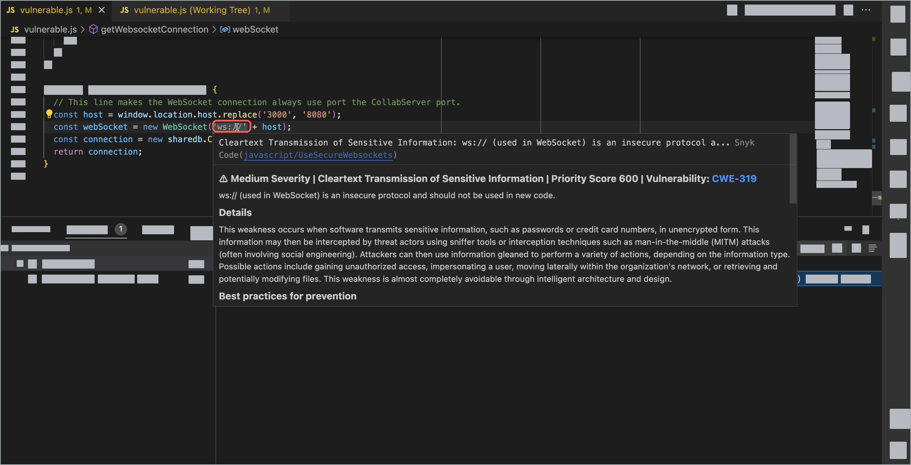
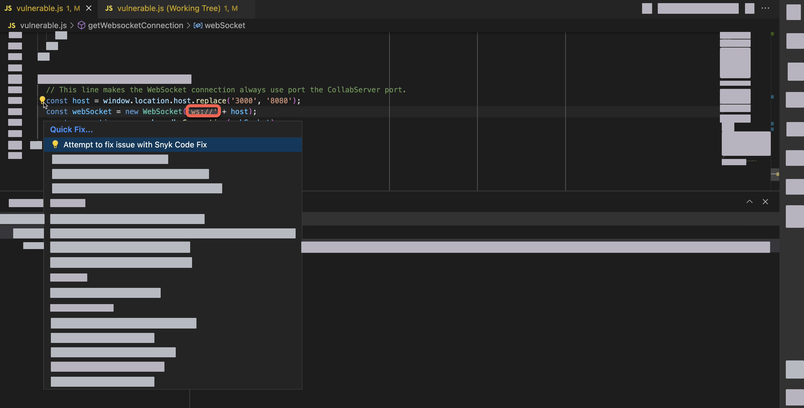
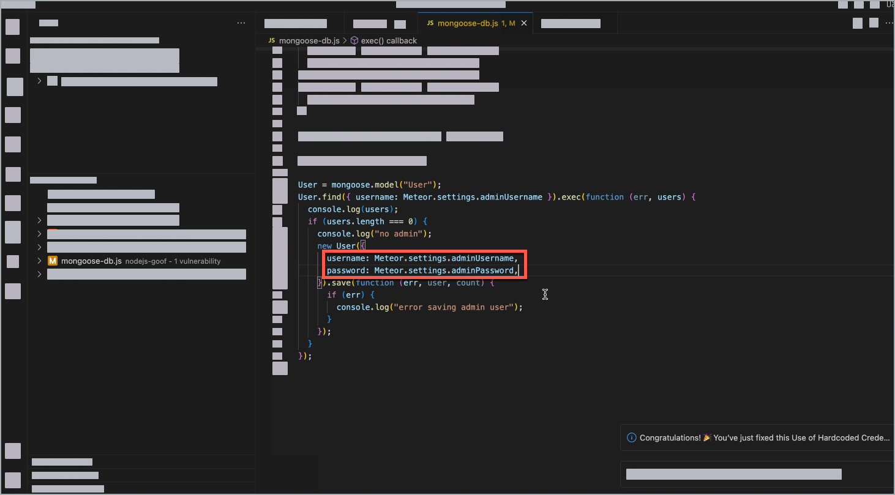

# Fix code issues automatically with Snyk IDE plugin (beta)


Snyk Code Fix Suggestions is in [Open Beta](../../more-info/snyk-feature-release-process.md) and fully supports Javascript frameworks.

:link: See [Enable Snyk Code Fix Suggestions](fix-code-issues-automatically-with-snyk-ide-plugin-beta.md#enable-snyk-code-fix-suggestions).


Fix the source code's security issues and quality flaws through an automated flow. Snyk Code Fix Suggestions calculates the most suitable solution for your issues and applies it automatically.

## Why use Fix Suggestions

Fix Suggestions combines the power of a thorough program analysis engine with the abilities of an in-house deep learning-based large language model. This merger allows for compiling large amounts of unstructured language information from [open source code](fix-code-issues-automatically-with-snyk-ide-plugin-beta.md#what-data-does-snyk-code-fix-suggestions-collect).

Two key features set Fix Suggestions apart. Firstly, it has a neural network trained on millions of lines of code, allowing for greater versatility and creativity. Secondly, the [Snyk Code engine](deployment-options/snyk-code-local-engine/introduction.md) rigorously checks the network's suggestions, ensuring all automated fixes are small and targeted to each vulnerability or code issue.

## What issues can you fix automatically

You can address a range of issues detected by the Snyk Code engine, both in terms of quality, promoting best code practices, and security vulnerabilities such as [SQL Injection](https://snyk.io/learn/sql-injection/) or [SSRF](https://learn.snyk.io/lessons/ssrf-server-side-request-forgery/javascript/).

## How Fix Suggestions works

A representation of information flow involved in fixing one issue is presented in the table below.

<table><thead><tr><th>Stage</th><th data-type="select">Subsystem</th><th>Details</th></tr></thead><tbody><tr><td>Code scan and   discovery of issues</td><td></td><td>Corresponds to a normal flow of scanning the code from IDE.</td></tr><tr><td>Code preprocessing and minimization w.r.t. the data flow of the particular issue \mathcal{I}</td><td></td><td>Data flow of \mathcal{I} is analyzed and code is minimized, keeping the relevant context only.</td></tr><tr><td>Generating k candidate fixes for the given issue \mathcal{I}</td><td></td><td>Here, k is an implementation parameter.</td></tr><tr><td>Candidate fixes ranking and self-assessment</td><td></td><td>Each of the  k fixes is assessed by the Code Engine, filtering out those rendering invalid code or failing to fix the issue (issue persists).</td></tr><tr><td>Returning the best candidate fix </td><td></td><td>The system has finished.</td></tr></tbody></table>

## Requirements

* Snyk IDE Plugin (see [available Snyk plugins and extensions](../../integrations/ide-tools/)). Available for IDE plugins that use Language Server, such as VS Code and Eclipse.
* Available in the USA Multi-Tenant region (see [available regions](../../more-info/data-residency-at-snyk.md#what-regions-are-available)).

## Language support

Fix Suggestions supports only [Javascript](snyk-code-language-and-framework-support.md#javascript-frameworks).

## Enable Snyk Code Fix Suggestions

Enable Snyk Code Fix Suggestions for your Organization in Snyk Web UI by navigating to **Settings** > **Snyk Preview**.

<figure><figcaption>
Snyk Code Fix Suggestions settings in Snyk Preview
</figcaption></figure>

## Example: Fix code issue automatically

Consider the following scenario where an insecure WebSocket protocol is fixed using Snyk Code Fix Suggestions.

1. When selecting the code, Snyk reveals the `ws` protocol to be insecure, with detailed information about the vulnerability.&#x20;

<figure><figcaption>
Discovering a vulnerability in the code
</figcaption></figure>

2. Clicking the:bulb: lightbulb in the IDE shows the **Quick Fix** dropdown, where **Attempt to fix issue with Snyk Code Fix** is selected.

<figure><figcaption>
Attempting to fix issue with Snyk Code Fix
</figcaption></figure>

3. The insecure protocol is replaced by `wss`, a secure version of the WebSocket protocol.

<figure><figcaption>
Fix applied with Snyk Code Fix 
</figcaption></figure>

You can follow through the entire sequence in this short (13-second) video.

<figure><figcaption>
Fixing WebSocket protocol vulnerability using Snyk Code Fix 
</figcaption></figure>

## What data does Snyk Code Fix Suggestions collect

The Large Language Model (LLM) is trained exclusively on public repositories with permissive licenses. If a repository's license changes after the initial scrape, it is immediately excluded from the training data.&#x20;

During the inference, Snyk Code Fix Suggestions does not collect the the client data, neither it sends it to third parties.

The data collection process is thorough and includes the following:

* Static analysis
* Automated assessment of the suggested fix qualities
* Partial in-house labeling by humans

The training data is ensured to be of the highest quality to optimize the performance of the LLM.

:link:See [How Snyk handles your data](../../more-info/how-snyk-handles-your-data.md).

