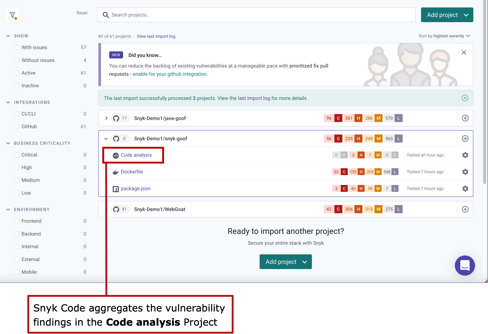
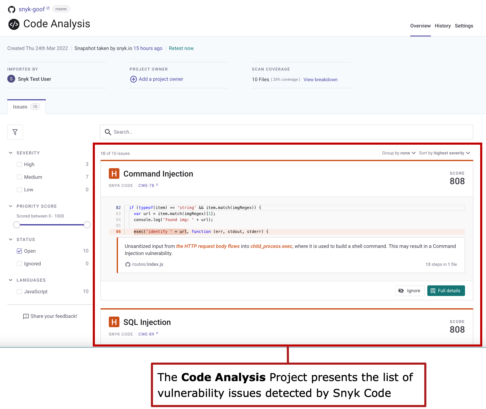

# Getting started with Snyk Code

You can use Snyk Code in the [Snyk Web UI ](../../../getting-started/quickstart/create-a-snyk-account/logging-in-to-an-existing-account.md)(including [PR Checks](../../run-pr-checks/)), with [IDEs](../../../integrations/ide-tools/), and through the [Snyk CLI](../../../snyk-cli/) and [Snyk API](../../../snyk-api-info/).

If you are using Snyk Code in your IDE or through the Snyk CLI with or without the Snyk API, ensure you have the [prerequisites](./#prerequisites-for-using-snyk-code) and then [enable the **Snyk Code** option](enabling-the-snyk-code-option-in-an-organization.md) in the Snyk Web UI. You can then use Snyk Code to test your code.

If you are using Snyk Code with the API but not the CLI, you must also [integrate your SCM via the Web UI](integrating-your-source-control-system-with-your-snyk-account.md).

If you are using Snyk Code in the Web UI, after ensuring you have the [prerequisites](./#prerequisites-for-using-snyk-code), follow the steps in [How to activate Snyk Code](./#how-to-activate-snyk-code).

## **Prerequisites for using Snyk Code**

To start using Snyk Code, you must have the following:

* A Snyk account\
  For more information on creating a Snyk Account, see [Create a Snyk account](../../../getting-started/quickstart/create-a-snyk-account/).
* A supported Source Code Management (SCM) system that is integrated with your Snyk account\
  Snyk Code supports the following SCMs: GitHub, GitHub Enterprise, GitLab Cloud, Bitbucket Cloud, Bitbucket Server, and Azure Repos.\
  For more information on integrating your SCM with your Snyk account, see [Snyk Code - Supported integrations](../snyk-code-key-features/snyk-code-supported-integrations.md).
* Repositories with code in a supported language and platform\
  Snyk Code creates an abstract syntax tree without compiling the code. This requires code to be valid and syntactically correct, including package import statements for components stored in other files or folders.\
  For more information, see [Snyk Code - Supported languages and frameworks](../snyk-code-language-and-framework-support.md).

## **How to activate Snyk Code**

To activate Snyk Code for use in the [Snyk Web UI](../../../getting-started/quickstart/create-a-snyk-account/logging-in-to-an-existing-account.md) follow these steps:

1. [Enable the Snyk Code option in your Snyk Organization settings](enabling-the-snyk-code-option-in-an-organization.md).\
   If you are using Snyk Code in your IDE or through the Snyk CLI with or without the Snyk API, this is the only step you need to do.
2. [Integrate your Source Control Management system with your Snyk account](integrating-your-source-control-system-with-your-snyk-account.md).\
   If you are using Snyk Code with the API but not the CLI, you must also do this step.
3. [Import repositories from your SCM to test with Snyk Code](importing-repositories-for-snyk-code-testing.md).

After you activate Snyk Code and import repositories to Snyk for testing, you can view and work with the Snyk Code test results, which include vulnerabilities and fixes, as described on the page [Exploring and working with the Snyk Code results](../exploring-and-working-with-snyk-code-results-in-the-web-ui/)_._

## **Viewing the Snyk Code results**

During the process of importing your selected repositories, Snyk Code automatically analyzes your imported code to find potential vulnerabilities. All the vulnerability findings that Snyk Code detects in the code of one imported repository are aggregated in one Snyk Project, called Code analysis:

<figure><figcaption>
Code analysis Project
</figcaption></figure>

Unlike other Snyk products, which create a separate Snyk Project for each imported file, Snyk Code creates one Snyk Project for all the imported files of one repository. All the vulnerabilities detected in the code in the repository are aggregated in one Project, and the Snyk Code results can present the data flow of a vulnerability across multiple files.

To view all the security vulnerabilities that Snyk Code detected in your imported code, click the **Code analysis** Project, and explore the details of each vulnerability:

<figure><figcaption>
Vulnerabilties in the Code Analysis Project
</figcaption></figure>

If your Snyk Account is already integrated with your SCM and contains imported repositories, Snyk Code may already be active in your Organization settings and running. In this case, you can check to see if your existing repositories are already being tested by Snyk Code by searching for the **Code analysis** Project in your Target folders. If a **Code analysis** Project exists in your imported repositories, you can proceed to the page [Exploring and working with the Snyk Code results](../exploring-and-working-with-snyk-code-results-in-the-web-ui/).

You may find this information about repositories and Snyk Code useful as you begin to work with Snyk Code results:

* [Importing additional repositories to Snyk](../snyk-code-and-your-repositories/importing-additional-repositories-to-snyk.md)
* [Excluding directories and files from the import process](../snyk-code-and-your-repositories/excluding-directories-and-files-from-the-import-process.md)
* [Removing imported repositories from the Snyk Code test](../snyk-code-and-your-repositories/removing-imported-repositories-from-snyk-code-testing.md)

##
