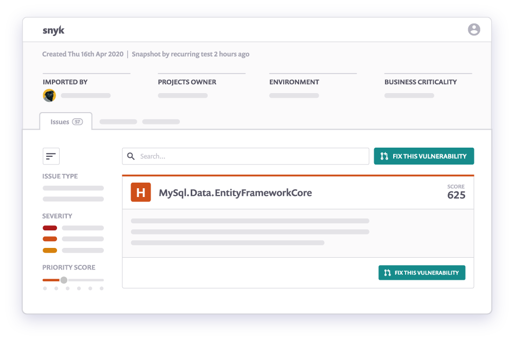

# Snyk CLI for container security

The Snyk Container command line interface ([CLI](../../../snyk-cli/)) helps you find and fix vulnerabilities in container images on your local machine.

To use the CLI, you must first [install](../../../snyk-cli/install-or-update-the-snyk-cli/) it and then [authenticate](../../../snyk-cli/commands/auth.md).

## Testing an image

To test an image, run the `container test` command, for example:

```
snyk container test debian
```

This command does the following:

1. Downloads the image if it is not already available locally in your Docker daemon
2. Determines the software installed in the image
3. Sends that bill of materials to the Snyk service
4. Returns a list of the vulnerabilities in your image

You can use Snyk to test any image you can pull from a remote registry or any image you have built locally and made available in your local Docker daemon.

```
snyk container test <repository>:<tag>
```

If you use a Dockerfile to build your image, you can specify that when running `snyk container test`.

```
snyk container test <repository>:<tag> --file=Dockerfile
```

Specifying a Dockerfile provides more context and allows Snyk to provide clear recommendations on how to fix discovered vulnerabilities.

As of January 24, 2023, Snyk [detects application vulnerabilities](https://docs.snyk.io/products/snyk-container/getting-around-the-snyk-container-ui/detecting-application-vulnerabilities-in-container-images#using-cli-to-detect-vulnerabilities) in your image by default.

## Monitoring an image

Snyk Container also allows you to [monitor an image](https://snyk.io/learn/container-security/container-monitoring/). This provides the following advantages:

* Snyk alerts you if new vulnerabilities are disclosed that affect your image without your having to retest your image locally.
* Snyk interactively filters the results and explores the list of vulnerabilities in your web browser.
* You can share results on Snyk with other members of your team.

You can also access aggregate reports of vulnerabilities across all of your Projects,


**Feature availability**\
This aggregate reports feature is available with all paid plans. See [pricing plans](https://snyk.io/plans/) for more details.


To monitor an image, run the `container monitor` command:

```
snyk container monitor <repository>:<tag>
```

This command does the following:

1. Downloads the image if it is not already available locally in your Docker daemon
2. Determines the software installed in the image
3. Sends that bill of materials to the Snyk service
4. Returns a link to the Snyk service, where you can see the results

<figure><figcaption><p>Recommendatios for upgrading the base image</p></figcaption></figure>


It is common to use both `test` and `monitor` with Snyk Container. The `test` command is great for quick checks. The `monitor` command can be used for ongoing assurance and easier sharing of results.


## More information for Snyk Container CLI

* [Understanding Snyk Container CLI results](understanding-snyk-container-cli-results.md)
* [Advanced Snyk Container CLI usage](advanced-snyk-container-cli-usage.md)
* Learn more about [container security](https://snyk.io/learn/container-security/)
