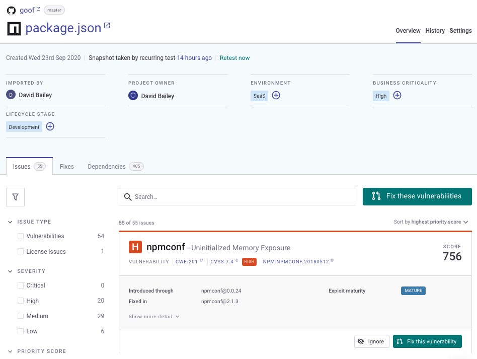
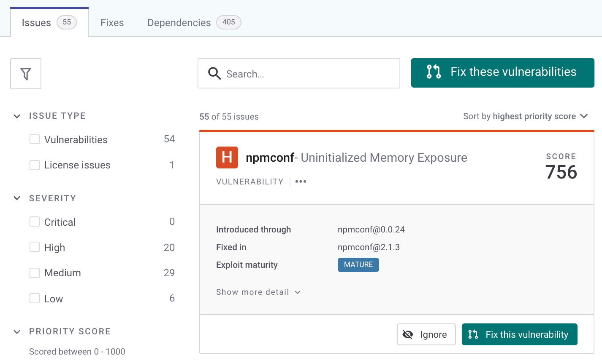

# Start using Snyk Open Source

Use Snyk Open Source to scan and fix vulnerabilities in the Open Source libraries used in your application for a [supported language and package manager](../../scan-applications/supported-languages-and-frameworks/), such as Java. For more information, see [Supported languages and frameworks](../../scan-applications/supported-languages-and-frameworks/).


This shows how to start using Snyk Open Source on the [Snyk Web UI](../../getting-started/quickstart/create-a-snyk-account/logging-in-to-an-existing-account.md) with a Git-based source repository.

* You can also use an [IDE tool](../../integrations/ide-tools/) or a [CI/CD integration](../../integrations/snyk-ci-cd-integrations/). For more information, see  [Integrations](../../integrations/).
* You can also [use Snyk Open Source from the CLI](use-snyk-open-source-from-the-cli/).


## **Prerequisites for Snyk Open Source**

Ensure you have done the following:

* [Created a Snyk account](../../getting-started/quickstart/create-a-snyk-account/).
* [Set up integration](../../getting-started/quickstart/set-up-an-integration.md) with your code repository on a supported system such as GitHub.
* [Imported a Snyk Project for scanning](../../getting-started/quickstart/import-a-project.md)

See the [Getting started](../../getting-started/) section for more details.

## View vulnerabilities

You can view vulnerability results for imported Projects. The **Projects** page appears by default after import, showing vulnerability information for the Snyk Projects you have imported, grouped into Targets, that is, the repositories you have scanned.

You can expand a Target to see vulnerability information for Projects, including the number of issues found, grouped by severity level:

<figure><figcaption>
Projects page
</figcaption></figure>

Click a Project to open the issues page for that Project where you will see the issue cards, showing the module where each issue was introduced, how to fix it, and more details about the vulnerability itself.

<figure><figcaption>
Open Source Project issues page
</figcaption></figure>

See [View Project information](../../snyk-admin/introduction-to-snyk-projects/view-project-information.md) for more details.

## Fix vulnerabilities

For some languages, Snyk can fix vulnerabilities using fix pull/merge requests. For more information, see [Automatic and manual PRs with Snyk Open Source](open-source-basics/).

Navigate to the **Issues** card for a Project:

<figure><figcaption>
Issues tab in Open Source Project
</figcaption></figure>

To fix vulnerabilities:

1. Click **Fix this vulnerability** to open a fix PR for this issue; click **Fix these vulnerabilities** to fix multiple issues.
2. The **Open a Fix PR** screen opens, displaying the selected vulnerabilities.
3. Check or uncheck the issues you want to fix or remove from this fix.
4. Scroll to the bottom of the screen and click **Open a Fix PR**.
5. Snyk acts on the PR and displays a results screen.
6. Optionally, select the **Files changed** tab to see details of the changes made.

<figure><figcaption>
Files changed tab in GitHub after triggering Fix PR for an open source project
</figcaption></figure>

See [Fix your vulnerabilities](../../scan-applications/snyk-open-source/manage-vulnerabilities/fix-your-vulnerabilities.md) for more details.
