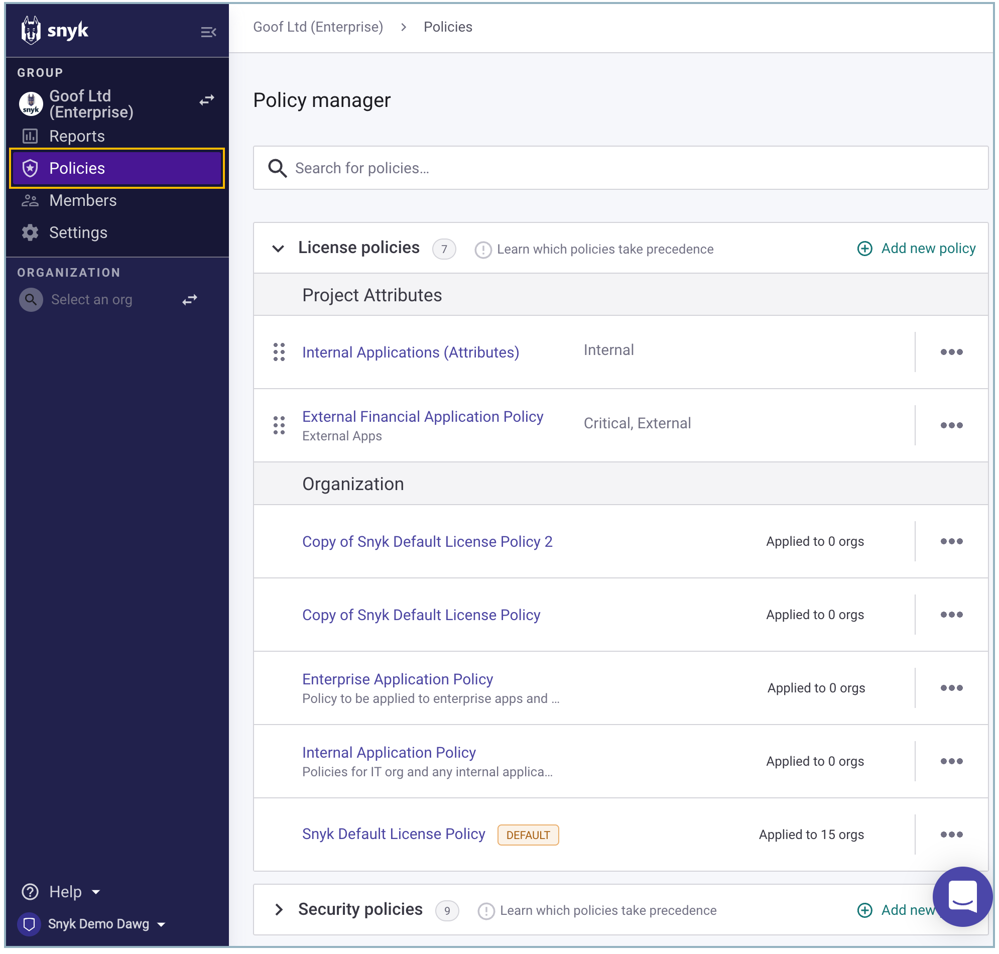

# License policies

Group administrators can [access and set license policy rules](setting-a-license-policy.md) by clicking **Policies** in the Group Overview page.

<figure><figcaption>
Policies overview
</figcaption></figure>

There is an initial policy that is created automatically and set as the default. The default license policy contains the **Snyk Default License Policy**, but the rules can be edited to match your preferences.

Any new Organizations that are created in your group are automatically added to the default policy. When an Organization is created, it can be moved to a different policy.
