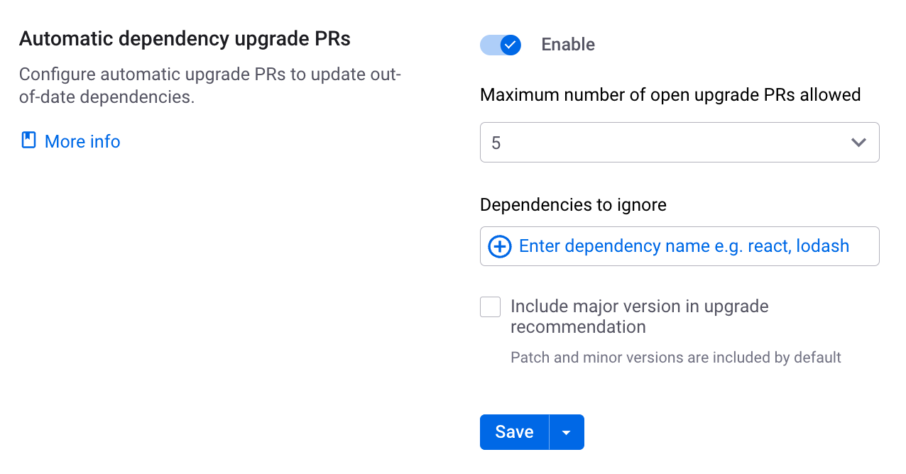

# Upgrading dependencies with automatic PRs

After importing the chosen Git repositories to Snyk, Snyk continuously monitors these repositories by scanning them for vulnerability, license, and dependency health issues. In addition to providing fix advice, Snyk also creates pull requests (PRs) on your behalf (configured by you).

## Supported languages and SCMs

Snyk currently supports the **Automatic dependency upgrade pull requests** feature for npm, Yarn, and Maven-Central repositories via the following Source Control Managers (SCMs): GitHub, GitHub Enterprise, and Bitbucket Cloud.

You can also use this feature with the Snyk Broker. To use this feature, Snyk Broker must be upgraded to a minimum of v. 1.4.55.0 or later. For more information, see [Upgrade your Snyk Broker client](upgrading-dependencies-with-automatic-prs.md#enabling-the-automatic-dependency-upgrade-prs-option).

<figure><figcaption>
Snyk Bot conversation card in GitHub
</figcaption></figure>

## Automatic dependency (upgrade) PRs

1. The **Automatic dependency upgrade pull requests** option is enabled (in [the Integration Settings at the Organization level](upgrading-dependencies-with-automatic-prs.md#enabling-the-automatic-dependency-upgrade-prs-option-for-an-entire-organization) or in [the Project Settings](../../../enterprise-setup/snyk-broker/upgrade-the-snyk-broker-client.md#upgrade-your-snyk-broker-client)).
2. When you import repos to Snyk, Snyk scans the repos and provides you with the scan results. Snyk then continues to monitor your Open Source Projects, scanning them on a regular basis.
3. Per scan, when new versions for your dependencies are identified, Snyk does the following:
   * Snyk creates automatic upgrade PRs.


The re-scan frequency is based on the schedule set in the Project Settings.


* Snyk does not open a new upgrade PR for a dependency that is already changed (upgraded or patched) in another open Snyk PR.
* Snyk opens separate PRs for each dependency.
* By default, Snyk does not create upgrade PRs for a Project that has 5 or more open Snyk PRs. If the limit of open PRs is reached, no new PRs are created. This limit number can be set to be between 1-10 on the Integration or Project Settings. This limit only applies to Upgrade PRs, but it does count Fix PRs. However, Fix PRs are not limited in this way.
* By default, Snyk recommends only patches and minor upgrades. However, recommendations for major version upgrades can be requested on the **Settings** page where the feature is enabled.
* If the latest eligible version contains vulnerabilities that are not found yet in your Project, Snyk will not recommend an upgrade.
* Snyk does not recommend upgrades to versions that are less than 21 days old. This is to avoid versions that introduce functional bugs and are subsequently unpublished or versions that are released from a compromised account (An account for which the account owner has lost control to someone with malicious intent).

## Enabling the Automatic dependency upgrade PRs option

You can configure Snyk to regularly check your dependency health, recommend dependency upgrades, and automatically submit PRs for upgrades on your behalf for an entire Organization or a specific Project. Once configured, Snyk automatically creates PRs for all the necessary dependencies as upgrades become available for the scanned Projects.

By default, the Project Settings inherit the Organization Settings. However, when the Settings on the Organization and Project levels are different, the Project Settings override the Organization Settings.


**Reminder**

Automatic dependency upgrade PRs are only available for the following SCM integrations: GitHub, GitHub Enterprise, and Bitbucket Cloud.


### Enabling the Automatic dependency upgrade PRs option for an entire Organization

**To configure automatic upgrade PRs for an entire Organization:**

1. On the Snyk Web UI, open the required Organization.
2.  Go to  **Settings > Organization Settings > Integrations,** find your configured SCM, and click **Edit settings** at the end of the row for that integration.

    <figure><figcaption>
Editing integration settings
</figcaption></figure>
3. On the **Settings** page of the selected integration, scroll down to the **Automatic dependency upgrade pull requests** section.
4. On the **Automatic dependency upgrade pull requests** section perform the following:

* Slider - change to **Enable**.
* **Maximum number of open upgrade PRs allowed** – define how many open Snyk PRs a Project can have, in order to also receive a dependency upgrade PR (maximum of 10). When the limit of the open PRs is reached, no new upgrade PRs are created.
* **Include major version in upgrade recommendation** – select whether to include major version upgrades in the recommendations. By default, only patches and minor versions are included in the upgrade recommendations.
* **Dependencies to ignore** – enter the exact name of the dependencies that should NOT be included in the **Automatic upgrade** operation. You can only enter lowercase letters.

<figure><figcaption></figcaption></figure>

5. To save and apply your changes, click one of the following:\
   

* **Save**  – your changes are saved and will be applied to all the Projects in the Organization that are configured to inherit these Settings from the Organization. Projects that have Custom Settings will not be influenced by this change.
* **Save changes and apply to all overridden Projects** – your changes are saved and will be applied to all the Projects in the Organization. Projects that have Custom Settings will inherit these Organization Settings, and their Custom Settings will be overridden.

From now on, every time Snyk scans any Project in the Organization, it automatically submits Upgrade PRs if the scan discovers that an upgrade is available.

If a newer version is released for an existing Snyk Upgrade PR, or for an existing Fix PR, the existing PR must be closed or merged before Snyk can raise a new PR.

### Enabling the Automatic dependency upgrade PRs option for a specific Project

The Settings on the Project level override the Settings on the organization level. However, the Settings on the Organization level can override the Custom Settings of a Project, if they are configured after the Project level customization, and are saved with the option **Apply changes to all overridden projects** (see Step 5, above).

**To configure automatic upgrade PRs for a specific Project.**

1. From the Snyk Web UI, open the Organization that includes the required Project.
2. In **Projects**, locate and expand the Project for which you want to enable automatic upgrade PRs.
3.  Click the **Project settings** (**...** >  **Project Settings**) at the end of the Project row.\

    <figure><figcaption></figcaption></figure>
4. In the **Project** **Settings** page, choose the relevant integration tab from the left submenu.\
   Project
5. In the **Integration** page, scroll to the **Automatic dependency upgrade pull requests** section and choose one of the following:
   * **Inherit from Integration settings** – apply the Integration Settings of the Organization to the selected Project.


If the **Automatic dependency upgrade pull requests option is disabled for the Organization, this option will also be disabled for the Project.** If you selected this option, move to Step 6.


* **Customize for only this project** – apply specific settings of the **Automatic dependency upgrade pull requests** option on the Project. If you selected this option:
  1. Change the slider to **Enabled**.
  2. In **Include major version in upgrade recommendation,** select one of the available options to define if major version upgrades will be included in the recommendations. By default, only patches and minor versions are included in the upgrade recommendations.
  3. In **Limit Snyk to this many dependency upgrade PRs open simultaneously,** define how many open Snyk PRs a Project can have to also receive a dependency upgrade PR. You can set a number between 1 - 10.\
     When the limit of the open PRs is reached, no new upgrade PRs are created.\
     By default, to _also_ receive a dependency upgrade PR, a Project can have _up to four_ open PRs.
  4. In **Dependencies to ignore**, enter the exact name of the dependencies to _exclude_ from the **Automatic upgrade** operation.\
     You can only enter lowercase letters.

<figure><figcaption>
Automatic dependency upgrade pull requests settings at the Project level
</figcaption></figure>

Click **Update dependency uprade settings** to save your changes.

From now on, every time Snyk scans this Project, it automatically submits Upgrade PRs if the scan discovers that an upgrade is available. If a newer version is released for an existing Snyk Upgrade PR or for an existing Fix PR, the existing PR must be closed or merged before Snyk can raise a new PR.
