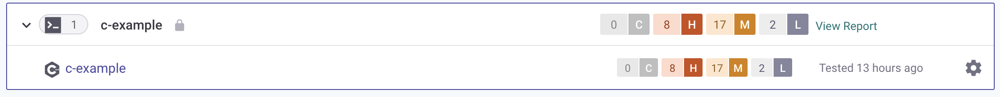

# Snyk for C/C++

You can use Snyk to scan C/C++ projects through the [CLI](../../../snyk-cli/). For more information see [Getting started with the CLI](../../../snyk-cli/getting-started-with-the-cli.md).

## Features of Snyk for C/C++


**Feature availability**\
Some features may not be available, depending on your plan. See [pricing plans](https://snyk.io/plans/) for more details.


| Package managers / Features | CLI support | Git support | License scanning | Fix PRs |
| --------------------------- | ----------- | ----------- | ---------------- | ------- |
| C/C++                       | ✔︎          |             | ✔︎               |         |

## How Snyk for C/C++ works

Scans are powered by an open-source database, periodically updated with the latest source code from online sources.


To navigate through the vulnerabilities for C/C++, use the [Snyk Vuln DB](https://security.snyk.io).


When you run the `snyk test --unmanaged` command, Snyk does the following:

1. Converts all files from your current folder into a list of hashes.
2. Sends the hashes to the Snyk scan server.
3. Queries the database to find a list of potentially matching dependencies.
4. Links the dependencies to the known vulnerabilities.
5. Displays the results.


For Snyk to scan the project, the dependencies must be available as source code in the scanned directory. If the dependencies are in a different location, that location must be scanned.


### Scanning archives

By default, archives are not scanned. However, Snyk CLI can recursively extract archives to analyze the source code inside.

To enable archive extraction, specify the depth of the extraction using the `--max-depth` option.

The supported archive formats are:

* zip-like archives
* tar archives
* tar with gzip compression algorithm

### Constraints and limitations


The following constraints and limitations are by design. While Snyk may work on improvements in the future, they are not considered an issue. Issues that are planned to be addressed are in the [Known issues](snyk-for-c-c++.md#known-issues-with-snyk-for-c-c++) section.


### **Source code dependencies need to be available in the scanned folder**

For Snyk CLI to be able to find dependencies in your source code, enough of the full dependencies source code needs to be present in the scanned folder.

Having a large percentage of files in their original (unchanged) form is critical to accurately identifying dependencies and reporting the correct set of vulnerabilities back. Modifying that source code reduces the confidence of the scanning engine, resulting in less accurate results. Other potential issues could include dependencies not being identified or being identified incorrectly, as a different version or even a different package.

The example that follows shows a typical package with dependencies listed:

```
c-example
├── deps
│   ├── curl-7.58.0
│   │   ├── include
│   │   │   ├── Makefile.am
│   │   │   ├── Makefile.in
│   │   │   ├── README
│   │   │   └── curl
│   │   ├── install-sh
│   │   ├── lib
│   │   │   ├── asyn.h
│   │   │   ├── base64.c
│   │   │   ├── checksrc.pl
│   │   │   ├── config-amigaos.h
│   │   │   ├── conncache.c
│   │   │   ├── conncache.h
│   │   ├── src
│   │   │   ├── tool_binmode.c
│   │   │   ├── tool_binmode.h
│   │   │   ├── tool_bname.c
│   │   │   ├── tool_xattr.c
...
```

### Data collection note

When you scan C++ Projects, the following data is collected and may be stored for troubleshooting purposes:

**Hashes of the scanned files:** All files are converted to a list of irreversible hashes.

**Relative paths to scanned files:** The paths to files relative to the directory being scanned are included for better identification and matching.\
\
Example:\
`./project-name/vendor/bzip2-1.0.6/blocksort.c`

## Snyk CLI for C/C++ Projects

### Install the Snyk CLI

C/C++ scanning is available in [Snyk CLI](../../../snyk-cli/). See [Install the CLI](../../../snyk-cli/install-or-update-the-snyk-cli/) for details.


The minimum version of Snyk CLI with C/C++ scanning is 1.857.0.


### Run the test

To test your Project for vulnerabilities, run:

```
$ snyk test --unmanaged
```

### Displaying dependencies

To display dependencies, use the `--print-deps` option:

```bash
$ snyk test --unmanaged --print-deps

Dependencies:

  cpython|https://github.com/python/cpython/archive/v3.7.2.zip@3.7.2
  confidence: 1.000
  
  zip|http://ftp.debian.org/debian/pool/main/z/zip/zip_3.0.orig.tar.gz@3.0
  confidence: 0.993
```

To learn what files contributed to each dependency being identified, use the `--print-dep-paths` option:

```bash
$ snyk test --unmanaged --print-dep-paths

Dependencies:

  curl|https://github.com/curl/curl/releases/download/curl-7_58_0/curl-7.58.0.tar.xz@7.58.0
  confidence: 1.000
  matching files:
    - c-example/deps/curl-7.58.0/CHANGES
    - c-example/deps/curl-7.58.0/CMake/CMakeConfigurableFile.in
    - c-example/deps/curl-7.58.0/CMake/CurlSymbolHiding.cmake
    ... and 2857 more files
```

### Understanding the confidence level

You may need to change the source code of the dependencies that you use in your software. As Snyk uses file signatures to find the closest possible match to an open-source library, your changes may decrease the accuracy of the identification of the actual library.

To learn how confident Snyk is about the identified dependency and its version, use the `--print-deps` or `--print-dep-paths` command line option:

```
curl|https://github.com/curl/curl/releases/download/curl-7_58_0/curl-7.58.0.tar.xz@7.58.0
confidence: 0.993
```

This confidence level shows how confident Snyk is about the actual identification of the dependency. The number can be between **0** and **1** and the higher it is, the more accurate the identification is. Thus a confidence of **1** means that all the files in the source tree fully matched all the expected files in the Snyk database.

### JSON output

To get a machine-readable output in JSON, use the `--json` option:

```
$ snyk test --unmanaged --json
[
  {
    "issues": [
      {
        "pkgName": "curl|https://github.com/curl/curl/releases/download/curl-7_58_0/curl-7.58.0.tar.xz",
        "pkgVersion": "7.58.0",
        "issueId": "CVE-2019-5481",
        "fixInfo": {
          "isPatchable": false,
          "isPinnable": false
        }
      }
    ],
    "issuesData": {
      "CVE-2019-5481": {
        "severity": "high",
        "CVSSv3": "",
        "originalSeverity": "high",
        "severityWithCritical": "high",
        "type": "vuln",
        "alternativeIds": [
          ""
        ],
        "creationTime": "2019-09-16T19:15:00.000Z",
        "disclosureTime": "2019-09-16T19:15:00.000Z",
        "modificationTime": "2020-10-20T22:15:00.000Z",
        "publicationTime": "2019-09-16T19:15:00.000Z",
        "credit": [
          ""
        ],
        "id": "CVE-2019-5481",
        "packageManager": "cpp",
        "packageName": "curl|https://github.com/curl/curl/releases/download/curl-7_58_0/curl-7.58.0.tar.xz",
        "language": "cpp",
        "fixedIn": [
          ""
        ],
        "patches": [],
        "exploit": "No Data",
        "functions": [
          ""
        ],
        "semver": {
          "vulnerable": [
            "7.58.0"
          ],
          "vulnerableHashes": [
            ""
          ],
          "vulnerableByDistro": {}
        },
        "references": [
          {
            "title": "https://curl.haxx.se/docs/CVE-2019-5481.html",
            "url": "https://curl.haxx.se/docs/CVE-2019-5481.html"
          },
        ],
        "internal": {},
        "identifiers": {
          "CVE": [
            "CVE-2019-5481"
          ],
          "CWE": [],
          "ALTERNATIVE": [
            ""
          ]
        },
        "title": "CVE-2019-5481",
        "description": "",
        "license": "",
        "proprietary": true,
        "nearestFixedInVersion": ""
      }
    },
    "fileSignaturesDetails": {
      "curl|https://github.com/curl/curl/releases/download/curl-7_58_0/curl-7.58.0.tar.xz@7.58.0": {
        "filePaths": [
          "deps/curl-7.58.0/CHANGES",
          "c-example/deps/curl-7.58.0/CMake/CMakeConfigurableFile.in",
          "c-example/deps/curl-7.58.0/CMake/CurlSymbolHiding.cmake"
        ],
        "confidence": 1
      }
    }
  }
]
```

### Command line options

The following `snyk` command line options are supported with the `snyk test --unmanaged` and `snyk monitor --unmanaged` commands:

`--org=<ORG_ID>`\
`--json`\
`--json-file-output=<OUTPUT_FILE_PATH>` (`snyk test` only)\
`--remote-repo-url=<URL>`\
`--severity-threshold=<low|medium|high|critical>` (`snyk test` only)\
`--max-depth`\
`--print-dep-paths`\
`--target-reference=<TARGET_REFERENCE>` (`snyk monitor` only)\
`--project-name=<c-project>` (`snyk monitor` only)

For more information about command line options see the Snyk help docs: [Options for scanning with `snyk test --unmanaged`](https://docs.snyk.io/snyk-cli/commands/test#options-for-scanning-using-unmanaged) or [`snyk monitor --unmanaged`](https://docs.snyk.io/snyk-cli/commands/monitor#options-for-scanning-using-unmanaged).

### Import scan results in the Snyk Web UI

To import the test results (issues and dependencies) in the Snyk Web UI, run the `snyk monitor --unmanaged` command:

```
$ snyk monitor --unmanaged
Monitoring /c-example (c-example)...

Explore this snapshot at https://app.snyk.io/org/example-org/project/8ac0e233-d0f9-403e-b422-5970e7a37443/history/5de4616d-3967-485f-bf21-bbbe91068029

Notifications about newly disclosed issues related to these dependencies will be emailed to you.
```

This creates a snapshot of dependencies and vulnerabilities and imports them into the Snyk Web UI, where you can review the issues and see them included in your reports.

Importing a Project with unmanaged dependencies creates a new Project:

<figure><figcaption><p>Project with unmanaged dependencies</p></figcaption></figure>

## Frequently asked questions, Snyk for C/C++

### **Is my source code sent to Snyk servers?**

No. The files are converted to a list of hashes before they are sent for scanning.

### **Why did Snyk not find any dependencies?**

Snyk stores the official releases of many open-source components in the Snyk database but it is possible that the source code you scanned is not there or is not found. If your scan does not find any dependencies [submit a request to support](https://support.snyk.io/hc/en-us/requests/new).

Here are a few things that you can check on your own:

* The source code of the dependencies you scanned is available as source code (unpacked) in the folder that you scanned. If you use a package manager, such as Conan, the source code is likely to be in the Conan cache, along with the source code of other dependencies of your other Projects. To scan dependencies managed by a package manager, Snyk recommends that you do that in a clean environment (for example during a build).
* The source code of the dependencies is not from an official release of the open-source software (OSS) component, and Snyk does not have it in the database
* The source code of the OSS has been modified too much, so Snyk cannot detect it. If there are too few files and you modify most of them, Snyk cannot match them to a component from the Snyk database. Examples of common modifications are whitespace formatting and adding license or copyright headers.
* Symlinks are not followed when collecting files for hashing. However, a Linux source package unzipped in Windows will usually have in-package symlinks replaced by _copies_ of linked files, thus creating a situation where the Windows representation is different from the original source. If the difference is too large, this can lead to Snyk not detecting it.
* The source code of the OSS components is too new. The Snyk database is refreshed monthly but it takes time for the latest releases to get processed.
