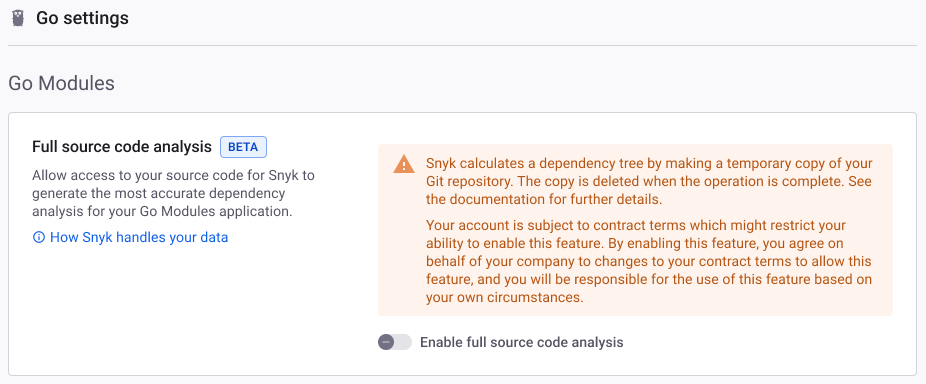

# Snyk for Go


From January 1 2023 Snyk no longer supports govendor Projects. As a general security best practice, Snyk recommends using tools that are consistently maintained and up-to-date.

Once Snyk no longer supports scanning of govendor Projects, a warning will be issued and no results will be received.


Snyk supports testing and monitoring of Go Projects with dependencies managed by [Go Modules](https://golang.org/ref/mod) and [dep](https://github.com/golang/dep).

The following describes how to use Snyk to scan your Go Projects.

## Features of Snyk for Go 


Some of these features may not be available for your Snyk plan. See [pricing plans](https://snyk.io/plans/) for more details.


| Package managers / Features              | CLI support | Git support | License scanning | Fix PRs |
| ---------------------------------------- | ----------- | ----------- | ---------------- | ------- |
| [Go Modules](https://golang.org/ref/mod) | ✔︎          | ✔︎          | ✔︎               |         |
| [dep](https://github.com/golang/dep)     | ✔︎          | ✔︎          | ✔︎               |         |

## **How Snyk for Go works**

Snyk builds a dependency tree, then uses the [vulnerability database](https://snyk.io/vuln) to find vulnerabilities in any of the modules or packages in the tree.

How Snyk analyzes and builds the tree varies depending on the language and package manager for the Project and your Project's location.

## Snyk CLI for Go Projects


To scan your dependencies in the CLI, ensure you have installed the relevant package manager and that your project contains the supported manifest files.


### **Go Modules and Snyk CLI**


Snyk scans Go Modules Projects in the CLI at the _package_ level rather than the _module_ level, as Snyk has full access to your local source code.



Packages from the [Go standard library](https://pkg.go.dev/std) are not supported or included in the dependency tree.&#x20;

Packages under `golang.org/x/` which are [part of the Go Project](https://pkg.go.dev/golang.org/x) but outside the main Go tree _are_ supported.


To build the dependency tree, Snyk uses the `go list -json -deps ./...` command.

When you test Go Modules Projects using the CLI, Snyk does not require their dependencies to be installed, but you must have a `go.mod` file at the root of your Project. `go list` uses this and your Project source code to build a complete dependency tree.


Different versions of Go generate different results for the `go list -json -deps` command. This can affect the dependency tree and the vulnerabilities that the Snyk CLI finds.


### **Dep and Snyk CLI**

To build the dependency tree, Snyk analyzes your `Gopkg.lock` files.

When you test dep Projects using the CLI, Snyk requires installation of dependencies. Run `dep ensure` to achieve this.

## Git services for Go Projects

### **Go Modules and Git**


By default, dependencies for Go Modules Projects imported via Git are resolved at the _module_ level rather than the _package_ level.

This means you may see more dependencies and issues reported, including potential false positives, than for Projects tested in the CLI.

To avoid this issue and achieve more accurate scans, enable [full source code analysis](snyk-for-golang.md#enable-full-source-code-analysis).


If full source code analysis is enabled, Snyk uses the `go list -json -deps ./...` command to build the dependency tree. Otherwise, it uses `go mod graph` .

#### Enable full source code analysis


Full source code analysis for Go Modules is currently in [Beta](../../../more-info/snyk-feature-release-process.md#open-beta).


To build the most accurate dependency tree for Go Modules Projects imported from Git, Snyk needs to access all the files in your repository.

This enables Snyk to see the `import` statements in your `.go` source files, and determine which specific packages are used in your application. Without this access, Snyk will include all packages from the modules listed in your `go.mod` file.

To enable full source code analysis, adjust your settings as follows:

1. Log in to your account and select your Group and Organization.
2. Go to **Settings** > **Languages**.
3. Select **Edit settings** for **Go**.
4. Toggle full source code analysis on or off.

<figure><figcaption>
Enable full source code analysis
</figcaption></figure>

For more details on levels of access to your repository required by different Snyk features, see [How Snyk handles your data](../../../more-info/how-snyk-handles-your-data.md).

#### **Private modules**

Go Modules Projects that depend on modules from private Git repositories are supported when the private repositories are in the same Git Organization as the main Project repository.

Imports for Projects with private modules from repositories in other Git organizations will fail.&#x20;

Private module support in different SCMs varies depending on whether [full source code analysis](snyk-for-golang.md#full-source-code-analysis) is enabled or disabled.

| Full source code analysis enabled                                                                                                      | Full source code analysis disabled                                         |
| -------------------------------------------------------------------------------------------------------------------------------------- | -------------------------------------------------------------------------- |
| <ul><li>Azure Repos</li><li>Bitbucket Cloud</li><li>Bitbucket Server</li><li>GitHub</li><li>GitHub Enterprise</li><li>Gitlab</li></ul> | <ul><li>GitHub</li><li>GitHub Enterprise</li><li>Bitbucket Cloud</li></ul> |

#### **Snyk Broker**


Snyk Broker is currently only supported when [full source code analysis](snyk-for-golang.md#enable-full-source-code-analysis) is disabled


Go Modules Projects imported via new [Snyk Broker](https://docs.snyk.io/integrations/snyk-broker/broker-introduction) clients should work as expected.

To add support to clients created before December 30, 2020, add `go.mod` and `go.sum` to your `accept.json` file, as per the changes in this [pull request](https://github.com/snyk/broker/pull/299/files).

If you're using private Go Modules integrated via the Broker, each private module must have a `go.mod` file defined.

### **Dep and Git**

To build the dependency tree, Snyk analyzes the `Gopkg.lock` files in your Git repository.
