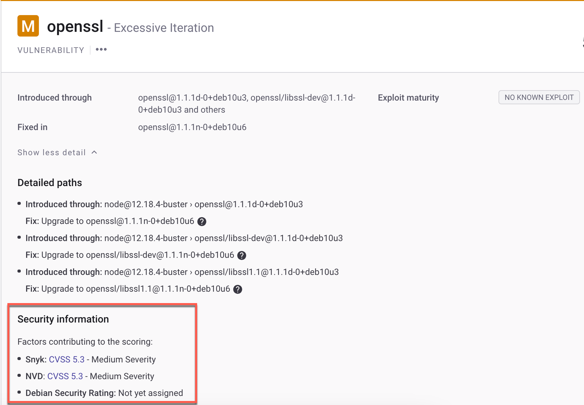

# Understanding the severity levels of detected Linux vulnerabilities

When determining the [severity level](../../../manage-risk/priorities-for-fixing-issues/severity-levels.md) of a Linux vulnerability (Low, Medium, High, Critical), Snyk Container considers multiple factors:

* Snyk’s internal analysis
* An assessment of the severity provided by the Linux distribution maintainer’s security team
* The severity of the vulnerability, as assessed by the National Vulnerability Database (NVD).

In certain cases, NVD assigns a different CVSS vector and severity score from the security maintainers of a particular Linux distribution. When this occurs, Snyk prioritizes and uses the CVSS and severity determined by the Linux distribution maintainers, as described by the relative importance feature.

## Relative importance feature

Relative importance asserts a common severity for a vulnerability and shows the underlying detailed information for that severity based on multiple sources. This helps developers and analysts view a common level of importance and exposes the underlying information that helped form the given severity.&#x20;

## View relative importance

For each issue, information appears on the Project page, under **Security information**.

<figure><figcaption>
Security information for a vulnerability
</figcaption></figure>

Snyk supports relative Importance in Ubuntu, Debian, Red Hat Enterprise Linux (RHEL), CentOS, Amazon Linux, Oracle Linux, and SUSE Linux Enterprise Server (SLES).

## External information sources for relative importance

To provide information for the distribution, Snyk uses the following external sources:

* [NVD Severity](https://nvd.nist.gov/vuln)
* [Debian Severity Levels](https://security-team.debian.org/security\_tracker.html#severity-levels) and [no-dsa](https://security-team.debian.org/security\_tracker.html#issues-not-warranting-a-security-advisory) issues
* [Ubuntu CVE Priority](https://people.canonical.com/\~ubuntu-security/priority.html)
* [Red Hat Enterprise Linux Severity Rating](https://access.redhat.com/security/updates/classification)
* [SUSE Linux Enterprise Security Rating Overview](https://www.suse.com/support/security/rating/)
* [Amazon Linux](https://alas.aws.amazon.com/alas2.html)
