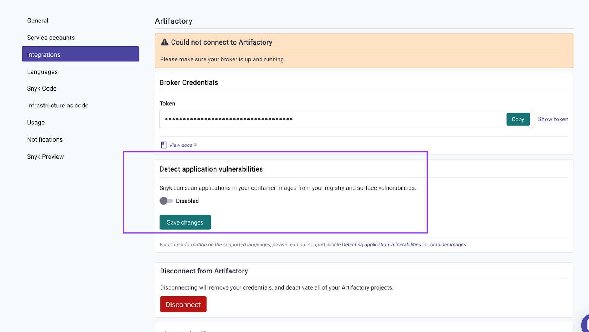

# Detecting application vulnerabilities in container images


For Container Registry integration, the feature is supported for Node, Ruby, PHP, Python, Go binaries, and Java.

For the CLI and Kubernetes, the feature is supported for Node, PHP, Python, Go binaries, and Java.



For application Projects created from images imported from **Container Registry integrations**, the applications will not be re-imported during recurring tests or manual re-test.

Instead, the application dependencies that were found during the initial image import will be tested for new vulnerabilities.

This means that if new dependencies were introduced in an application within an image, they will not be detected by the recurring tests or manual re-test.

To detect **new or updated** applications within images from container registries, you must re-import the image to Snyk.

For applications found in images imported from **the Kubernetes integration**, existing applications will be re-imported, but new apps added to the image will not be imported during recurring tests.

To detect **new** applications within images from Kubernetes, you must re-import the image to Snyk.


Snyk allows detection of vulnerabilities in your application dependencies from container images, as well as from the operating system, all in one scan.

After you integrate with a container registry and import your Projects, Snyk scans your image and test for vulnerabilities.

## Enable application vulnerabilities scan from container registries

1. Navigate to your container registry integration settings
2. Enable the _**Detect application vulnerabilities**_ capability and save the changes:

<figure><figcaption>
Enable Detect application vulnerabilities
</figcaption></figure>

When you are scanning an image using a container registry or Kubernetes integration, the scan also uses the `--app-vulns` flag by default. You can opt out of the flag in the container registry only. Do so by disabling the _detect application vulnerabilities_ toggle in the integration settings.


* For Java, when you use the flag, Snyk scans one level of nested jars by default.
* For Python, Snyk supports Poetry and Pip (in all integration points).
* For Go binaries, Snyk supports any type of Go binary built with Go module support.


## Using Snyk Container CLI to detect vulnerabilities

### App vulns option

In CLI versions 1.1090.0 (2023-01-24) and higher, Snyk scans for application dependencies in your image by default; you do not need to specify the `--app-vulns` option.

If you wish to opt out of application vulnerability scanning, you can specify the `--exclude-app-vulns` flag. This omits the application vulnerabilities section from the results, mimicking the previous behavior. The `--exclude-app-vulns` option is available in CLI version 1.1021.0 and above.

### Nested jars depth option

For Java applications, when `--app-vulns` is enabled, you can also use the `--nested-jars-depth=n` option to set how many levels of nested jars Snyk will unpack. The implicit default is 1. When you specify 2, it means that Snyk unzips jars in jars; 3 means Snyk unzips jars in jars in jars, and so on.

Use `--nested-jar-depth=0` to opt out of any scans you feel are unnecessary.

## View vulnerabilities and licensing issues

After the feature is enabled, you can see:

* Dependency vulnerabilities and licensing issues of manifest files detected in your container image
* Vulnerabilities detected in operating system packages

When an image is imported to Snyk, it appears under its registry record in the **Projects** view, showing the operating system vulnerabilities found in your image.

With this feature enabled, you can also see nested manifest files detected in the image and their vulnerabilities and licensing issues.

<figure><figcaption>
Images listed in Projects view
</figcaption></figure>

## Automated scanning

Snyk scans the image regularly based on your Project settings. Snyk updates you via email or Slack based on your configuration when any new vulnerabilities are identified in both the operating system and application dependencies.

For each Project, you can choose the test frequency under its settings; the default is daily testing.

<figure><figcaption>
Update test frequency
</figcaption></figure>

## **Supported container registries**

This is supported across the following container registries:

* [Docker Hub](https://docs.snyk.io/snyk-container/image-scanning-library/docker-hub-image-scanning)
* [GCR](https://docs.snyk.io/snyk-container/image-scanning-library/gcr-image-scanning)
* [ACR](https://docs.snyk.io/snyk-container/image-scanning-library/acr-image-scanning)
* [Amazon ECR](https://docs.snyk.io/snyk-container/image-scanning-library/ecr-image-scanning)
* [JFrog Artifactory](https://docs.snyk.io/snyk-container/image-scanning-library/jfrog-artifactory-image-scanning)
* [Harbor](https://docs.snyk.io/products/snyk-container/image-scanning-library/harbor-image-scanning)
* [Quay](https://docs.snyk.io/products/snyk-container/image-scanning-library/quay-image-scanning)
* [GitHub](https://docs.snyk.io/products/snyk-container/image-scanning-library/github-container-registry-image-scanning)
* [Nexus](https://docs.snyk.io/products/snyk-container/image-scanning-library/nexus-image-scanningexsd)
* [DigitalOcean](https://docs.snyk.io/products/snyk-container/image-scanning-library/digitalocean-image-scanning)
* [GitLab](https://docs.snyk.io/products/snyk-container/image-scanning-library/gitlab-container-registry-image-scanning)

## **Supported integrations**

The supported languages work with the following integrations:

| **Language** | **Container Registry** | **CLI** | **Kubernetes** |
| ------------ | ---------------------- | ------- | -------------- |
| Node         | Yes                    | Yes     | Yes            |
| Ruby         | Yes                    |         |                |
| PHP          | Yes                    | Yes     | Yes            |
| Python       | Yes                    | Yes     | Yes            |
| Go Binaries  | Yes                    | Yes     | Yes            |
| Java         | Yes                    | Yes     | Yes            |

## Additional information about application vulnerabilities

For more information, see the following pages:

* [Application vulnerability in Snyk Container and Snyk Open Source](../../../scan-application-code/snyk-container/how-snyk-container-works/application-vulnerability-in-snyk-container-and-snyk-open-source.md)
* [Understanding the severity levels of detected Linux vulnerabilities](../how-snyk-container-works/understanding-linux-vulnerability-severity.md)
