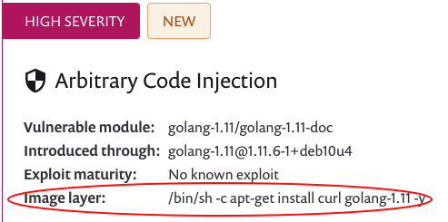

# Image layer information

When you scan a Docker image in Snyk, you can see information for the **Image layer,** as shown in this example:

<figure><figcaption>
Image layer information for Docker images
</figcaption></figure>

This is the instruction in the image layers that introduces the vulnerability.

There is no need to perform any action.
