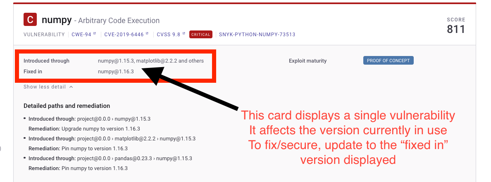
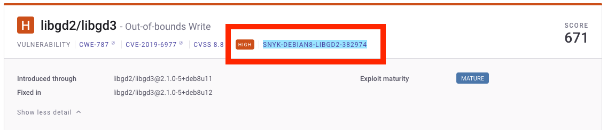
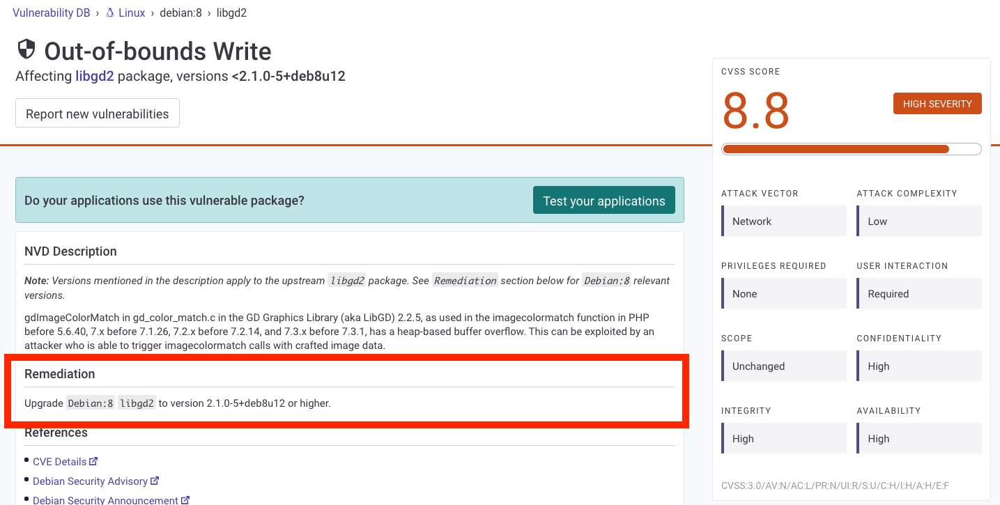

# Vulnerability fix types

A fixed vulnerability does not appear in scan results, as it is no longer considered a vulnerability.

There are two types of vulnerability information provided by Snyk:

* [Fixability Filters](vulnerability-fix-types.md#fixability)
* [Fix this vulnerability button](vulnerability-fix-types.md#fix-prs-fix-this-vulnerability)

Use the filters available in the [Snyk Web UI](../../../getting-started/exploring-the-snyk-web-ui.md) to filter your vulnerabilities.

<figure><figcaption>
Fixability filter on Snyk Web UI
</figcaption></figure>

## Fixability

The fixability option applies to Snyk Open Source, Snyk Container, and to SCM and CLI monitor workflows.

Conditions for the fixability workflow:

* The issue has a **Fixed in** property indicating that the vulnerability has a known fix.
* The issue has upgradable paths. Snyk has found ways of upgrading the current project.
  * If all detailed paths have remediation, then the issue is fixable and the **Fixable** option is available.
  * If the ecosystem is JavaScript or TypeScript using the npm or Yarn package managers and one but not all detailed paths have remediation, then the issue is **Partially fixable**.
  * Otherwise, it's marked as **No fix available**.

### Fixed in version

This shows the version of the package that no longer has the vulnerability.

<figure><figcaption>
Vulnerability card information
</figcaption></figure>

#### Why is "Fixed in" showing when the issue is not fixable?

The difference here is whether it's looking at direct or transitive dependencies. For direct dependencies, this would mean that fixable is true if a fixed (or secure) version of the package exists anywhere in the system. However, this is not the case for transitive dependencies as they require a direct dependency that can be updated to the fixed (or secure) version of the transitive dependency.

<figure><figcaption>
Vulnerability card details
</figcaption></figure>

The above is an example of a transitive dependency. The detailed paths section (blue outline in image above) shows that no fix path is available; however, it does show that the vulnerability is fixed in the more recent version, unlike the no fix available status seen above. This means that Snyk doesn't have the ability to reach the level that the vulnerability actually exists in this specific Project.

#### Fixing transitive dependencies


You cannot automatically fix transitive dependencies, or open a Fix PR (see [Fix your vulnerabilities](fix-your-vulnerabilities.md#apply-fixes)) due to their relationships with other components. To avoid breaking changes, Snyk only provides recommendations for this scenario.


To fix a transitive dependency such as this, click on the Vulnerability DB link:

<figure><figcaption>
Snyk Vulnerability DB link
</figcaption></figure>

From the [Snyk Vulnerability Database](../manage-vulnerabilities/snyk-vulnerability-database.md), you can then see fix advice for more information:

<figure><figcaption>
Vulnerability Database remediation advice
</figcaption></figure>

#### Fixing transitive dependencies through direct dependencies

If Snyk recommends using a direct dependency with the same version as the one used to fix an affected transitive dependency, you can update to a newer version of the transitive by reinstalling the direct dependency.

To illustrate this issue, consider a scenario where a Project relies on `react-scripts@5.0.1`, (direct dependency), which has a vulnerable component called (transitive dependency) `loader-utils@2.0.2`. Snyk recommends updating `react-scripts` to the version `5.0.1` to fix the vulnerable component. After the update, the vulnerable package `loader-utils` is still at the version `2.0.2`. This indicates that another package in the Project is preventing the upgrade to a higher version. Reinstalling the `react-scripts@5.0.1` direct dependency addresses this issue, as you can later upgrade the vulnerable component.

### No fix available

You don't have any fix available for a vulnerability card.

<figure><figcaption>
License card information
</figcaption></figure>

### Partially fixed

You can partially fix a vulnerability if you are using an ecosystem that is JavaScript or TypeScript and npm or Yarn as a package manager.


The option to partially fix vulnerabilities is only available for JavaScript and TypeScript.


<figure><figcaption>
Partially fix a vulnerability
</figcaption></figure>

## Fix PRs - Fix this vulnerability

The **Fix this vulnerability** functionality applies to Snyk Open Source and Snyk Container projects imported through SCM workflows.


The Fix this vulnerability option is not available for CLI monitor workflows.


Conditions for the Fix PRs workflow:

* The integration is SCM.
* Your ecosystem is Docker, JavaScript, Java, Ruby, Python, or .NET.

Any **fixable** issue in a project meeting the above criteria supports the fix workflow and Snyk can open a pull request against that repository to update to a secure version of the dependency.

The easiest way to tell if Snyk can open a pull request against your project in the Snyk Web UI is to look for the **Fix this vulnerability** button on the vulnerability card.

<figure><figcaption>
Fix this vulnerability button
</figcaption></figure>

##
