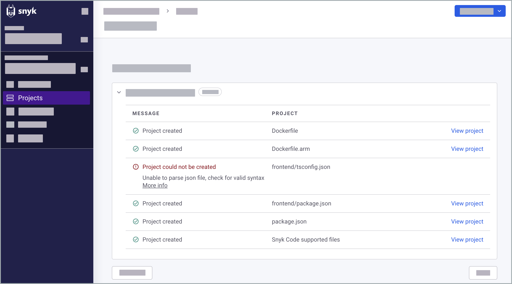

# Import repository to Snyk

## How importing repositories works

After you select repositories on the Snyk Web UI and click the **Add selected repositories** button, the import starts, and a progress bar appears on the Projects page.

<figure><figcaption>
Importing repositories progress bar
</figcaption></figure>

When the import is finished, a confirmation message appears on the Projects page. Your imported repositories appear as separate Target folders on the Projects page. Each Target folder has the name of your SCM account and the imported repository and contains the Snyk Projects that were created for it.

<figure><figcaption>
Target folders on Projects page
</figcaption></figure>


If some of the files in the selected repositories were not imported, you receive a notification about the Projects that were not imported. Click **View import log** to see more details.


<figure><figcaption>
Project could not be created notification
</figcaption></figure>

Snyk Code analyzes the directories and files in the selected repositories during import. Then, Snyk Code creates a Project called **Code** **analysis** for each imported repository to contain the test results. The Snyk Code testing is already performed during the import process. After the import is completed, the Snyk Code results are displayed in the **Code** **analysis** Project without any additional action on your part.

<figure><figcaption>
Code analysis Project
</figcaption></figure>

In addition, when the import is completed, you receive an email informing you that the import is completed. This confirmation email also contains links to the results of the import.

<figure><figcaption>
Snyk Code import confirmation email
</figcaption></figure>

After the import, Snyk Code continues to monitor the code of the imported repositories in search of vulnerabilities. When a repository is imported, Snyk automatically creates a webhook to the SCM, and this webhook is used after the import for regular scans. By default, Snyk Code analyzes and tests the pull requests in the imported repositories on a weekly basis, and it sends you a **New issues and remediations** summary via email when new vulnerabilities are detected.


You can also set a daily test for your imported code or cancel the automatic testing via the **Code analysis** Project settings. In addition, you can retest the imported code on-demand using the **Retest now** option on the **Code Analysis** page.


## Import repository to Snyk

If you already have Projects in your Snyk Account, you can add other repositories to be tested by Snyk.


If the **Snyk Code** feature was previously disabled, and you want to apply Snyk Code testing to your existing repositories as well, you must [re-import these repositories](./#re-import-repository-to-snyk).


Follow these steps to import additional repositories to Snyk:

1\. On the Snyk Web UI, click either **Dashboard** or **Projects**.

2\. On the **Dashboard** or **Projects** page, click the **Add project** button. Then, select from the pop-up list the SCM that contains the repositories you want to import:

<figure><figcaption>
Add project button
</figcaption></figure>

The **Personal and Organization repositories** page appears, displaying the repositories available to you in the selected SCM.

3\. On the **Personal and Organization repositories** page, select the checkboxes of the repositories you want to import to Snyk. If you also want Snyk Code to test repositories you previously imported, select these repositories as well for re-import.


The repositories you previously imported are indicated with a checkmark .

To import all the repositories of a specific SCM account, select the **account checkbox**.

The **Settings** options on this page are NOT applicable to Snyk Code, and you can only import entire repositories. However, you can [exclude directories and files from the import process using the .snyk file](excluding-directories-and-files-from-the-import-process.md).


<figure><figcaption>
Select the checkboxes of the repositories to import
</figcaption></figure>

4\. After you select the required repositories, click the **Add selected repositories button** to import the repositories into your Snyk Account:

<figure><figcaption>
Add selected repositories button
</figcaption></figure>

The selected repositories are imported to Snyk, and a progress bar appears on the Projects page. When the import is completed, a confirmation message appears on the Projects page. Your imported repositories appear as Target folders.

<figure><figcaption>
Imported Target folder with Code analysis Project
</figcaption></figure>

## Re-import repository to Snyk

If your Snyk account includes repositories that were imported to it before the **Snyk Code** option was enabled, and you want Snyk Code to test these repositories, you must re-import these repositories to Snyk.

Follow these steps to re-import existing repositories:

1\. On the Snyk Web UI, click either the **Dashboard** or **Projects**.

2\. On the **Dashboard** or **Projects** page, click the **Add project** button. Then, select from the pop-up list the SCM that contains the repositories you want to re-import:

<figure><figcaption>
Add project button
</figcaption></figure>

3\. On the **Personal and Organization repositories** page, select the checkboxes of the repositories you want to re-import to Snyk:

The repositories you already imported are indicated with a checkmark .

<figure><figcaption>
Select the checkboxes of the repositories to import
</figcaption></figure>

4\. Click the **Add selected repositories** button to re-import the selected repositories:

<figure><figcaption>
Add selected repositories buton
</figcaption></figure>

Your selected repositories are re-imported to Snyk. During the re-import process, Snyk Code analyzes these repositories, and a **Code analysis** Project is added to each repository, containing the results of the Snyk Code test.


If you are re-importing repositories you deleted before the re-import, you must refresh the **Projects** page to view the re-import results.


## What's next?

* [Exclude directories and files from the import process](excluding-directories-and-files-from-the-import-process.md)
* [Remove imported repository](removing-imported-repositories-from-snyk-code-testing.md)
