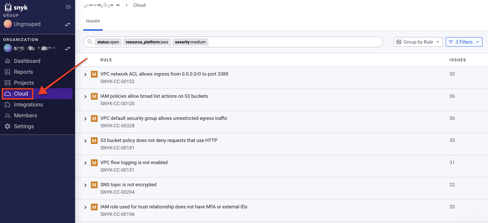
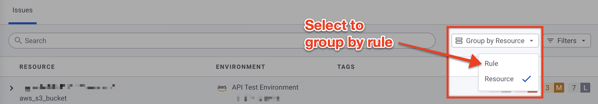
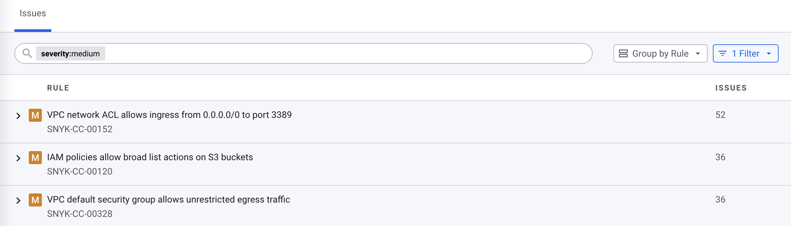
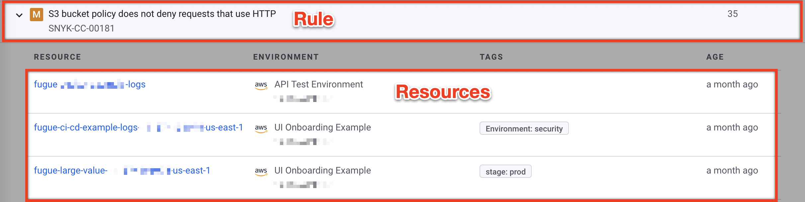
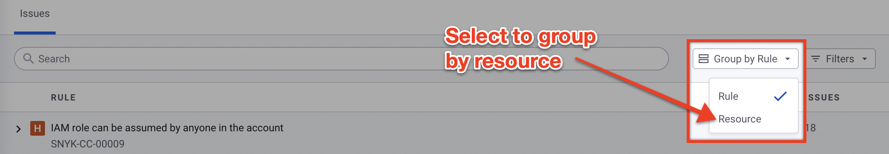
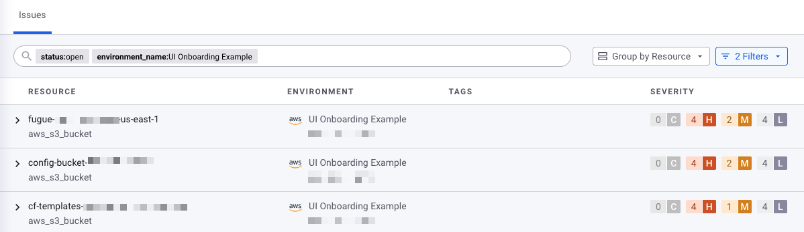
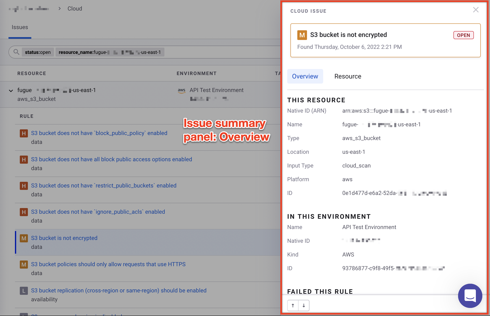
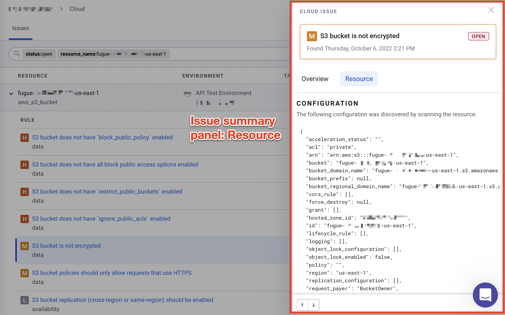
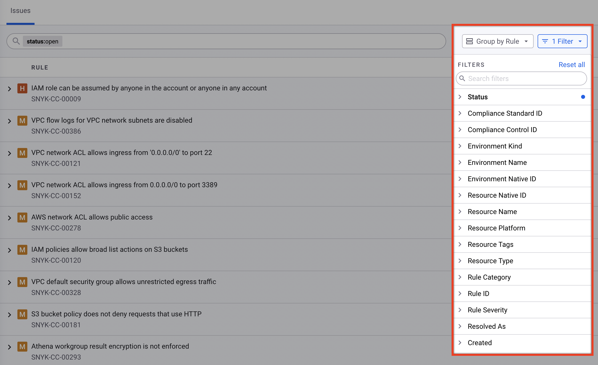

# View cloud issues in the Snyk Web UI

You can view cloud issues for an Organization through the Snyk Web UI.

To view your Organization's cloud issues in the Snyk Web UI, navigate to the Organization and select **Cloud** in the left menu:

<figure><figcaption>
How to access the Snyk Cloud issues page in the Web UI
</figcaption></figure>

By default, Snyk displays open issues across all Snyk Cloud Environments in an Organization. The issues are initially [grouped by the security rule they failed](view-cloud-issues-in-the-snyk-web-ui.md#group-cloud-issues-by-rule), but you can choose to [group them by resource](view-cloud-issues-in-the-snyk-web-ui.md#group-cloud-issues-by-resource).

## Group cloud issues by rule

Issues are grouped by rule by default.

If you have grouped them by resource instead, you can group them by rule again by selecting the **Group by Resource** drop-down menu next to the search bar and selecting **Rule**:

<figure><figcaption>
How to group issues by rule in the Snyk Web UI
</figcaption></figure>

The rules are sorted by severity and then by number of issues, both from highest to lowest.

### Rule details

Each rule shows the following information:

* Severity
  * C: Critical
  * H: High
  * M: Medium
  * L: Low
* Rule title
* Rule ID
* Number of open issues

<figure><figcaption>
Issues grouped by rule in the Snyk Web UI
</figcaption></figure>

By default, when you expand a rule by selecting its **Expand row** (`>`) symbol, you see all the resources with an open issue associated with that rule. Each resource shows the following information:

<figure><figcaption>
A rule expanded to show resources in the Snyk Web UI
</figcaption></figure>

* Resource name
* Environment kind (provider)
* Environment name
* Environment native ID (Amazon Web Services account ID, Google project ID, etc.)
* Resource tags
* Age of issue

## Group cloud issues by resource

If issues are currently grouped by rule, you can group them by resource instead by selecting the **Group by Rule** drop-down menu next to the search bar and selecting **Resource**:

<figure><figcaption>
How to group issues by resource in the Snyk Web UI
</figcaption></figure>

The resources are sorted by severity of issue and then by number of issues, both from highest to lowest.

### Resource details

Each resource shows the following information:

* Resource name
* Resource type
* Environment kind
* Environment name
* Environment native ID
* Resource tags
* Severity of open issues
* Number of issues for each severity

<figure><figcaption>
Issues grouped by resource in the Snyk Web UI
</figcaption></figure>

By default, when you expand a resource by selecting its **Expand row** (`>`) symbol, you see all the rules with an open issue associated with that resource. Each rule shows the following information:

<figure><figcaption>
A resource expanded to show rules in the Snyk Web UI
</figcaption></figure>

* Severity
* Rule title
* Rule category
* Rule ID
* Age of issue

## View cloud issue details

To view an issue, select the **Expand row** (`>`) symbol on the left side of a row, then select a corresponding resource or rule. Snyk displays a panel with the cloud issue details.

### Issue summary panel

The cloud issue summary panel displays the **Overview** by default, which contains the following information:

* Severity
* Status (open or closed)
* Resource details:
  * Native ID (Amazon Resource Name); AWS only
  * Name
  * Type
  * Location (AWS region, Google project, Terraform file, etc.)
  * Input type (`cloud_scan`, `tf_hcl`, etc.)
  * Platform (`aws`, `google`, etc.)
  * ID
* Environment details:
  * Name
  * Native ID (AWS account ID, Google project, `:cli`, etc.)
  * Kind (AWS, Google, CLI, etc.)
  * ID
* Rule details:
  * Title
  * Category
  * Severity
  * ID, with a link to [fix advice](https://snyk.io/security-rules/cloud)
  * Rule description (**Why to fix it** section)

<figure><figcaption>
The Snyk Cloud issue summary panel, Overview tab
</figcaption></figure>

Select the **Resource** tab to view the scanned resource's attributes:

<figure><figcaption>
The Snyk Cloud issue summary panel, Resource tab
</figcaption></figure>

## Filter cloud issues

To filter which cloud issues are shown:

1. Select the **Filter** drop-down menu. The name of the menu shows how many filters are selected (for example, **1 Filter**).
2. Select the parameter you want to filter by (for example, **Severity**).
3. Check the box for the values you want to show (for example, **High**).

By default, the **Status** filter is set to only include **open** issues.

You can also filter issues by compliance control, resource type, environment name, and more.

<figure><figcaption>
Filters in the Snyk Cloud issues page
</figcaption></figure>

## Search cloud issues

As you select filters from the **Filters** drop-down menu, the search bar populates with key-value pairs.

To search cloud issues by key-value pair:

1. Select the search bar.
2. Select a key from the drop-down list, or type in a key from the list of available filters.
3. Select a value from the drop-down list, or type in a value.

To remove a key-value pair, select the **X** or press the **Delete** key on your keyboard.
