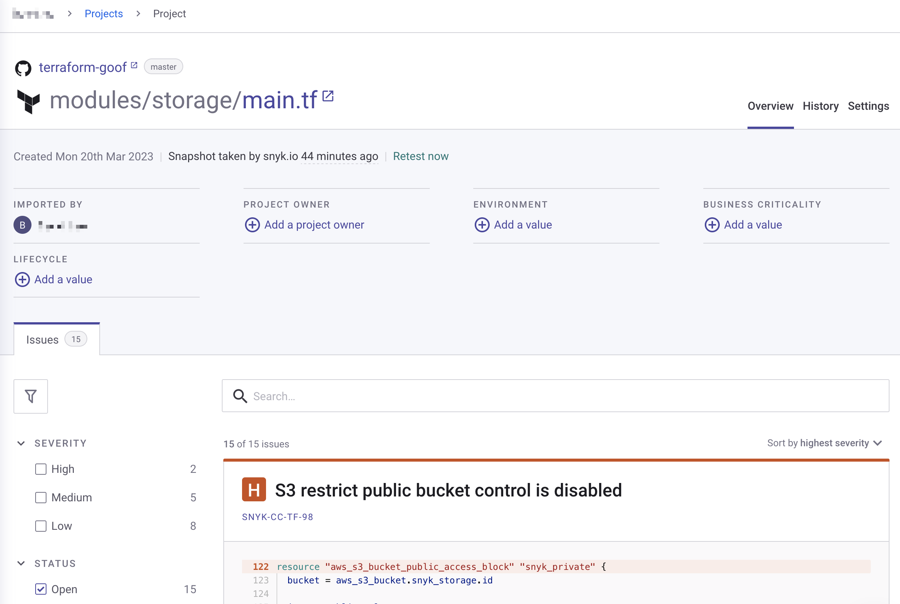

# Getting started with Snyk Infrastructure as Code (IaC)

This page explains how to get started with Snyk IaC to inspect, find, and fix issues in configuration files for [Terraform](scan-terraform-files/), [AWS CloudFormation](scan-cloudformation-files/), [Kubernetes](scan-kubernetes-configuration-files/) (including Helm), and [Azure Resource Manager (ARM)](scan-arm-configuration-files.md) environments. The process explained here uses the Snyk Web UI. You can use IaC with the Snyk CLI. For details, see [Snyk CLI for Infrastructure as Code](snyk-cli-for-infrastructure-as-code/). To learn more about IaC in the Snyk Web UI, See [Using Snyk IaC with the Web UI](using-snyk-iac-via-web.md).


The bottom of this page includes specific documentation for [Integrated IaC](broken-reference)**,** a new version of Snyk IaC that is currently in closed beta. Reach out to your Snyk account team if you have questions.


## **Prerequisites for Snyk IaC**

Ensure you have:

* A Snyk account (go to [https://snyk.io/](https://snyk.io) and sign up; see [Create a Snyk account](../../getting-started/quickstart/create-a-snyk-account/) for details.
* An existing Terraform, CloudFormation, Kubernetes, or ARM environment to work in.
* A Git repository you have integrated with Snyk as for other Snyk products; see [Git repository (SCM) integrations](../../integrations/git-repository-scm-integrations/) for more details.

For more information about IaC and supported environments, see:

* [Configure your integration to find security issues in your Terraform files](scan-terraform-files/configure-your-integration-to-find-security-issues-in-your-terraform-filess.md)
* [Configure your integration to find security issues in your CloudFormation files](scan-cloudformation-files/configure-your-integration-to-find-security-issues-in-your-cloudformation-files.md)
* [Configure your integration to find security issues in your Kubernetes configuration files](scan-kubernetes-configuration-files/configure-integration-for-security-issues-in-kubernetes-configuration-files.md)


ARM configuration files can only be scanned via the Snyk CLI. See [Scan ARM configuration files](scan-arm-configuration-files.md).


## Stage 1: Import Projects

Import [Projects](../../manage-issues/snyk-projects/) to test with Snyk by choosing repositories for Snyk to test and monitor.

1. Select **Projects** from the Snyk Web UI.
2. In the **Add projects** drop-down menu, select the tool to add the Project from, for example, GitHub.
3. In **Personal and Organization repositories**, select the repositories to use.
4. Click **Add selected repositories** to import the selected repositories into your Projects.
5. Select **View import Log** to see import log results.\
   You can scan multiple types of configuration files simultaneously.\
   Project import completes.


For Snyk Infrastructure as Code Projects, the recurring test interval is one week. You can disable recurring tests on the **Settings** tab of the Project's page; Set **Test & Automated Pull Request Frequency** to **Test never**.


## Stage 2: View configuration file issues

View results for configuration files in imported Projects by selecting **Projects** from the menu on the left.

* If **Group by targets** is selected: A list of [Targets](../../manage-issues/snyk-projects/#target) is displayed. Select a Target to expand its list of Projects.
* If **Group by none** is selected: A list of all [Projects](../../manage-issues/snyk-projects/#project) is displayed.

Each Project entry shows information for a scanned configuration file, including the number of critical, high, medium, and low-severity issues found, for example:

<figure><figcaption>
A list of Snyk IaC Projects
</figcaption></figure>

Select a Project to see more information, including details of the issues in the configuration file:

<figure><figcaption>
An example Snyk IaC Project with a list of issues
</figcaption></figure>


If you encounter any errors during import, see [Importing projects](https://support.snyk.io/hc/en-us/sections/360000923478-Importing-projects) FAQs.


## Stage 3: View and fix config files

Act on the recommendations produced by Snyk IaC, which are included in the IaC results that appear as issues in each Project.

1. From a Project page, select an issue to see the details for that issue and specific recommendations from Snyk IaC.
2. Edit the configuration file to fix the issue identified, based on the recommendations, then commit the change.
3. Snyk automatically rescans the changed file; see the change reflected in the issue display.

<figure><figcaption>
An example IaC issue within a Project
</figcaption></figure>
