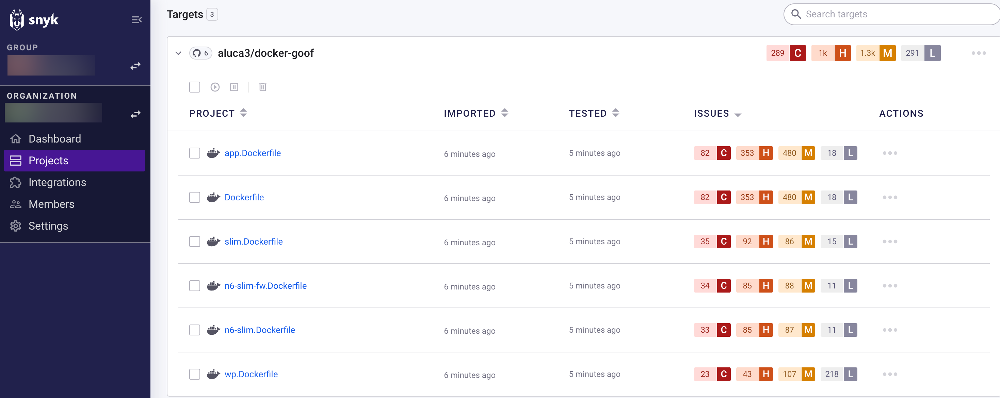
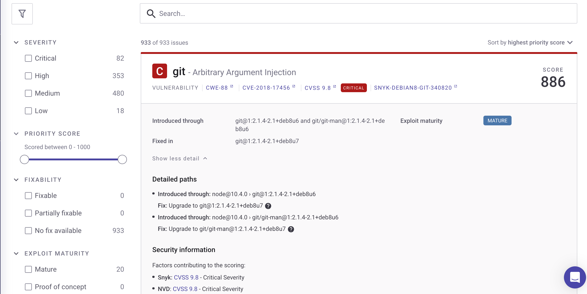

# Start using Snyk Container

Snyk Container helps you find and fix vulnerabilities in container images, based on container registry scans.


The process described on this page uses the Snyk Web UI. For information on how to use Snyk Container using the Snyk Command Line Interface (Snyk CLI), see [Snyk CLI for container security](../scan-applications/snyk-container/snyk-cli-for-container-security/).


## **Prerequisites for Snyk Container**

Ensure you have:

* [Created a Snyk account](../getting-started/quickstart/create-a-snyk-account/).
* [Set up an integration](../getting-started/quickstart/set-up-an-integration.md) for your container registry, like Docker Hub. Snyk supports multiple registries. For more information, see [Snyk Container - integrations](snyk-container-integrations/).
* [Imported a Snyk Project](../getting-started/quickstart/import-a-project.md) to scan (specifically, your container registry).

For more information on how to get started with Snyk, see [Getting started](../getting-started/).

## View vulnerabilities

In the **Projects** tab, you can see vulnerability results for Snyk Projects that you have imported. The imported Projects are grouped into **Targets**.

To see vulnerability information for that Project, select an imported Project from the target list.

<figure><figcaption>
Vulnerability information for an imported Snyk Project
</figcaption></figure>

Click on a Project entry to see details of the vulnerabilities found, including where it was introduced, how to fix it, and other details about the vulnerability.

<figure><figcaption>
Vulnerability information
</figcaption></figure>

## Fix vulnerabilities

To fix vulnerabilities:

1. Open a PR based on Snyk recommendation by clicking **Open a fix PR**.
2. Upgrade or rebuild your image.

After it is pushed, Snyk automatically rescans your new image.&#x20;

For more details on how to fix vulnerabilities, see [Analysis and fixes for your images from the Snyk Web UI](../scan-applications/snyk-container/use-snyk-container/analysis-and-remediation-for-your-images-from-the-snyk-app.md).
