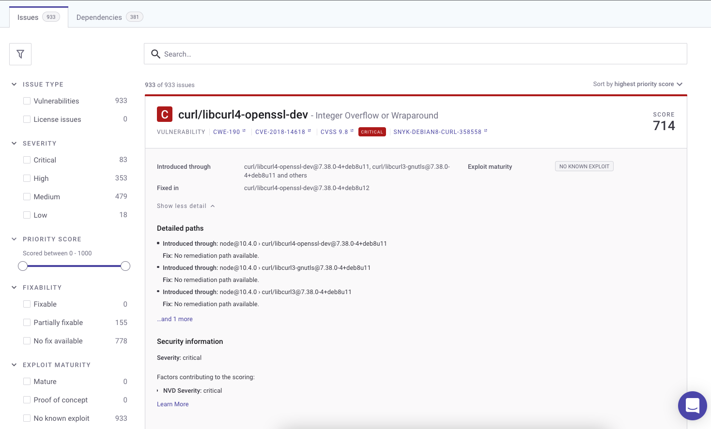

# Getting started with Snyk Container

Start using Snyk Container to help you find and fix vulnerabilities in container images based on scans of a container registry.


The process described on this page uses the Snyk Web UI. For details of Snyk Container using the Snyk CLI (command line interface), see [Snyk CLI for container security](snyk-cli-for-container-security/).


## **Prerequisites for Snyk Container**

Ensure you have completed the following:

* [Created a Snyk account](../getting-started/quickstart/create-a-snyk-account/)
* [Set up integration](../getting-started/quickstart/set-up-an-integration.md) for your container registry, for example, Docker Hub. Snyk supports multiple registries; see [Snyk Container - integrations](snyk-container-integrations/) for details.
* [Imported a Snyk Project for scanning](../getting-started/quickstart/import-a-project.md) (your container registry)

See the [Getting started](../getting-started/) section of the user docs for more information.

## View vulnerabilities

You can see vulnerability results for imported Projects.

Select **Projects**, then click on the imported Project entry under its registry record to see vulnerability information for that Project.

<figure><figcaption>
Vulnerability information for a Project
</figcaption></figure>

Here you can see a summary of the severity of the detected vulnerabilities.

Click on an entry to see details of vulnerabilities found:

<figure><figcaption>
Vulnerability information
</figcaption></figure>

## Fix and review

1. Fix issues found, based on Snyk recommendations
2. Rebuild your image
3. Snyk will automatically retest your new image after it is pushed.

See [Analysis and fixes for your images from the Snyk Web UI](use-snyk-container/analysis-and-remediation-for-your-images-from-the-snyk-app.md) for more details.
