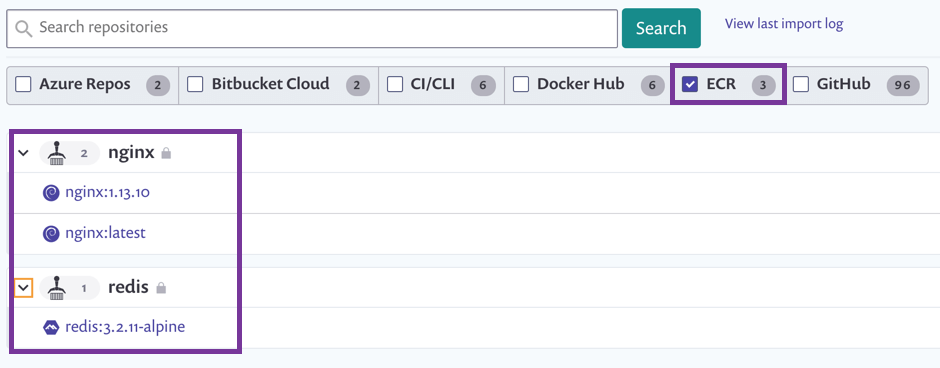

# Amazon Elastic Container Registry (ECR) - add images to Snyk

Snyk tests and monitors your Amazon ECR container images by evaluating the tags as they are in your ECR repositories.

## **Prerequisites for adding images to Snyk from ECR**

* You must have an account with Snyk and be onboarded to your Organization by an administrator.
* Ensure you have configured the integration between Snyk and your ECR repository.

## **Steps to add images to Snyk from ECR**

1. Log in to your account and navigate to the relevant group and Organization you want to manage.
2. Go to **Projects**, and click **Add projects**.\
   The list of integrations already configured on your account opens.
3. The view **Which images do you want to test?** opens, displaying all of the available images for the registry to which you connected, grouped by each of your repositories.
4. Select single or multiple images with any or all of the following methods:
   1. Type the name of a single image for import in the **Image Name** field.
   2. Select any of the repositories if you want to import all of the associated images.
   3. Expand and collapse repositories to select multiple images.
5. Click **Add selected repositories.**\
   A status bar appears at the top of the page as the images are imported; you can continue working in the meantime.
6. When the import ends, a notification of success or failure appears at the top of the page. Click Refresh to view the **Projects** page with the newly imported images.\
   Images are grouped by repository and are each linked individually to a detailed Projects page.
7. You can now connect your Git repo to this Project in order to use your Dockerfile for enriched fix advice.\
   For more information, see [Adding your Dockerfile and testing your base image](../../../scan-using-snyk/snyk-container/scan-your-dockerfile/detect-vulnerable-base-images-from-your-dockerfile.md).

ECR files are indicated with a unique icon . You can filter to view only those Projects:

<figure><figcaption>
List of ECR Projects
</figcaption></figure>

Amazon ECR integration works like other Snyk integrations. To continue to monitor, fix, and manage your Projects, see the relevant pages in the Snyk user documentation.


For **application** vulnerabilities within container images, any changes to the application will not be reflected with a manual or recurring retest. A re-import of the image is required. See [Detecting application vulnerabilities in container images ](../../../scan-using-snyk/snyk-container/use-snyk-container-from-the-web-ui/detect-application-vulnerabilities-in-container-images.md)for more information.

