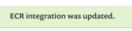

# Amazon Elastic Container Registry (ECR) - configure your integration with Snyk

After you create or update an IAM role, allow a few minutes for AWS to update the role on their servers before continuing.

1. From AWS, copy the **Role ARN** key that appears at the top of the **Summary** section of the **Role** area.
2. Log in to your Snyk account.
3. Navigate to **Integrations** and click the Amazon ECR option.\
   The Amazon ECR configuration page in the Settings area loads.
4. Enter credentials as follows:
   1. **AWS Region**—use the format `region-part-#`, for example, `eu-west-3`.\
      You must enter the default region as configured for your AWS account for your repositories and images to be available for import.
   2. **Role ARN**—copy from your AWS account in the format `arn:aws:iam:::role/`.
5. Click **Save**

An example follows:

```
   arn:aws:iam::881001789406:role/TestSnykIntegration_role
```

Snyk tests the connection values, and the page reloads, now displaying Amazon ECR integration details as you entered them. A confirmation message that the details were saved also appears in green at the top of the screen.

<figure><figcaption><p>ECR integration was updated</p></figcaption></figure>

If the connection to AWS fails, a notification appears under the **Connected to Amazon ECR** section.
