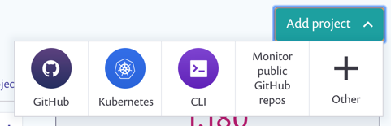

# Manually import Kubernetes workload project


Using the same integration id, you can import **many** clusters to **one** Snyk Organization by giving clusters a unique cluster name during installation.

You can also import **one** cluster to **multiple** Snyk Organizations in manual import by [cloning an integration across your Snyk orgs](../../../enterprise-setup/snyk-broker/clone-an-integration-across-your-snyk-organizations.md), so the integrations have the same integration id.

**One Snyk Organization has a limit of 25,000 projects.** For more information,  consult your SCM.


## **Prerequisites for manual import of Kubernetes workload project**

You must have an account with Snyk and be onboarded to your Organization by an administrator.

In addition, the integration must be configured between Snyk and your Kubernetes environment per Organization. To verify the integration is configured, ensure you have an [**Integration ID**](../../kubernetes-workload-and-image-scanning/kubernetes-integration-overview/viewing-your-kubernetes-integration-settings.md)**.**

1. Deploy Snyk Controller in your Kubernetes cluster.
2. Deploy Kubernetes workloads that you want to be imported into the Kubernetes cluster

## Manually add workloads

Go to the **Projects page**, click **Add project** and select the **Kubernetes** option.

<figure><figcaption><p>Add Kubernetes Project</p></figcaption></figure>

The import screen loads, similar to the one in the following mage, displaying all namespaces from the Kubernetes environment on the left and relevant namespace workloads on the right:

<figure><figcaption><p>Kubernetes workloads import screen</p></figcaption></figure>

Snyk purposely ignores scanning certain namespaces which Snyk believes are internal to Kubernetes (any namespace starting with _**kube-\***_). Therefore you will not see those namespaces in the list as well as the workloads those namespaces contain.\
The full list of ignored namespaces can be found in the [kubernetes-monitor internal-workspaces file](https://github.com/snyk/kubernetes-monitor/blob/master/src/supervisor/watchers/internal-namespaces.ts). This can be configured by adding the following code to Helm when you are setting up the snyk-monitor:

```
      --set excludedNamespaces={kube-node-lease,local-path-storage,some_namespace}
```

* Select one or multiple namespaces from the left side and for each namespace, select one or multiple workloads to import from the right side.

<figure><figcaption><p>Kubernetes workloads import screen, select namespace(s)</p></figcaption></figure>

* When you are ready, click **Add selected workloads** from the top right of the screen. When the import completes, the Projects page loads and all workloads that you’ve imported appear, with a unique Kubernetes icon:

<figure><figcaption><p>Kubernetes icon</p></figcaption></figure>

Each item is named according to its Kubernetes metadata as follows: **\<namespace>/\<kind>/\<name>**.

You can filter for Kubernetes Projects only:

 (1) (1) (1) (1) (1).png>)
