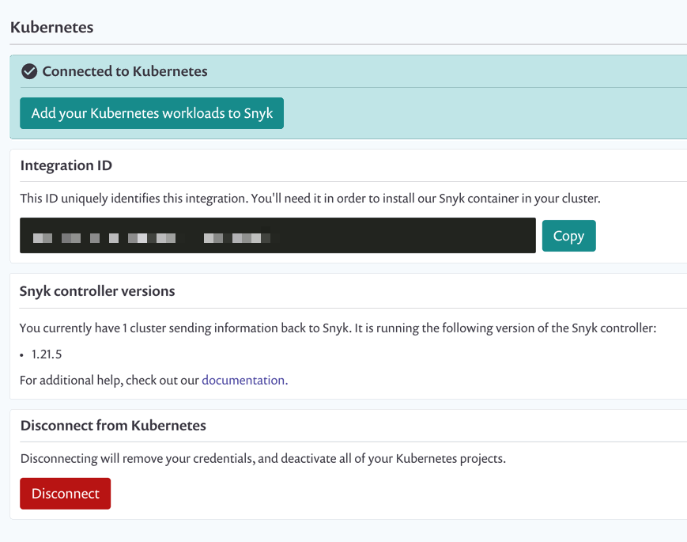

# Enable the Kubernetes integration


**Feature availability**\
This feature is available in Enterprise plans. See [pricing plans](https://snyk.io/plans/) for more details.


## Setting up the Kubernetes integration for your Snyk Org

1. Click on **Integrations** tabs
2. Select **Container orchestrators**

 (1) (1) (1) (1) (1) (1) (1) (1) (1) (1) (1) (1) (1) (1).png>)

3\. Click **Connect**

4\. The **Integration ID** is created for the Kubernetes integration. This **Integration ID** is needed during the Snyk Controller installation

 (1) (1) (1) (1) (1) (1) (1) (1) (1) (1) (1) (2) (1).png>)

5\. Create a [**Group** or **Org Service Account Token**](../../../enterprise-setup/service-accounts.md). This **Service Account Token** is needed during the Snyk Controller installation. For more information including the permissions needed, see the [prerequisites](../../kubernetes-integration/snyk-controller-installation/prerequisites-for-snyk-controller.md).

## Viewing In the relevant organization:

1. Click on settings  > **Integrations**.
2. Navigate to Kubernetes and click **Edit** **Settings**.
3. Navigate to the **Integration ID** and other integration settings:

From this window, you can access and work with the following:

| Part                       | Description                                                                                                                                                                                                                                                                                                                                                                                                                                                                                                                                                                                                                                                                |
| -------------------------- | -------------------------------------------------------------------------------------------------------------------------------------------------------------------------------------------------------------------------------------------------------------------------------------------------------------------------------------------------------------------------------------------------------------------------------------------------------------------------------------------------------------------------------------------------------------------------------------------------------------------------------------------------------------------------- |
| Connected to Kubernetes    | When the integration is not yet set up, this is the only section that appears in this window, with the Connect button (Integrate with these instructions: ([Kubernetes integration overview](./)). If you just clicked the Connect button, and when you're connected successfully, this area should appear as in the image.                                                                                                                                                                                                                                                                                                                                                |
| Integration ID             | The Integration ID is a UUID and appears similar to this format: `abcd1234-abcd-1234-abcd-1234abcd1234`. Click Connect and use this ID to set up your configuration if you haven't already. If you've already set up configuration, this and the rest of the data in the window should now all appear immediately when you navigate to and land on this page. You can now add your workloads from here, from the Dashboard, from the Projects page or set up automatic importing from your cluster. [Adding Kubernetes workloads for security scanning](../../kubernetes-integration/kubernetes-integration-features/adding-kubernetes-workloads-for-security-scanning.md) |
| Snyk controller versions   | Check the version of the Snyk controller that you've installed on your clusters from this area.                                                                                                                                                                                                                                                                                                                                                                                                                                                                                                                                                                            |
| Disconnect from Kubernetes | To remove this integration from this organization, click Disconnect.                                                                                                                                                                                                                                                                                                                                                                                                                                                                                                                                                                                                       |
