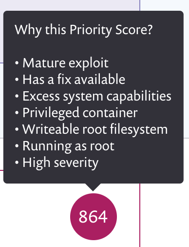

# Snyk Priority Score and Kubernetes

All issues in Snyk have a [Priority Score](../../../manage-issues/issue-management/priority-score.md). This helps determine the relative importance of vulnerabilities, taking into account both the severity of the issue and various other contextual factors. As well as the factors discussed in the main Priority Score documentation, images imported from the Kubernetes integration have a number of additional contributing factors.

## How well configured is your workload?

The Kubernetes integration collects information about how workloads are configured, focusing on options which can lead to security issues. We show this summary on the project page:

.

We also use this information to contribute to the Priority Score, based on the idea that a vulnerability present in a workload that is poorly configured scores higher than the same vulnerability in a well configured one.

We do this based on both the nature of the vulnerabilities and the specific issues raised by the configuration. We take the following into account today.

| **Configuration**                                                                                   | **Vulnerability properties**                                                                                                  |
| --------------------------------------------------------------------------------------------------- | ----------------------------------------------------------------------------------------------------------------------------- |
| Permission issues, for instance running privileged, able to run as root, not dropping capabilities. | CVSSv3 Privileges (PR) vector present in the vulnerability. Weighing based on the impact.                                     |
| Missing memory and/or CPU limits.                                                                   | CVSSv3 Availability (A) vector present in the vulnerability, or CWE includes denial of service. Weighing based on the impact. |
| Not setting a read only root filesystem.                                                            | CWE indicates filesystem access required.                                                                                     |

This scoring system is not intended to be binary, rather it’s a risk calculation intended to help you with prioritization efforts. This capability is enabled automatically for all customers using the Kubernetes integration and doesn't require any additional configuration.
