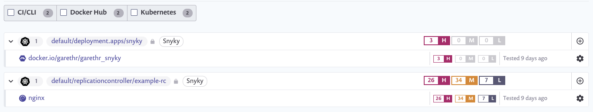
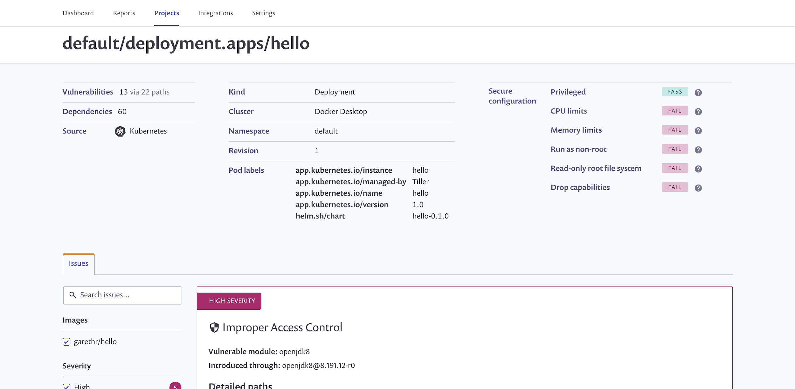

# View Project details and scan results

All workloads that you have imported for monitoring appear on the **Projects** page and are marked with a unique Kubernetes icon.

To view and manage the workload scan results:

Navigate to the **Projects** page and filter Kubernetes Projects:

Expand any item to view:

* a list of the individual images used in the workload
* a summary of the number of vulnerabilities in each image

To view vulnerabilities in detail for any image, including its history, click the image name. The Project details page loads for the selected image:

 (2) (3) (3) (3) (3) (4) (5) (5) (5) (4) (1) (1) (1) (1) (1) (1) (1) (1) (1) (1) (1) (1) (1) (1) (1) (1) (1) (1) (1) (1) (1) (1) (1) (1) (1) (1) (1) (1) (1) (1) (1) (1) (1) (1) (1) (1) (1) (1) (1) (1) (1) (1) (1) (1) (1) (1) (1) (1) (1)  (2).png>)

* To view an aggregate list of the vulnerabilities in all of the images in the workload, along with details about the security posture of the workload configuration, click the workload link. The Project details page loads for the selected image similar to the following example:

Currently, we test the workload configuration for the following properties:

| **Snyk parameter**     | **Associated Kubernetes parameters**         | **Description**                                                                                                                                                                                                                                                                                                                     |
| ---------------------- | -------------------------------------------- | ----------------------------------------------------------------------------------------------------------------------------------------------------------------------------------------------------------------------------------------------------------------------------------------------------------------------------------- |
| CPU and Memory limits  | Resources.limits.memory resources.limits.cpu | Limiting the expected CPU and Memory available to the container has operational as well as security benefits. In the context of security, this is about limiting the impact of potential denial of service attacks to affecting the app rather than the node and potentially the whole cluster.                                     |
| runAsNonRoot           | securityContext.runAsNonRoot                 | By default, containers can run as the root user. This property prevents that at the container runtime, meaning an attacker would only have limited permissions if they were to be able to execute a command in the context of the container.                                                                                        |
| readOnlyRootFilesystem | securityContext. readOnlyFilesystem          | By default the file system mounted for the container is writable. That means an attacker who compromises the container can also write to the disk, which makes certain kinds of attacks easier. If your containers are stateless then you don’t need a writable filesystem.                                                         |
| Capabilities           | securityContext.capabilities                 | At a low-level, Linux capabilities control what different processes in the container are allowed to do: from being able to write to the disk, to being able to communicate over the network. Dropping all capabilities and adding in those that are required is possible but requires understanding the list of capabilities first. |
