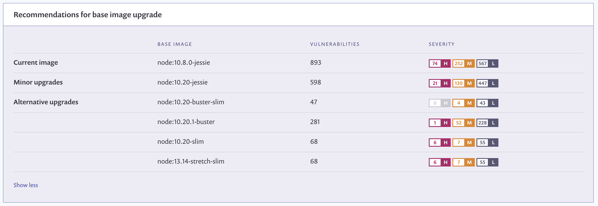

# Adding your Dockerfile and testing your base image

To receive base image fix advice, including major, minor, and alternative upgrades and advice when you need to rebuild your image, integrate with your preferred Git repository and import the repo that contains the relevant Dockerfile.

You can add a single Dockerfile to each image that you have imported. Follow the instructions on this page **to add your Dockerfile for additional fix advice.**

## **Prerequisites to adding your Dockerfile for additional fix advice**

* Ensure the relevant Git repository has been configured.
* Import the relevant image from its registry.

## **Steps to add your Dockerfile for additional fix advice**

1. On the **Project** tab, filter for your Project and then choose **Settings** to use the settings to add a Dockerfile.
2.  On the **Project** settings page, click **Configure Dockerfile** and then select the relevant Git repository.\

    

    <figure><figcaption>
Configure your Dockerfile by selecting the relevant repository.
</figcaption></figure>

    

3. When the **Add Projects** view opens, examine the list of all repositories from the Git account you integrated, grouped by Organization and personal account.
4. Enter a checkmark for the relevant repo from which to import the Dockerfile.
5. Enter the relative path in the **Path to your Dockerfile** field in the following format: /path/dockerfile.
6. Click **Save**.

<figure><figcaption>
Enter the path to your Dockerfile
</figcaption></figure>

Snyk tests the Project again, this time producing any relevant base image fix advice shown on the **Recommendations for base image upgrade** screen:

<figure><figcaption>
Recommendations for base image upgrade
</figcaption></figure>

The following are shown: **Current image**, **Minor upgrade**, **Alternative upgrade**, number of vulnerabilities in each, and a severity ranking.
