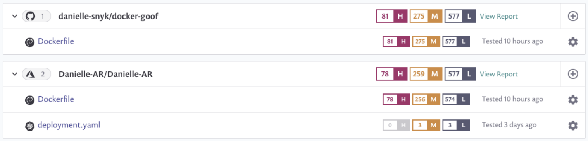
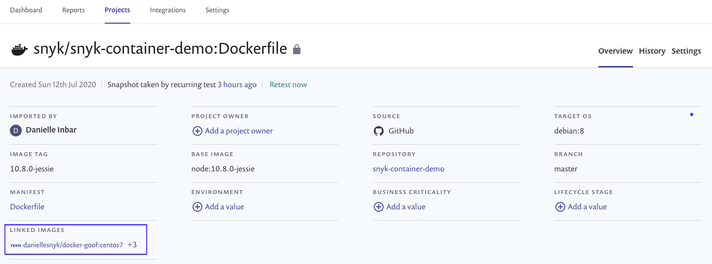

# Detect vulnerable base images from Dockerfile

Snyk detects vulnerable base images by scanning your Dockerfile when importing a Git repository. This allows you to examine security issues before building the image and thus helps solve potential problems before they land in your registry or in production.


When scanning Dockerfiles, Snyk can provide vulnerability information and base image recommendations for supported base images from [this list](https://snyk.io/docker-images/).


After you [integrate your Git repository to Snyk](../../integrations/git-repository-scm-integrations/), any Dockerfiles in that repository are automatically picked up and shown in the Web UI as Projects.

<figure><figcaption>
Dockefiles in Projects list
</figcaption></figure>

## Linking from a Dockerfile to its container images

You can also link from a Dockerfile to all container images built from it. This linking can be used to understand the security impact on your running applications and to understand which images can be better secured or need to be rebuilt when you are taking action and updating the Dockerfile base image.

<figure><figcaption>
Dockerfile Project showing linked images
</figcaption></figure>

See [Base image detection](../use-snyk-container/base-image-detection.md) for more details about detecting vulnerable base images and fix recommendations.
