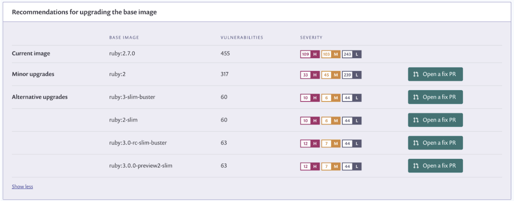
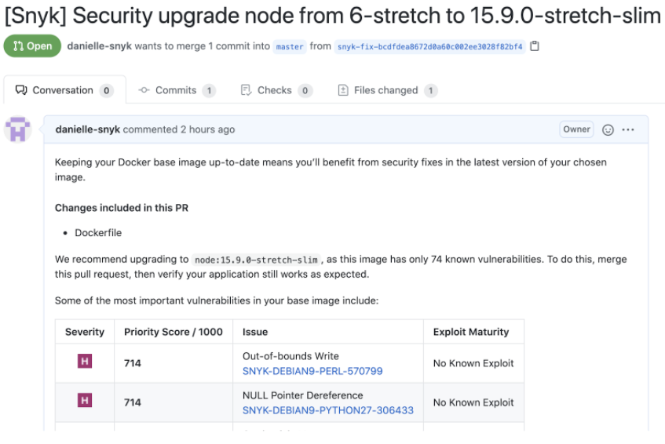
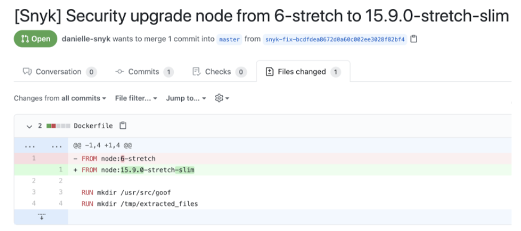

# Open pull requests to fix vulnerable base images in your Dockerfile

Snyk detects vulnerable base images by scanning your Dockerfile when importing a Git repository and helps you fix them using automatic pull requests. This allows you to examine security issues before you build the image and fix them before they land in your registry or in production.

Supported Git-based repository managers for Dockerfile fix PRs include:

* GitHub
* GitLab
* Bitbucket Server
* Bitbucket Cloud
* GitHub Enterprise Server
* Azure Repos

For any Dockerfile Project created in Snyk, if the base image is a [Docker Official image](https://docs.docker.com/docker-hub/official\_images/), the results include a list of suitable base images that can be used instead of the existing, more vulnerable one. See the screenshot with base image recommendations  on the page [Analysis and fixes for your images from the Snyk Web UI](../use-snyk-container/analysis-and-remediation-for-your-images-from-the-snyk-app.md) for more information.

Snyk then automatically issues a fix pull request against your Dockerfile to upgrade to the latest minor version available.

An automatic fix PR is opened when there is a change in the Dockerfile or a better base image detected after the initial scan.

Alternatively, you can open a fix PR manually by clicking **Open a Fix PR** for the version you wish to upgrade to.

<figure><figcaption>
Open a fix PR to upgrade the base image
</figcaption></figure>

After the fix PR is opened, you can view it n your Git repository and see what the change is and where it takes place. The `FROM` line in your Dockerfile is updated with the new and improved version.


Snyk recommends making sure your application works properly before merging the change.


When the PR is opened and ready, you can safely merge it and instantly reduce the number of vulnerabilities in your container image.

<figure><figcaption>
Fix PR showing changes included
</figcaption></figure>

<figure><figcaption>
Changed content in fix PR
</figcaption></figure>

## How to enable automatic update of Dockerfile base images

The feature is available for all Snyk users. It is on by default for all users with free accounts and off by default for existing integrations of Snyk customers. You can opt-in from the integration or Project settings (in the **Dockerfiles** section).

<figure><figcaption>
Enable auto-update PRs for base images
</figcaption></figure>

