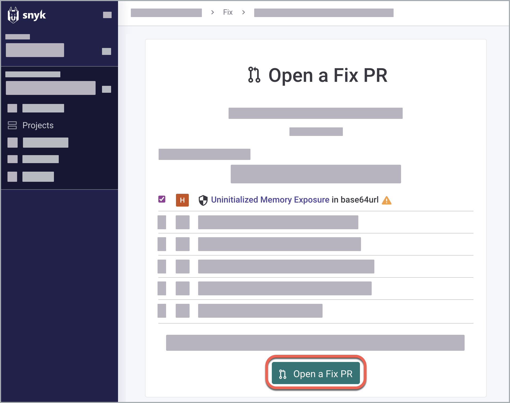
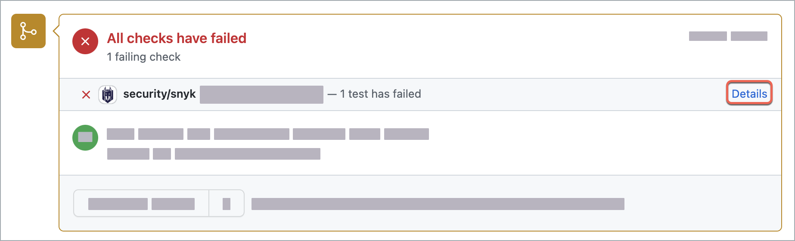
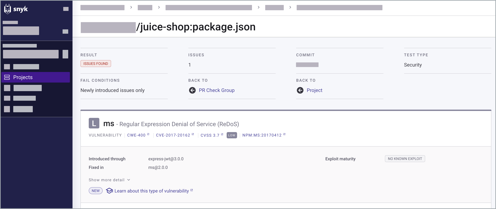
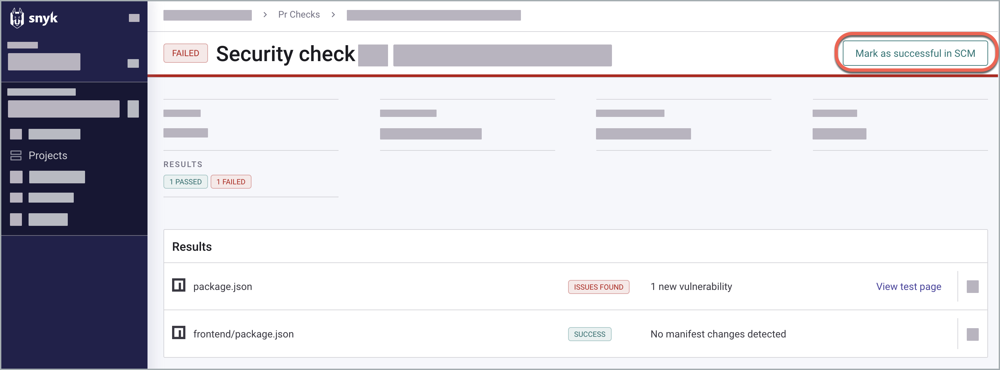
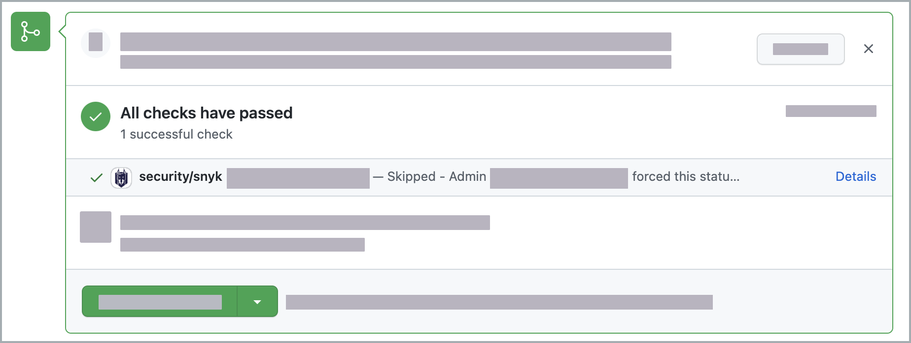

# Analyze PR Checks results

## PR Checks results

After you [submit a pull request to fix vulnerabilities](../snyk-open-source/manage-vulnerabilities/fix-your-vulnerabilities.md), PR Checks detects issues with a severity level that meets or exceeds your configured threshold and provides a report. Examine the report status and result to decide whether to merge the pull request.

You can change the default severity threshold either at the [Integration level](configure-pr-checks.md#configure-pr-checks-at-the-integration-level), or at the [Project level](configure-pr-checks.md#configure-pr-checks-at-the-project-level).

## Result status

Check the status of the PR Checks results in the integrated SCM to identify security issues that need to be addressed before merging a pull request.

The following status indicators can appear for your Snyk PR checks in the integrated SCM:

<table><thead><tr><th width="212">Result status</th><th>Description</th></tr></thead><tbody><tr><td><strong>Success/Passed</strong></td><td>No issues were discovered and the manifest file was not changed.</td></tr><tr><td><strong>Pending</strong></td><td>The PR Checks are still running.</td></tr><tr><td><strong>Failed/Issues found</strong></td><td>Security issues were identified in the pull request. In this scenario, you need to manually set the result status to <strong>Passed</strong>.</td></tr><tr><td><strong>Error</strong></td><td>Out-of-sync package.json and package.lock files, failure to find or to read the manifest file.</td></tr><tr><td><strong>Canceled</strong></td><td>The test limit has been reached.</td></tr></tbody></table>


For false positive or false negative results, see [Troubleshooting PR Checks](troubleshooting.md).


## **Example: fix dependency issues with PR Checks**

Consider the following end-to-end scenario, including specific actions such as triggering a Fix PR and marking a **Failed** result as **Passed**. You can take these actions in relation to the information provided by the PR Checks. This example shows taking the steps for a [GitHub integration](../../integrate-with-snyk/git-repositories-scms-integrations-with-snyk/snyk-github-integration.md) as follows:

1. [Trigger a fix for an individual dependency issue](analyze-pr-checks-results.md#trigger-a-fix-for-an-individual-dependency-issue) to find and address vulnerabilities.
2. [Open a Fix PR](analyze-pr-checks-results.md#open-a-fix-pr) to open a pull request in GitHub.
3. [Analyze PR Checks results and set status](analyze-pr-checks-results.md#analyze-pr-checks-result-and-set-status) to merge the pull request.

### Trigger a fix for an individual dependency issue

1. Log in to the Snyk Web UI.
2. Navigate to **Projects**.
3. Expand the target containing your Project.
4. Click a Project name to open it and select **package.json** to check for open-source and licensing issues.
5. In the **Issues** tab, find an individual issue card and select **Fix this vulnerability**. For this example, an Uninitialized Memory Exposure is selected.

<figure><figcaption>
Fixing an individual issue in the dependencies project
</figcaption></figure>

6. (Optional) Select **Fix these vulnerabilities** at the top of the page to fix all dependency vulnerabilities with one pull request.

### Open a Fix PR

Confirm your selected issue and click **Open a Fix PR** to open a pull request in the GitHub integration.

<figure><figcaption>
Triggering a Fix PR for an individual issue in the dependencies project
</figcaption></figure>

### Analyze PR Checks result and set status

1. (Optional) Examine the pull request generated by [Snyk Bot](../../integrate-with-snyk/git-repositories-scms-integrations-with-snyk/snyk-github-integration.md#commit-signing) in the Conversation tab in GitHub.
2. Find the conversation card showing the PR Checks results. For this example, the result is set to **Failed** and is manually changed to **Passed**.&#x20;


Issues that have previously been ignored via the Snyk Web UI in the associated Open Source or code analysis Project are not flagged in these checks. This reflects [ignored issues](../find-and-manage-priority-issues/ignore-issues/) across feature branch PRs.


<figure><figcaption>
PR Checks card in the Conversations tab, GitHub
</figcaption></figure>

3. Click **Details** to open the list of files that have been checked for this issue.
4. (Optional) Click **View test page** to examine the issue details.\
   \
   You can get a complete picture of the vulnerability by clicking **Show more detail**, with technical security information and remediation options.\
   \
   To return to the main issue page, click **Project**.

<figure><figcaption>
Overview of PR Checks result
</figcaption></figure>

5. **Mark as successful in SCM** to change the result status and merge the pull request with failed security issues.

<figure><figcaption>
Marking PR Checks result as successful
</figcaption></figure>


Marking a vulnerability as successful does not ignore the issue but only allows the security checks for the PR to pass in this current branch. If the issue is not fixed, it shows up in future commits and PR Checks after you merge it with the target branch.


The issue is marked as **Passed** and shows up as **Skipped** in the PR Checks card in GitHub.

<figure><figcaption>
PR Checks information in GitHub with issues marked as Skipped
</figcaption></figure>

## Troubleshooting PR Checks

[Troubleshooting PR Checks](troubleshooting.md) has more information on how to troubleshoot PR Checks or how to restart them

## More resources for PR Checks

To learn from an end-to-end example in Bitbucket, see the following Snyk Learn course: [Use Snyk to block builds in Bitbucket](https://learn.snyk.io/lesson/snyk-with-bitbucket/).
