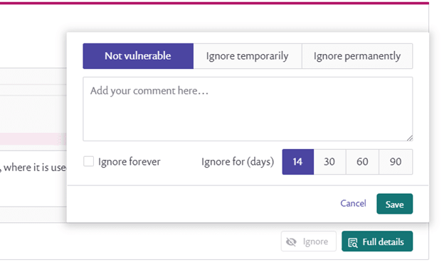

# Snyk Code Web UI

## **Issue filtering, sorting, and grouping**

Filter issues by severity, language, priority score, and more. Along with sorting and grouping issues by the vulnerability type or file to identify the most prevalent problems, you can sort by fix in several locations or problematic files that contain multiple issues.

## **Priority Score**

Sort by and prioritize the more important issues by incorporating factors such as issue prevalence, ease of fix, and risk factor into a single risk score.

## **Issue data flow**

See exactly how the issue flows through your application with a step-by-step visualization from the source to the sink.

## **Vulnerability overview**

Learn more about the vulnerability through curated content that explains how the vulnerability was created, what the risk factors are, and popular mitigation strategies for it.

## **Fix examples**

Examine several examples with links to actual code that show how others in the world are fixing the same issues in similar data flows. These examples help you gain insight and provide context on how to fix the problem.

## **Create Jira ticket**

Export issue information from Snyk directly to your project in Jira to make sure issues are tracked with follow up.

## **Ignore issues**

Use the **ignore** button to suppress specific warnings and ignore suggested fixes for an issue. For example, you may have deliberately used hard-coded passwords to test your routines in test code, or you are aware of an issue but have decided not to fix it.

After you click **ignore**, a prompt opens to specify a reason and time period for the ignore.

<figure><figcaption>
Reason and time period for an ignore
</figcaption></figure>

* Select whether this is to be marked **not vulnerable**, **ignore temporarily** (to suppress the message for now), or **ignore permanently** (to not fix ever)
* Add any notes to yourself or your colleagues in the comment box; Snyk recommends writing a brief explanation for your decision.
* Specify how long to ignore the issue (14, 30, 60, or 90 days, or **ignore forever**).

Click **save** to ignore this issue with the parameters selected. After you ignore an issue, it will not appear in scan results.


There is a status selector for ignored issues, and you can include those and remove or edit the ignore flag if you want to review ignored results.


See [Ignoring issues not prioritized for your project](https://docs.snyk.io/fixing-and-prioritizing-issues/issue-management/ignore-issues) for full details of using the ignore function.

See [Ignoring issues in Snyk Code](https://docs.snyk.io/fixing-and-prioritizing-issues/issue-management/ignore-issues#Ignore-Snyk-Code) for specific details of how Snyk Code processes the ignore function.

## **Excluding files**

Check for DeepCode/Snyk ignore files `.gitignore` `.dcignore` and read them if they exist. Using the information in these files, Snyk filters to identify only the files with [the supported extensions](../../supported-languages-and-frameworks/supported-languages-frameworks-and-feature-availability-overview.md) in the Project directory and not above the current Project directory. Snyk Code bundles these files that are smaller than 4 MB and sends them to Snyk.
