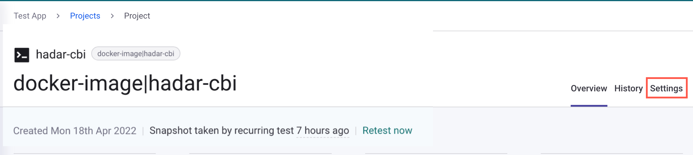

# Use Custom Base Image Recommendations


**Feature availability**

This feature is currently in Open Beta and is available for the Snyk Enterprise plan.


## **Overview of Custom Base Image Recommendations (CBIR)**

When scanning a container image, Snyk provides recommendations based on the base image it detects. Because Snyk precomputes recommendations only for Docker Official Images, these recommendations apply only to a subset of images.

Customers often maintain their own internal, customized base images, built on top of Docker Official Images or other upstream images. These are provided as a service to a wider set of development teams, for example, `somecompany/java:v1.2.4`.

The Custom Base Image Recommendation feature allows Snyk to recommend an image upgrade from a pool of your internal images. This allows teams to be notified of newer and more secure versions of their internal base images.

## How CBIR works

To use the Custom Base Image Recommendations feature, Snyk must enable it for each Organization that wants to be able to mark images as custom base images, for example, the platform team. This means that every user in the Organization (in this example, the platform team) will be able to mark images as custom base images in the Project settings.

Later, Projects in the same Group as the Organization (in this example, the platform team) will be able to receive custom base image recommendations.

The current logic of the feature is that for the same image repository (same repo and name), Snyk recommends the newest image based on the semantic versioning of the image tag. If Snyk is unable to find a [standard semantic versioning schema](https://semver.org/) in the tag, the recommendation is the last image that was marked as a custom base image based on the timestamp of marking.

To receive custom base image recommendations, you must specify a Dockerfile in the Project.&#x20;

All custom base image recommendations are considered minor upgrades, regardless of the image tag.

Custom base image recommendation supports Automatic fix PRs. If you are not using the latest version of the base image, then immediately after image import, Snyk automatically issues a fix pull request against your Dockerfile to upgrade to the latest available custom base image version.

In order for Snyk to identify whether a Project is using a custom base image, the same custom base image must be imported and marked as such in the Project settings.

## **Enable CBIR**

The following steps describe how to configure custom base images. You can also do this through the [Snyk API](https://apidocs.snyk.io/#tag--Custom-Base-Images) (the recommended method).

### Configure an image as a custom base image

The team that is responsible for creating and maintaining custom base images for the Organization performs this step. In this example, the responsible team is the platform team.

1. Ask Snyk to enable the feature for the Organization being used by the platform team (unless you're using the API).
2. Create a custom base image.
3.  Import the image to a Snyk Project using one of the following options:

    * The Snyk Web UI: Import an image into Snyk using a container registry.
    * The CLI: Use `--project-name` (mandatory) to give the Project a unique name and`--file` (optional) to specify the path to the Dockerfile. Snyk recommends using the image name and tag without the repo.

    Example of image name: `oracle-jre-rhel7/8e32:1.8.0_2021022508`)

    Example of Snyk CLI command: `snyk container monitor snykgoof/custom-base-python:3.9.2_2021110408 --file=path/to/Dockerfile.3.9.2 --project-name=custom-base-python:3.9.2_2021110408 --org=ORGANIZATION_ID/ORGANIZATION_NAME`
4.  Mark the Project as a custom base image. To do this:

    1.  On the Project page, navigate to **Settings**.

        <figure><figcaption>
 Settings tab on the Project page
</figcaption></figure>
    2. On the **Settings** page, under **Custom Base Image Recommendation**, select **Treat as custom base image**.
    3. Click **Update image status**.

    Alternatively, you can use the [Snyk API](https://apidocs.snyk.io/?version=2023-08-31%7Ebeta#get-/custom\_base\_images) to mark an image as a custom base image.&#x20;
5. Mark whether the image should be eligible for recommendations.
   1. On the **Settings** page, under **Custom Base Image Recommendation,** check the  **Use in recommendations** checkbox.
   2. Click **Update image status**.
6. Test the feature and get recommendations by going through the previous steps for at least two different images from the same repository.

### Receive custom base image recommendations

The applications team responsible for using pre-built custom base images and adding additional layers on top of the pre-built images for their applications performs this step.

First, import an image to a new Snyk Project. Ensure that the Project is in the same Group as the custom images. You can import an image either from the CLI or the Web UI.


If the same image is scanned from both the CLI and Web UI, Snyk creates two Projects and monitors both.


#### Import an image through the CLI

Here is an example command for importing an image through the CLI:

`snyk container monitor snykgoof/custom-base-python:3.9.2_2021110408 --file=path/to/Dockerfile.3.9.2`

Use `--file` (mandatory) to specify the path to the Dockerfile.

Use the `--exclude-base-image-vulns` flag (optional) for the `snyk container test` command not to show the base image vulnerabilities.

#### Import an image through the Web UI

On the Project page, navigate to **Settings** and configure the Dockerfile by clicking **Configure Dockerfile** and selecting your source control system from the dropdown.

<figure><figcaption>
Configure the Project Dockerfile
</figcaption></figure>

Choose the Dockerfile repository and add the path to your Dockerfile. Click **Update Dockerfile**.

<figure><figcaption>
Configure the path to your Dockerfile
</figcaption></figure>

#### See Custom Base Image Recommendations

Next, navigate to the **Project** page to see the recommendations for the image.

<figure><figcaption>
Example of Custom Base Image Recommendations
</figcaption></figure>

## Case study for Custom Base Image Recommendations

You can use Custom Base Image Recommendations feature in the following scenario:

1. Your company's platform team, which is responsible for creating and maintaining custom base images for the Organization, scans and marks images in Snyk as custom base images.
2. Your company's application teams get recommendations for upgrading to a newer internal version by using pre-built custom base images and adding more layers on top of the pre-built images for the team's applications.

## Known limitations of CBIR

* When you scan a base image, custom base image recommendations do not appear unless you attach the Dockerfile to the scanned Project.
* The image's registry is ignored when recommendations are given for custom base images. When showing recommendations and fix PRs, images with the same repository but different registries are treated as coming from the same registry (the current base image's registry).
* After you have imported and marked a custom base image, the custom base image Project must not be moved to a different Organization or Group within Snyk.

##
